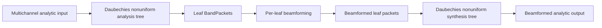
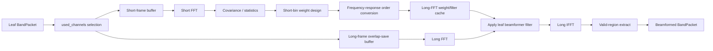

# Nonuniform FilterBank Daubechies beamforming試作結果

## 1. 目的

本書は、不均一複素フィルタバンクについて、
正式 stopband 最適化に先立ち

- Daubechies/QMF 系 stage を使って
- leaf beamforming まで一度通し
- 構造安定性を先に確認する

ための試作結果を記録する文書である。

今回の目的は、

- 最終係数を確定すること
- front-end を含む正式版を完了すること

ではなく、

- tree 解析
- leaf beamforming
- tree 合成

を接続したときに、構造上の破綻が起きないかを先に確認することにある。

位置付け:

- 本書は beamforming 経路を formal tree へ最初に通した段階結果を残す文書である
- その後の streaming 一致、representative な interferer 条件、MVDR の多周波・多方位 sanity check は `doc/Nonuniform_FilterBank_Daubechies_streaming_sweep結果.md` に追記済みである
- したがって、本書の「今後の進め方」は当時の次段階メモとして読むのが正しい

---

## 2. 今回の結論

現時点では、Daubechies 系の暫定 stage を用いた
`nonuniform analysis -> leaf beamforming -> synthesis`
の通し経路は安定に動作する。

少なくとも以下は確認できた。

- dense center / sparse edge の 32 ch 配列条件を実装へ反映できる
- leaf ごとの `used_channels` 制限を持った beamforming 経路を構成できる
- leaf beamforming を挿入しても tree 合成まで通せる
- identical broadside 入力に対して再構成誤差は十分小さい
- representative leaf 条件では、MVDR が target distortionless を保ったまま interferer 応答を CBF より低減できる
- formal full-tree 条件でも、single-band interferer 条件で MVDR streaming が offline と一致し、後半区間では CBF より target 誤差を下げられる

したがって、以後の主要リスクは

- 不均一木の構造破綻

ではなく、

- stage の stopband 改善
- steering の周波数依存設計
- multiband interferer 条件での MVDR 実用評価
- real-input streaming を含む front-end 実用評価

にあると整理してよい。

---

## 3. 暫定採用した stage 候補

今回の beamforming 試作では、
以下を暫定採用した。

- candidate: `daubechies_qmf_order4_taps8`

採用理由は以下である。

1. 既存の `ComplexPRHalfbandStage` 試験で PR が確認済みである。
2. tap 数が短く、beamforming 接続時の不具合切り分けがしやすい。
3. 非均一木へ再帰接続したときの長さ管理と packet 管理を先に確認するには十分である。
4. 今回は stopband の最終性能よりも、beamforming 経路を通したときの構造安定性確認を優先する。

注意点:

- この候補は正式 stopband 要求を満たす最終係数ではない。
- 今回の採用は正式係数確定ではなく、beamforming 先行試作のための暫定採用である。

---

## 4. 実装した通し構造

対応実装:

- `src/spflow/filterbank/daubechies_nonuniform_beamformer.py`
- `src/spflow/filterbank/daubechies_nonuniform_streaming.py`
- `src/spflow/filterbank/nonuniform_leaf.py`

leaf beamforming まで含めた通し構造は以下である。



leaf 内部の正式候補構造は以下である。



現在の試作では、

- `beamformer_mode = "cbf"`
- `beamformer_mode = "mvdr"`

の両方を同じ formal metadata 経路で通せる。

実装経路そのものは現在、

- `FormalNonuniformTreeFilterBank` による formal analysis / synthesis
- `FormalBandPacket` を保ったままの leaf beamforming
- `FormalNonuniformTreeStreamingAnalyzer / Synthesizer` を使った streaming 再構成
- leaf 内部の fixed-step scheduling による chunk-invariant な MVDR 更新順

へ差し替え済みである。
つまり、leaf processor の構造は正式候補と同じであり、
今回の安定性確認は formal metadata 付き CBF / MVDR 条件で実施している。

---

## 5. 配列条件

主評価条件は、設計どおり
`dense center / sparse edge` の 32 ch 直線配列とした。

チャネル位置:

```text
[-0.395, -0.355, -0.315, -0.275, -0.235, -0.195, -0.155, -0.115,
 -0.075, -0.065, -0.055, -0.045, -0.035, -0.025, -0.015, -0.005,
  0.005,  0.015,  0.025,  0.035,  0.045,  0.055,  0.065,  0.075,
  0.115,  0.155,  0.195,  0.235,  0.275,  0.315,  0.355,  0.395] m
```

leaf ごとの暫定 `used_channels` は以下とした。

| leaf band | used channels |
|---|---:|
| `0 - 128 Hz` | `32` |
| `128 - 256 Hz` | `32` |
| `256 - 512 Hz` | `24` |
| `512 - 1024 Hz` | `20` |
| `1024 - 2048 Hz` | `16` |
| `2048 - 4096 Hz` | `12` |
| `4096 - 8192 Hz` | `8` |
| `8192 - 16384 Hz` | `4` |

高域では中心対称な contiguous subset のみを使う。

---

## 6. 今回見つかった実装上の論点

leaf で beamforming を挿入した最初の実装では、
内部ノード合成時に sibling packet の長さが揃わず停止した。

原因は以下である。

- leaf 側の overlap-save 出力は leaf packet 長へ切り詰めていた
- しかし stage 合成は FIR の full convolution により親長より長い列を返す
- そのまま次段合成へ渡すと、別 sibling 側の packet 長と一致しなくなる

対策として、解析時に各内部ノード packet を保持し、
合成時には

- その親ノードが解析時に持っていた長さ

を `synthesize_packets(..., length=...)` に明示的に渡すよう修正した。

この修正により、

- 各内部ノードは解析時と同じ長さへ戻る
- sibling 長不一致で tree 合成が止まらない
- beamforming を挿入しても解析木と合成木の長さ整合が保てる

ことを確認した。

これは stopband 最適化とは独立の、
非均一 FIR tree に beamforming を挿入する際の重要な構造条件である。

---

## 7. 安定性評価

### 7.1 broadside exactness 評価条件

- `fs = 32768 Hz`
- stage candidate: `daubechies_qmf_order4_taps8`
- 入力: 複素 analytic ランダム信号
- 条件: 全 32 ch に identical な broadside 信号を入力
- beamformer: `cbf`, `mvdr`
- steering: 全チャネル同位相の broadside 仮定
- `mvdr` 条件では `integration_time = 0`, `weight_update_period = 0`, `diag_load = 1e-3`

この条件では、理想的には leaf beamforming を挿入しても
出力は入力と一致するはずである。

### 7.2 broadside exactness 結果

評価結果は以下であった。

| metric | value |
|---|---:|
| max abs error | `1.50e-12` |
| RMS error | `4.76e-13` |
| input RMS | `1.41` |
| relative RMS error | `-249.45 dB` |

### 7.3 interferer を含む実用評価

まず leaf 単体で、`1024 - 2048 Hz` leaf を代表条件として
実用的な null 形成を確認した。

条件:

- leaf: `1024 - 2048 Hz`
- active channels: `16`
- target angle: `10 deg`
- interferer angle: `-25 deg`
- target absolute frequency: leaf center `1536 Hz`
- target relative frequency: leaf baseband `512 Hz`
- interferer relative frequency: `516 Hz`
- `integration_time = 0.5`, `weight_update_period = 0`, `diag_load = 1e-3`

結果:

| metric | value |
|---|---:|
| CBF target RMS error | `6.901e-01` |
| MVDR target RMS error | `3.365e-01` |
| MVDR target response | `0.000 dB` |
| CBF interferer response | `-2.828 dB` |
| MVDR interferer response | `-8.946 dB` |

次に formal full-tree 条件で、single-band interferer 条件の streaming 一致と
後半区間の target 誤差改善を確認した。

条件:

- full tree, single active band: `1024 - 2048 Hz`
- target angle: `10 deg`
- interferer angle: `-25 deg`
- interferer gain: `1.5`
- `integration_time = 1.0`, `weight_update_period = 0`, `diag_load = 1e-3`
- 指標は後半 `1/2` 区間の target 参照誤差と streaming/offline 差分

結果:

| metric | value |
|---|---:|
| CBF target RMS error (2nd half) | `9.985e-01` |
| MVDR target RMS error (2nd half) | `6.553e-01` |
| streaming/offline max abs diff | `1.58e-14` |
| streaming/offline max `jump_abs` | `3.82e-15` |
| boundary `jump_abs` | `8.93e-16` |

この full-tree 条件は multiband 実運用を代表する最終評価ではないが、
少なくとも

- formal metadata 付き MVDR streaming
- interferer を含む update 条件
- dense center / sparse edge 配列

を同時に載せても、構造不一致や chunk 境界破綻は起きていない。

対応試験:

- `tests/nonuniform/test_nonuniform_leaf.py`
- `tests/nonuniform/test_daubechies_nonuniform_beamformer.py`
- `tests/nonuniform/test_daubechies_nonuniform_streaming.py`

試験内容:

1. 代表 dense/sparse 配列の active count が設計どおりか確認
2. identical broadside analytic 入力に対し、CBF 通し後も元信号へ戻るか確認
3. identical broadside analytic 入力に対し、MVDR 通し後も元信号へ戻るか確認
4. formal leaf packet の `time_origin_at_root_rate` / `delay_samples_at_root_rate` が保持されるか確認
5. MVDR 条件でも formal leaf metadata が保持されるか確認
6. real input でも formal front-end 経由で broadside 再構成が成立するか確認
7. representative leaf 条件で MVDR が target distortionless と interferer 抑圧を両立するか確認
8. CBF streaming beamforming が offline と一致し、chunk 境界 continuity を崩さないか確認
9. MVDR streaming beamforming が offline と一致し、chunk 境界 continuity を崩さないか確認
10. single-band interferer 条件で MVDR streaming が offline と一致し、後半区間で CBF より target 誤差を下げるか確認

再確認結果:

```text
python -m pytest -q tests/nonuniform/test_nonuniform_leaf.py tests/nonuniform/test_daubechies_nonuniform_beamformer.py tests/nonuniform/test_daubechies_nonuniform_streaming.py
14 passed in 14.73s
```

全体回帰結果:

```text
python -m pytest -q
151 passed in 19.53s
```

---

## 8. 今回の結果の意味

今回確認できたのは、

- Daubechies/QMF 系 stage
- 不均一木
- leaf beamforming
- dense center / sparse edge 条件
- formal metadata 付き streaming

を接続した構造が、broadside 条件だけでなく、
少なくとも代表的な interferer 条件でも破綻せず動作するということである。

一方で、まだ今回の結果だけでは確定していないものは以下である。

- 高選択度 stopband を持つ正式係数
- steering の周波数依存設計
- multiband interferer 条件での MVDR 実用評価
- real-input streaming を含む正式評価

したがって、今回の評価は

- 正式版完成の証明

ではないが、

- beamforming を先に入れても構造的な破綻は起きていない
- interferer を含む MVDR 更新を formal tree へ載せても streaming 一致は崩れていない
- filter 設計をこの先手戻りさせても、beamforming 経路の骨格は再利用可能

であることを示す重要な前進である。

---

## 9. 当時の次段階メモ

本節は、試作時点で残っていた次段階メモを履歴として残す。
当時の列挙のうち、representative な interferer 条件と streaming 一致確認は
その後の文書で確認済みである。

当時の次段階では以下を順に進める想定だった。

1. leaf ごとの `short_fft_size` と `weight_update_period` を詰める
2. steering の周波数依存を入れた multiband interferer 条件へ拡張する
3. real-input streaming を含む正式評価へ進む
4. その上で stage 係数の stopband 最適化を進める
5. 必要なら sinc 目標 constrained optimizer の結果へ差し替える

この順にすることで、

- beamforming が原因の問題
- フィルタ係数が原因の問題
- metadata / streaming が原因の問題

を切り分けやすくできる。
