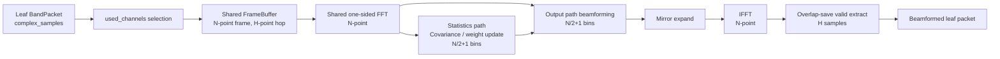
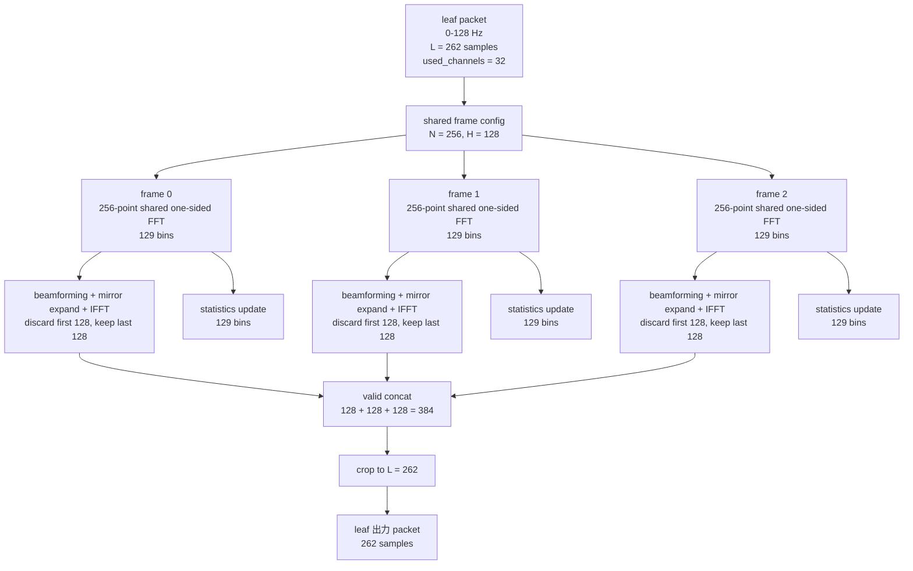
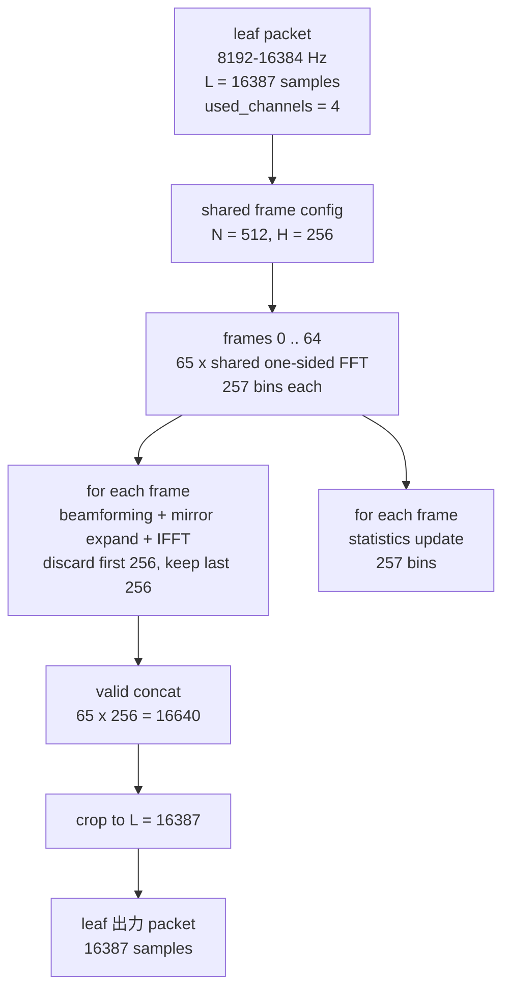

# Nonuniform FilterBank leaf 処理構造

## 1. 目的

本書は、不均一 FIR/QMF tree の各 leaf における beamforming 処理を、
**現行実装の正式な読み方**に合わせて整理するための文書である。

ここで主に固定したい点は以下である。

- tree 本体は FFT filter bank ではなく、`ComplexPRHalfbandStage` による FIR/QMF 木であること
- FFT を使うのは leaf 内の beamforming / statistics 処理だけであること
- 現行の one-sided leaf 方式では、`long FFT / short FFT` という呼び方よりも
  `output path / statistics path` と呼ぶ方が実態に合うこと
- 時間波形の連続性は overlap-save の valid 抽出で担保していること

経緯や旧方式との比較は、
`doc/Nonuniform_FilterBank_InnerProductBinReduction.md` を参照。
本書は比較履歴ではなく、**現在の leaf 構造そのもの**を記述する。

---

## 2. 現在の設計の要点

各 leaf は 1 本の複素サブバンド packet を受け取り、内部で 2 経路を持つ。

1. `output path`
2. `statistics path`

### 2.1 output path

- 実際の beamforming 出力を作る経路
- one-sided 周波数ビンで beamforming を行い、IFFT 後に overlap-save の valid 部だけを採用する
- 生成した valid block を順に連結し、最後に入力 leaf packet 長へ crop する

### 2.2 statistics path

- `Rxx` 更新と MVDR 重み更新のための経路
- 出力時間波形は作らない
- 現行 one-sided 実装では output path と同じ frame FFT を共有し、その one-sided bins から共分散を更新する

### 2.3 現在の正式な読み方

現行の one-sided leaf 方式では、
各 leaf の `output path` と `statistics path` は**同じ FFT 次数**を使う。
したがって、旧来の

- `long FFT`
- `short FFT`

という呼び方は、現状では本質を表していない。
現在の違いは FFT 次数ではなく、**役割**である。
さらに現行 one-sided 実装では、同じ `N` / `H` 条件のため、FFT 自体も共有できる。

- `output path`: 出力を作る
- `statistics path`: 重み更新だけを行う
- `shared FFT`: 1 回だけ計算し、両方が参照する

---

## 3. 1 leaf の基本構造

現行 one-sided 実装では、frame 化された leaf 信号に対して FFT は 1 回だけ計算する。
その FFT の one-sided bins を

- output path
- statistics path

の 2 つが共有する。

ここで

- `N = leaf ごとの FFT size`
- `H = leaf ごとの hop size`

である。

現行の default one-sided leaf 方式では

- `H = N / 2`

を使う。

---

## 4. 時間波形の連続性をどう保証しているか

時間波形の連続性は、statistics 側の bin 数ではなく、
**output path の overlap-save 契約**で保証している。

現行の output path は各 frame で

1. `N` 点 shared FFT
2. one-side 重みから設計済みの full complex `filter FFT` を適用
3. `N` 点 IFFT
4. frame 前半を無効領域として捨てる
5. frame 後半 `H = N/2` 点だけを valid として出力する

という手順を踏む。

重要なのは、output path が直接 one-side スペクトルを IFFT しているのではなく、
one-side 重みから構成した causal FIR を overlap-save で実行している点である。
したがって runtime の output path は full complex FFT/IFFT だが、
statistics path は shared FFT の正側ビンだけを使う。

### 4.1 なぜ `H` 点だけ取り出しても所望の出力長を復元できるか

ここで重要なのは、各 frame が `N` 点入力を見ていても、
**そのうち新しく入ってきたサンプルは `H` 点だけ**だということである。

- frame 1 は `history (N-H)` と `new block (H)` から作る
- frame 2 も、前 frame の後半 `N-H` 点を history として引き継ぎ、さらに次の `H` 点を足す
- したがって frame ごとに「新しく確定できる出力」も `H` 点だけになる

言い換えると、各 frame の `N` 点 IFFT 出力は

- 前半 `N-H` 点: overlap に対応する冗長領域、または circular convolution 汚染を含む領域
- 後半 `H` 点: 今回の `new block (H)` に対応する線形畳み込みの確定領域

に分かれている。

したがって、frame ごとに後半 `H` 点だけを取り出して順に連結すると、
各 hop で 1 回ずつ **新しい `H` 点の出力**が得られる。
これを全 frame について繰り返せば、入力が `L` 点なら最終的に `L` 点分の output を再構成できる。
最後に tail padding 分を crop すれば、所望の sample 数へ戻る。

### 4.2 少ない sample 数から復元しているのではなく、冗長部を捨てている

見かけ上は

- `N` 点 IFFT をしたのに `H` 点しか使わない

ので「少ないサンプル数の beamforming 結果から元の長さを復元している」ように見えるが、
実際にはそうではない。

正しくは、

- 各 frame は `N` 点の出力候補を持つ
- しかしそのうち前半 `N-H` 点は前後 frame と重複するか、または circular convolution 汚染を含む
- 後半 `H` 点だけが今回新しく確定した output である

という関係にある。

つまり、output 長を増やしているのではなく、
**各 frame の冗長な `N-H` 点を捨てながら、新しい `H` 点だけを継ぎ足していく**ことで、
最終的に所望の時間波形を得ている。

### 4.3 現在の continuity 条件

したがって、現在の continuity は

- `N` 点 FFT
- `N/2` 点 hop
- 先頭 `N/2` 点破棄
- 後半 `N/2` 点採用

に依存している。
FFT を 2 回計算していることには依存していない。したがって、shared FFT 化しても continuity 条件自体は変わらない。

---

## 5. 共分散更新の bin 数が `65 / 129` ではない理由

ここも誤解しやすい点なので明示する。

現行実装では、statistics path の FFT size も `N` である。
そのため one-sided bin 数は常に

- `N / 2 + 1`

になる。

例えば

- low-band 例: `N = 256` -> `129 bins`
- high-band 例: `N = 512` -> `257 bins`

である。

一方、もし statistics path の FFT size 自体を hop size `H` まで落とすなら

- low-band: `H = 128` -> `65 bins`
- high-band: `H = 256` -> `129 bins`

となる。

これは将来の処理量削減案としてはあり得るが、現時点では未採用である。
理由は以下である。

- 周波数分解能が 2 倍粗くなる
- 現在の target resolution をそのままは満たさない
- statistics grid と output beamforming grid がずれる
- 重み補間または次数変換の設計が別途必要になる

したがって、**現状の正式実装では low-band `129`, high-band `257` が正しい**。

---

## 6. leaf ごとに持つパラメータ

各 leaf は少なくとも以下を持つ。

- `used_channels`
- `long_fft_frame_size`
- `long_fft_valid_size`
- `short_fft_size`
- `short_fft_hop_size`
- `output_path_mode`
- `integration_time`
- `weight_update_period`
- `diag_load`

ただし、one-sided 正式系を読むときの実質的な解釈は以下である。

- `output FFT size = short_fft_size`
- `output hop size = short_fft_hop_size`
- `statistics FFT size = short_fft_size`
- `statistics hop size = short_fft_hop_size`

すなわち、現行 one-sided 方式では
`long_fft_*` は旧 overlap-save 基準 path との互換パラメータとして残っているが、
main path の理解には `short_fft_*` を見ればよい。

---

## 7. `Nsig = 32768` の具体例

実装確認用に、
`DaubechiesNonuniformBeamformer(output_path_mode = leaf_independent_one_sided)`
かつ analytic 複素入力 `Nsig = 32768` のときの実測値を示す。

ここで重要なのは、**leaf へ分解された packet 全体がそのまま 1 回の FFT/IFFT で処理されるわけではない**という点である。
各 leaf は

1. tree から `L` 点の leaf packet を受け取る
2. その packet を内部で `N` 点 frame, `H` 点 hop に分ける
3. 各 frame から valid な `H` 点だけを順に出力する
4. 連結結果を最後に `L` 点へ crop する

という手順で処理される。

### 7.1 全体図

```mermaid
flowchart TD
    A["信号生成<br/>32768 samples"] --> B["filterbank 入力<br/>32768 samples"]
    B --> C["root block pad<br/>32768 samples<br/>(padなし)"]
    C --> D["Formal FIR/QMF tree<br/>global FFT なし"]

    D --> E1["0-128 Hz<br/>leaf packet length L = 262<br/>leaf Fs = 256 Hz"]
    D --> E2["128-256 Hz<br/>leaf packet length L = 262<br/>leaf Fs = 256 Hz"]
    D --> E3["256-512 Hz<br/>leaf packet length L = 518<br/>leaf Fs = 512 Hz"]
    D --> E4["512-1024 Hz<br/>leaf packet length L = 1030<br/>leaf Fs = 1024 Hz"]
    D --> E5["1024-2048 Hz<br/>leaf packet length L = 2054<br/>leaf Fs = 2048 Hz"]
    D --> E6["2048-4096 Hz<br/>leaf packet length L = 4102<br/>leaf Fs = 4096 Hz"]
    D --> E7["4096-8192 Hz<br/>leaf packet length L = 8197<br/>leaf Fs = 8192 Hz"]
    D --> E8["8192-16384 Hz<br/>leaf packet length L = 16387<br/>leaf Fs = 16384 Hz"]

    E1 --> F1["leaf internal frame processing<br/>N = 256, H = 128<br/>3 frames -> 384 valid samples -> crop to 262"]
    E2 --> F2["leaf internal frame processing<br/>N = 256, H = 128<br/>3 frames -> 384 valid samples -> crop to 262"]
    E3 --> F3["leaf internal frame processing<br/>N = 256, H = 128<br/>5 frames -> 640 valid samples -> crop to 518"]
    E4 --> F4["leaf internal frame processing<br/>N = 512, H = 256<br/>5 frames -> 1280 valid samples -> crop to 1030"]
    E5 --> F5["leaf internal frame processing<br/>N = 512, H = 256<br/>9 frames -> 2304 valid samples -> crop to 2054"]
    E6 --> F6["leaf internal frame processing<br/>N = 512, H = 256<br/>17 frames -> 4352 valid samples -> crop to 4102"]
    E7 --> F7["leaf internal frame processing<br/>N = 512, H = 256<br/>33 frames -> 8448 valid samples -> crop to 8197"]
    E8 --> F8["leaf internal frame processing<br/>N = 512, H = 256<br/>65 frames -> 16640 valid samples -> crop to 16387"]

    F1 --> G1["leaf 出力 packet<br/>262 samples"]
    F2 --> G2["leaf 出力 packet<br/>262 samples"]
    F3 --> G3["leaf 出力 packet<br/>518 samples"]
    F4 --> G4["leaf 出力 packet<br/>1030 samples"]
    F5 --> G5["leaf 出力 packet<br/>2054 samples"]
    F6 --> G6["leaf 出力 packet<br/>4102 samples"]
    F7 --> G7["leaf 出力 packet<br/>8197 samples"]
    F8 --> G8["leaf 出力 packet<br/>16387 samples"]

    G1 --> H["Formal synthesis tree<br/>32768 samples"]
    G2 --> H
    G3 --> H
    G4 --> H
    G5 --> H
    G6 --> H
    G7 --> H
    G8 --> H

    H --> I["再構成後 analytic 出力<br/>32768 samples"]
    I --> J["最終出力<br/>32768 samples"]
```

### 7.2 数値表

| 帯域 | leaf Fs [Hz] | leaf packet 長 `L` | used channels | shared FFT size `N` | hop `H` | frame 数 `ceil(L/H)` | valid 連結長 `frame_count * H` | one-sided bins |
|---|---:|---:|---:|---:|---:|---:|---:|---:|
| `0-128 Hz` | `256` | `262` | `32` | `256` | `128` | `3` | `384` | `129` |
| `128-256 Hz` | `256` | `262` | `32` | `256` | `128` | `3` | `384` | `129` |
| `256-512 Hz` | `512` | `518` | `24` | `256` | `128` | `5` | `640` | `129` |
| `512-1024 Hz` | `1024` | `1030` | `20` | `512` | `256` | `5` | `1280` | `257` |
| `1024-2048 Hz` | `2048` | `2054` | `16` | `512` | `256` | `9` | `2304` | `257` |
| `2048-4096 Hz` | `4096` | `4102` | `12` | `512` | `256` | `17` | `4352` | `257` |
| `4096-8192 Hz` | `8192` | `8197` | `8` | `512` | `256` | `33` | `8448` | `257` |
| `8192-16384 Hz` | `16384` | `16387` | `4` | `512` | `256` | `65` | `16640` | `257` |

この表の `valid 連結長` は leaf 内部で一度生成される中間長であり、
そのまま tree へ戻すわけではない。
最終的に各 leaf は必ず `L` 点へ crop してから synthesis tree に渡す。

### 7.3 sample 数の読み方

この具体例では、

- 信号生成時 sample 数: `32768`
- filterbank 入力 sample 数: `32768`
- root pad 後 sample 数: `32768`
- 各 leaf packet 長: 上表の `L`
- 各 leaf 内部で一時的に生成される valid 連結長: 上表の `frame_count * H`
- 各 leaf の tree 返却長: crop 後なので `L`
- root 再構成後 sample 数: `32768`
- 最終出力 sample 数: `32768`

real 入力では causal analytic front-end の `31 sample` 遅延と tail pad が入るため、

- signal generation: `32768`
- analytic frontend output: `32799`
- root pad 後: `32896`
- root analytic 再構成後: `32799`
- recover_real 後の最終出力: `32768`

となる。

---

## 8. leaf 内部の frame 処理

### 8.1 低域 leaf 例: `0-128 Hz`

`L = 262`, `N = 256`, `H = 128` なので、
この leaf は 1 回の FFT/IFFT ではなく **3 frame** に分けて処理される。

### 8.2 高域 leaf 例: `8192-16384 Hz`

`L = 16387`, `N = 512`, `H = 256` なので、
この leaf は **65 frame** に分けて処理される。

### 8.3 読み方

上の 2 例から分かる通り、現行 one-sided leaf 方式では

- output path と statistics path は同じ FFT 次数を使う
- output path と statistics path は同じ hop size を使う
- 現行 one-sided 実装では FFT 自体も共有する
- 両者の違いは「出力を作るか」「重み更新だけを行うか」である
- leaf packet `L` は frame FFT size `N` とは別物であり、通常は `L > N` となる
- leaf 出力 packet は、複数 frame の valid 領域を連結してから `L` 点へ crop して得る
- 低域では `N = 256`, 高域では `N = 512`
- one-sided bin 数はそれぞれ `129`, `257`

である。

## 9. 実装上の補足

現時点では `src/spflow/filterbank/nonuniform_leaf.py` において、少なくとも以下を実装済みである。

- contiguous `used_channels` に対する slice selection
- one-sided covariance 更新
- stacked MVDR weight update
- offline / streaming 一致
- formal packet metadata (`time_origin_at_root_rate`, `delay_samples_at_root_rate`) の保持

旧 `full_overlap_save` path は削除済みであり、
現行 code は `leaf_independent_one_sided` だけを持つ。

本書で記述している leaf 構造は、
その正式 one-sided OLS 実装そのものである。

---

## 10. 結論

現行 leaf 設計の本質は、`long FFT / short FFT` の対比ではなく、

- `output path`
- `statistics path`

の役割分離である。

両 path は現在の正式 one-sided OLS 方式では同じ FFT 次数 `N` を共有する。
ただし shared なのは入力 frame FFT であり、output path はその後段で full complex `filter FFT` を掛ける。
時間波形の連続性は output path の overlap-save valid 抽出で保証される。

したがって、今後の設計議論では

- FFT 次数の違い
- hop size の違い
- output / statistics の役割の違い

を意識的に分けて記述するのが適切である。

