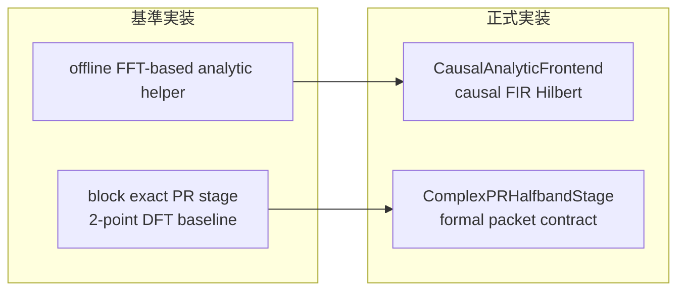
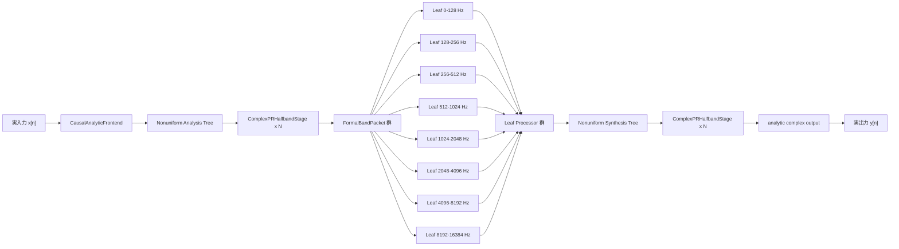
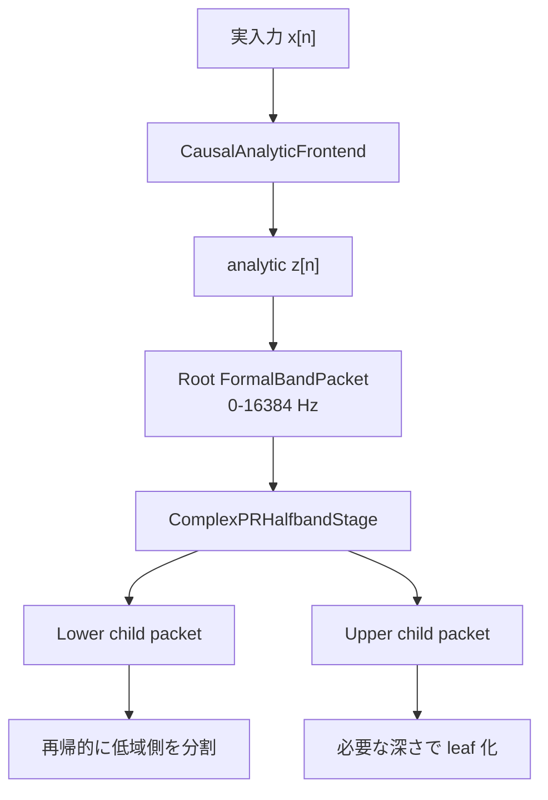
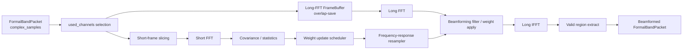
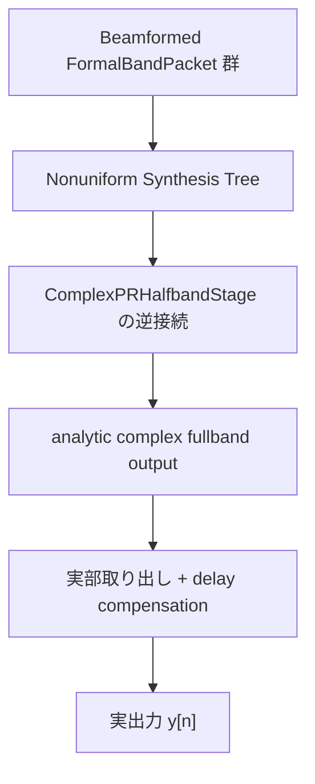

# Nonuniform FilterBank 正式処理詳細図

## 1. 目的

本書は、不均一複素フィルタバンクの正式版処理構造を
図式で固定するための補助設計書である。

ここでは特に、

- 基準実装と正式実装の違い
- `CausalAnalyticFrontend`
- `ComplexPRHalfbandStage`
- leaf 内の `long FFT + short FFT`
- 合成側の戻し方

を見える形で整理する。

---

## 2. 基準実装と正式実装の違い

差し替え対象は以下の 2 点である。

- 木の前段: `offline helper -> CausalAnalyticFrontend`
- 木の内部 stage: `block exact PR -> ComplexPRHalfbandStage`

leaf 内の `long FFT + short FFT` 処理骨格は、
正式版でもそのまま使う。

---

## 3. 正式版の全体構造

---

## 4. 解析側の詳細

このとき packet 規約は、

- lower-edge 基準
- `sample_rate_hz = 2 * bandwidth_hz`
- `delay_samples_at_root_rate`
- `time_origin_at_root_rate`

で固定する。

---

## 5. leaf 内部の詳細

重要点:

- `short FFT` は `long FFT` の内部段ではない
- `short FFT` は leaf 入力から並列に分岐する
- `short FFT` 側で作った周波数依存重みを
  `Frequency-response resampler` で long FFT 応答へ変換してから
  overlap-save 本処理へ渡す

これは均一帯域 DFT フィルタバンク版と同じ責務分離である。

---

## 6. 合成側の詳細

合成側で重要なのは、

- leaf ごとの delay metadata
- stage ごとの遅延加算
- front-end の整数遅延補償

を最終実出力まで一貫して追跡することである。

---

## 7. 実装済みの正式部品

現時点で正式版として追加した部品は以下である。

- `src/spflow/filterbank/causal_analytic_frontend.py`
- `src/spflow/filterbank/formal_complex_pr_stage.py`
- `src/spflow/filterbank/formal_nonuniform_tree.py`
- `src/spflow/filterbank/formal_nonuniform_streaming.py`
- `src/spflow/filterbank/nonuniform_leaf.py`

これにより、

- causal analytic front-end
- formal packet 契約を持つ stage
- formal full tree 接続
- leaf 内 `long FFT + short FFT`

の 4 要素はコード上に揃った。

---

## 8. 現時点での Pending

まだ残っているのは以下である。

1. `ComplexPRHalfbandStage` の係数を `>= 80 dB` 級まで高選択度化すること
2. interferer / real-input streaming を含む MVDR 実用評価を完了すること
3. 最終処理量比較へ front-end / short FFT / tree 本体コストを入れること

---

## 9. 現時点での結論

正式版処理構造は、

- `CausalAnalyticFrontend`
- `ComplexPRHalfbandStage`
- `FormalBandPacket`
- leaf ごとの `long FFT + short FFT`
- metadata つき synthesis

から成る。

基準実装との差は、

- front-end を causal 化したこと
- stage を formal packet 契約に載せたこと

であり、
leaf 内の beamforming 骨格は正式版でもそのまま使う。
