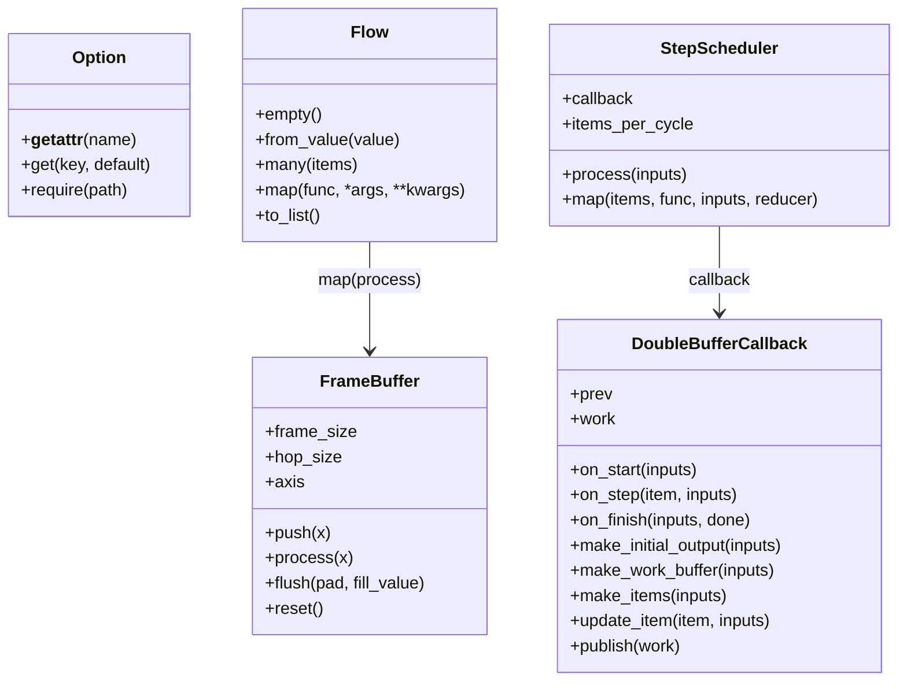

# spflow 基本設計書

## 1. 目的

`spflow` は、逐次信号処理を Python で書きやすくするための軽量ユーティリティ群である。

本ライブラリは、信号処理アルゴリズムそのものを提供する大規模なフレームワークではない。STFT、ビームフォーミング、MVDR、検出器、可視化処理などの実装を、継承クラスや DAG 定義に押し込めることを目的としない。

本ライブラリの目的は、ユーザが自分で書いた信号処理コードに対して、以下の実装上の面倒を軽くすることである。

```text
1. 逐次入力から処理フレームを切り出す
2. オーバーラップ処理を扱う
3. 入力レートと処理レートの差を扱う
4. 0個・1個・複数個の出力を同じ形で次段へ流す
5. 周波数ビンなどの反復処理を簡潔に書く
6. 重い処理を複数周期に分割し、完成値だけ外部へ公開する
7. 設定値を軽量に扱う
```

従来の SPFW は、Excel で処理フローを定義し、各処理を Block として接続する方向で検討していた。しかし、この方式では分岐・合流・Adapter・細かい処理単位の整合が重くなり、ユーザ実装の自由度を下げやすい。

`spflow` では、処理の流れは Python コードとして書く。ライブラリは、ユーザの処理構造を強制せず、逐次信号処理で頻出する補助機能だけを提供する。

---

## 2. 設計方針

### 2.1 フレームワークではなくユーティリティ群とする

`spflow` は、ユーザに以下を強制しない。

```text
- Processor 基底クラスの継承
- Block クラスの実装
- DAG 定義
- Excel による接続定義
- yield による実行モデル
- Runtime クラスの利用
```

ユーザは、通常の Python 関数、通常の Python クラス、通常の変数代入で処理を記述する。

`spflow` が提供するのは、以下の中核ユーティリティである。

```text
Option
    dotアクセス可能な設定辞書

Flow
    0個・1個・複数個のデータ流を吸収する軽量コンテナ

FrameBuffer
    連続入力を処理フレームへ切り出すバッファ

StepScheduler
    周波数ビンなどの item 列を1周期または複数周期に分けて処理するスケジューラ

DoubleBufferCallback
    分割更新中は前回完成値を返す callback 基底
```

### 2.2 処理の流れは Python で書く

処理フローは、ライブラリ側の Graph や DAG に記述しない。ユーザは Python の関数として、次のように書く。

```python
def process_frame(x, env):
    return (
        Flow.from_value(x)
        .map(env.input_buffer.process)
        .map(calc_fft, env)
        .map(beamforming_process, env)
        .to_list()
    )
```

ここで `env` は、ユーザが自由に定義する処理環境である。`spflow` は `Runtime` を標準提供しない。必要な Processor、Buffer、Scheduler、Probe などは、ユーザ側で保持する。

### 2.3 Processor は自由形式とする

Processor は `spflow` が定める厳密なクラスではない。

```text
状態なし処理:
    関数でよい

状態あり処理:
    クラスでよい

重い初期化が必要な処理:
    ユーザ側の env に保持すればよい
```

例：

```python
def calc_power(X):
    return np.abs(X) ** 2

class STFTProcessor:
    def __init__(self, opt):
        self.nfft = opt.stft.nfft
        self.window = opt.stft.get("window", "hann")

    def process(self, x):
        ...
```

`spflow` は Processor の継承やメタ情報記述を要求しない。実装の心理的ハードルを下げることを優先する。

---

## 3. 最小利用イメージ

最小構成では、逐次入力 `x` を受け取り、Buffer でフレーム化し、FFT し、パワーを計算する。

```python
from types import SimpleNamespace
import numpy as np

from spflow import Option, Flow, FrameBuffer


def make_env(opt):
    env = SimpleNamespace()
    env.opt = opt
    env.input_buffer = FrameBuffer(
        frame_size=opt.stft.nfft,
        hop_size=opt.stft.hop,
        axis=-1,
    )
    return env


def calc_fft(frame, env):
    return np.fft.fft(frame, n=env.opt.stft.nfft, axis=-1)


def calc_power(X):
    return np.abs(X) ** 2


def process_frame(x, env):
    return (
        Flow.from_value(x)
        .map(env.input_buffer.process)
        .map(calc_fft, env)
        .map(calc_power)
        .to_list()
    )
```

実行側は以下のようになる。

```python
raw_opt = {
    "stft": {
        "nfft": 1024,
        "hop": 512,
        "window": "hann",
    }
}

opt = Option(raw_opt)
env = make_env(opt)

for _ in range(n_step):
    x = source.next_frame()
    ys = process_frame(x, env)

    for y in ys:
        handle_output(y)
```

`process_frame()` の戻り値は常に list とする。

```text
[]
    出力なし

[y]
    1個出力

[y1, y2, ...]
    複数出力
```

---

## 4. 全体処理フロー

`spflow` の概念的な処理フローは以下である。

```text
逐次入力 x
  ↓
Flow.from_value(x)
  ↓
Flow.map(...)
  ↓
FrameBuffer.process(x) など
  ↓
0個・1個・複数個のデータ
  ↓
Flow.map(...)
  ↓
ユーザ処理
  ↓
Flow.to_list()
```

重要なのは、`Flow` 自体が処理レートを持つわけではないことである。

```text
処理レート差を作る部品:
    FrameBuffer / Repeat など

0個・1個・複数個の出力を自然に次段へ流す部品:
    Flow
```

例えば、`FrameBuffer` が `[]` を返せば、後段の `.map()` は実行されない。`FrameBuffer` が `[frame1, frame2]` を返せば、後段の `.map()` は2回実行される。

---

## 5. モジュール構成

推奨する最小構成は以下である。

```text
spflow/
├── __init__.py
├── option.py
├── flow.py
├── buffer.py
├── scheduler.py
└── callback.py
```

公開 API は以下とする。

```python
from spflow import (
    Option,
    Flow,
    FrameBuffer,
    StepScheduler,
    DoubleBufferCallback,
)
```

---

## 6. Option の設計

### 6.1 目的

`Option` は、ネストした辞書を dot アクセス可能にする軽量ラッパーである。

設定値を dataclass として厳密に定義し始めると、Processor ごとの Config クラス定義が増え、ユーザ実装の心理的ハードルが上がる。

そのため、初期設計では以下の方針とする。

```text
- 設定値は dict で書く
- Option で dot アクセス可能にする
- 存在しないキーは分かりやすいエラーにする
- Excel / TOML / YAML / INI などの入力方式は後から Option へ変換する
```

### 6.2 利用例

```python
raw_opt = {
    "env": {
        "fs": 32768,
        "c": 1500.0,
    },
    "stft": {
        "nfft": 1024,
        "hop": 512,
        "window": "hann",
    },
    "array": {
        "pos": pos,
    },
}

opt = Option(raw_opt)

fs = opt.env.fs
c = opt.env.c
nfft = opt.stft.nfft
hop = opt.stft.hop
pos = opt.array.pos
```

存在しない値を読んだ場合は、以下のようなエラーとする。

```text
opt.stft.nfft の定義がありません。
```

### 6.3 API

```python
opt.env.fs
opt.stft.nfft
opt.stft.get("window", "hann")
opt.require("stft.nfft")
```

`require()` はドットパスを受け取れる。

```python
opt.require("env.fs")
opt.require("stft.nfft")
```

---

## 7. Flow の設計

### 7.1 目的

`Flow` は、処理結果が 0個・1個・複数個になることを吸収する軽量コンテナである。

逐次信号処理では、入力1回に対して出力が毎回1個とは限らない。

```text
FrameBuffer:
    入力不足なら []
    1フレームできたら [frame]
    複数フレームできたら [frame1, frame2, ...]

Repeat:
    1入力から [x, x, x, x] を返す

フィルタや検出器:
    条件を満たさなければ None
```

`Flow` は、これらの戻り値を同じ形で次段へ流す。

### 7.2 Flow はレート制御部品ではない

混同を避けるため、以下を明確にする。

```text
Flow:
    データ個数の変化を吸収する

FrameBuffer:
    フレーム化、オーバーラップ、処理レート差を扱う

StepScheduler:
    重い反復処理を分割する
```

`Flow` が処理レートを決めるわけではない。`Flow` は、Buffer や Repeat が返した `[]` / `[x]` / `[x1, x2, ...]` を自然に次段へ運ぶだけである。

### 7.3 API

```python
Flow.empty()
Flow.from_value(x)
Flow.many(items)

flow.map(func, *args, **kwargs)
flow.to_list()
```

`Flow`は継承用の基底クラスではなく、完成した軽量コンテナとして提供する。
継承による拡張は公開契約に含めず、`from_value`と`many`は常に`Flow`を返す。
処理の追加はsubclass methodではなく、`map`へ渡す通常の関数、または状態を持つ独立クラスで行う。
これによりFlowの型引数を項目型だけに限定し、独自Processor階層を導入しない。

### 7.4 map の戻り値規約

`Flow.map()` に渡す関数は、以下の戻り値を返せる。

```text
None:
    次段へ流さない

単一データ y:
    y を1個流す

list:
    list の各要素を次段へ流す

Flow:
    Flow の中身を次段へ流す
```

`Flow[T]`の型引数`T`は項目型だけを表し、項目数や処理レートを固定しない。
例えば`Flow[Frame]`は、入力周期ごとに0個・1個・複数個の`Frame`を保持できる。
`map`は入力項目型`T`とcallback出力項目型`R`を接続し、`Flow[R]`を返す。

`None`はAPI境界によって意味が異なる。`Flow.from_value(None)`は`None`を1項目として
現在段へ渡すため、値がない周期でも状態更新を実行できる。これに対し、`map`へ渡した
callbackが返す`None`は「完成出力なし」を表し、次段を呼ばない。Generic化はこの実行時規約を
変更せず、各段が受け取る項目型だけを型検査器へ伝える。

### 7.5 利用例

```python
def process_frame(x, env):
    return (
        Flow.from_value(x)
        .map(env.input_buffer.process)
        .map(calc_fft, env)
        .map(calc_power)
        .to_list()
    )
```

これは通常の Python で書くと以下と同等である。

```python
def process_frame(x, env):
    frames = env.input_buffer.process(x)

    outputs = []
    for frame in frames:
        X = calc_fft(frame, env)
        P = calc_power(X)
        outputs.append(P)

    return outputs
```

`Flow` は、この `for` を隠蔽するための補助である。

### 7.6 Flow から通常の Python に戻る

`Flow` は強制的な書き方ではない。途中で `to_list()` すれば、通常の Python 処理に戻せる。

```python
def process_frame(x, env):
    flow = Flow.from_value(x)
    flow = flow.map(env.input_buffer.process)

    frames = flow.to_list()

    outputs = []
    for frame in frames:
        X = calc_fft(frame, env)
        Y = beamforming_process(X, env)
        outputs.append(Y)

    return outputs
```

---

## 8. FrameBuffer の設計

### 8.1 目的

`FrameBuffer` は、連続入力を処理フレームへ切り出す独立ユーティリティである。

責務は以下である。

```text
- 入力を内部に蓄積する
- frame_size 分のデータを切り出す
- hop_size 分だけ読み出し位置を進める
- 0個・1個・複数個のフレームを返す
- flush 時に残りデータを扱う
```

`FrameBuffer` は STFT 専用ではない。以下のような用途に使える。

```text
STFT用フレーム切り出し
RMS計算
移動平均
スナップショット生成
検出器の積分窓
特徴量抽出
処理レート変換
```

### 8.2 オーバーラップと処理レート差

オーバーラップと処理レート差は別概念であり、競合しない。

```text
オーバーラップ:
    出力フレーム同士が入力サンプルを共有するか
    frame_size と hop_size の関係で決まる

処理レート差:
    1回の push 入力サイズと、1回の出力に必要な hop_size が一致するか
```

例えば、以下の場合を考える。

```text
input_size = 128
frame_size = 1024
hop_size   = 512
```

この場合、50% オーバーラップしつつ、4回の入力ごとに1フレーム出力される。

```text
オーバーラップ:
    frame_size 1024 に対して hop_size 512 なので発生する

処理レート差:
    input_size 128 に対して hop_size 512 なので発生する
```

### 8.3 API

```python
buffer = FrameBuffer(
    frame_size=1024,
    hop_size=512,
    axis=-1,
)

frames = buffer.push(x)
frames = buffer.process(x)
frames = buffer.flush(pad=True, fill_value=0.0)
buffer.reset()
```

`process()` は `push()` と同じ意味を持つ。

```python
def process(self, x):
    return self.push(x)
```

これは `Flow.map(env.input_buffer.process)` で使いやすくするためである。

### 8.4 戻り値

```text
[]:
    出力なし

[frame]:
    1フレーム出力

[frame1, frame2, ...]:
    複数フレーム出力
```

これにより、`Flow` と自然に接続できる。

```python
Flow.from_value(x)
    .map(env.input_buffer.process)
    .map(calc_fft, env)
```

---

## 9. StepScheduler の設計

### 9.1 目的

`StepScheduler` は、周波数ビン、ビーム、フレームチャンクなどの item 列に対して、同じ処理を適用するための軽量スケジューラである。

主な用途は以下である。

```text
- 周波数ビンごとの処理
- ビームごとの処理
- フレームチャンクごとの処理
- 重い処理を1周期ですべて処理する
- 重い処理を複数周期に分割する
```

### 9.2 一発 map 処理

全 item を1回で処理したい場合は `StepScheduler.map()` を使う。

```python
W = StepScheduler.map(
    items=range(n_bin),
    func=mvdr_weight_one_bin,
    inputs=inputs,
    reducer=collect_mvdr_weight,
)
```

各引数の意味は以下である。

```text
items:
    反復処理する対象
    例: 周波数ビン番号 0, 1, ..., n_bin-1

func:
    1 item 分の処理関数

inputs:
    各 item 処理で共有する入力データ

reducer:
    各 item の処理結果を最終出力へまとめる関数
```

内部的には、以下と同等である。

```python
results = []

for item in items:
    result = func(item, inputs)
    results.append(result)

out = reducer(results, inputs)
```

### 9.3 inputs の名称

`ctx` という名称は曖昧であるため、`StepScheduler` へ渡す局所データは `inputs` と呼ぶ。

```text
env:
    ユーザが保持する長寿命の処理環境
    Processor, Buffer, Scheduler, Probe などを置く

inputs:
    一つの時間分割周期で固定する局所入力snapshot
    共分散、steering、generationなどを置く
```

例：

```python
def beamforming_process(X, covariance, generation, env):
    snapshot = MVDRWeightSnapshot(
        covariance=covariance,
        steering=env.steering,
        generation=generation,
    )

    H = env.mvdr_scheduler.process(snapshot)
    Y = apply_beamformer(X, H)

    return Y
```

### 9.4 複数周期に分割する処理

重い処理は、1回の `process()` で全 item を処理せず、N個ずつ処理できる。

```python
scheduler = StepScheduler(
    callback=MVDRWeightCallback(diag_load=1e-3),
    items_per_cycle=4,
)

W = scheduler.process(snapshot)
```

`items_per_cycle` の意味は以下である。

```text
None:
    1周期ですべて処理する

1:
    1周期に1 itemだけ処理する

N:
    1周期にN item処理する
```

デフォルトは `None` とする。通常の関数的な使い方では、1回呼んだら完成結果が返る方が直感的だからである。

同じgenerationの処理中は、最初に受け取ったsnapshotだけを全itemへ渡す。後続周期に
同じgenerationの別objectが渡されても混在させない。また、適応ビームフォーマの共分散と
steeringは`MVDRWeightSnapshot`生成時にcopyして読み取り専用にし、元配列のin-place更新が
進行中計算へ影響しないようにする。新しいgenerationが到着した場合は、旧generationの
未完成作業を破棄する。

### 9.5 Flowとの接続

最新の完成値を毎周期使う場合は、従来どおり`process()`を直接接続する。

```python
coefficients = Flow.from_value(snapshot).map(scheduler.process).to_list()
```

未完成周期にも、前回完成値または安全側の初期値が1個流れる。信号を毎周期処理する
適応ビームフォーマでは、この経路を使う。

新しい完成値が生成された周期だけを後段へ流す場合は、`process_result()`の固定結果型と
`updated_value()`を使う。

```python
updated_coefficients = (
    Flow.from_value(snapshot)
    .map(scheduler.process_result)
    .map(lambda result: result.updated_value())
    .to_list()
)
```

未完成周期の`updated_value()`は`None`であり、`Flow`が0出力として扱う。これにより、
`Flow`は処理レートを決めず、`StepScheduler`の完成状態だけを0個・1個の値へ変換できる。

---

## 10. DoubleBufferCallback の設計

### 10.1 目的

`DoubleBufferCallback` は、重い処理を複数周期に分割する場合に、未完成の作業値を外へ出さず、常に前回完成値だけを返すための callback 基底である。

### 10.2 基本動作

```text
prev:
    外へ返す前回完成値

work:
    現在更新中の作業値
```

動作は以下である。

```text
初回:
    prev を安全側の完成値で初期化する

処理中:
    work を少しずつ更新する
    外へは prev を返す

全 item 完了時:
    prev = work に切り替える
    外へ新しい prev を返す
```

この方式により、Nビンずつ処理する場合でも、後段へ未完成の重みや途中結果を流さずに済む。
初期値の意味はcallback固有であり、適応ビームフォーマでは無音となるゼロ係数ではなく、
目標方向を無歪で通す固定ビームフォーマ係数を使う。

### 10.3 ユーザが実装するメソッド

```python
class XxxCallback(DoubleBufferCallback[InputSnapshot, int, OutputArray]):
    def make_initial_output(self, inputs):
        ...

    def make_work_buffer(self, inputs):
        ...

    def make_items(self, inputs):
        ...

    def update_item(self, item, inputs):
        ...
```

### 10.4 内部 callback API

`StepScheduler` から見る callback API は以下である。

```python
on_start(inputs)
on_step(item, inputs)
on_finish(inputs, done)
```

ただし、`DoubleBufferCallback` を使う場合、ユーザは通常これらを直接実装しない。

---

## 11. MVDR係数計算の例

### 11.1 方針

MVDRは、ビームフォーマ出力までをScheduler内で作らず、係数計算と係数適用を分ける。

```text
StepScheduler:
    周波数ビンごとにMVDR実適用係数Hを計算する

apply_beamformer:
    Hを共役せずXに適用する
```

これにより、以下が容易になる。

```text
- Hを保存する
- Hを可視化する
- Hの指向性を確認する
- 同じHを別のXに適用する
- Bartlett / MVDR などで後段を共通化する
```

### 11.2 一発処理の例

```python
def mvdr_weight_one_bin(bin_idx, inputs):
    X = inputs["X"]
    A = inputs["A"]
    diag_load = inputs.get("diag_load", 1e-3)

    Xf = X[:, bin_idx, :]        # (n_ch, n_frame)
    Af = A[:, :, bin_idx]        # (n_ch, n_beam)

    R = Xf @ Xf.conj().T / Xf.shape[1]

    load = diag_load * np.trace(R).real / R.shape[0]
    R = R + load * np.eye(R.shape[0])

    Z = np.linalg.solve(R, Af)
    denom = np.sum(Af.conj() * Z, axis=0)

    theoretical_weights = Z / denom[np.newaxis, :]
    Hf = np.conj(theoretical_weights)

    return bin_idx, Hf


def collect_mvdr_weight(results, inputs):
    A = inputs["A"]
    n_ch, n_beam, n_bin = A.shape

    H = np.zeros((n_ch, n_beam, n_bin), dtype=np.complex64)

    for bin_idx, Hf in results:
        H[:, :, bin_idx] = Hf

    return H
```

呼び出し例：

```python
inputs = {
    "X": X,
    "A": A,
    "diag_load": 1e-3,
}

H = StepScheduler.map(
    items=range(X.shape[1]),
    func=mvdr_weight_one_bin,
    inputs=inputs,
    reducer=collect_mvdr_weight,
)
```

### 11.3 複数周期分割処理の例

帯域ごとのMVDR数式を利用者側へ複製せず、公開済みの`MVDRWeightCallback`と
`MVDRWeightSnapshot`を組み合わせる。

```python
env.mvdr_scheduler = StepScheduler(
    callback=MVDRWeightCallback(diag_load=opt.mvdr.get("diag_load", 1e-3)),
    items_per_cycle=4,
)


def beamforming_process(X, covariance, generation, env):
    snapshot = MVDRWeightSnapshot(
        covariance=covariance,
        steering=env.steering,
        generation=generation,
    )
    coefficients = env.mvdr_scheduler.process(snapshot)
    Y = apply_beamformer_bands(X, coefficients)

    return Y
```

初回に`items_per_cycle=4`で未完了の場合、`coefficients`は同じsteeringから設計した
固定CBF実適用係数である。これは`h^T a=1`を満たすため、適応係数が未完成でも目標方向の
信号を消失させない。全帯域が完了した周期に限り、完成したMVDR実適用係数へ切り替える。

---

## 12. ユーザ側 env の設計

`spflow` は `Runtime` クラスを提供しない。ユーザは、自分のプロジェクトで自由に `env` を作る。

例：

```python
from types import SimpleNamespace


def make_env(opt):
    env = SimpleNamespace()
    env.opt = opt

    env.input_buffer = FrameBuffer(
        frame_size=opt.stft.nfft,
        hop_size=opt.stft.hop,
    )

    env.stft = STFTProcessor(opt)

    env.steering = make_steering_vector(
        pos=opt.array.pos,
        beam_axis=opt.beam.axis,
        freq_axis=opt.freq.axis,
        c=opt.env.c,
    )

    env.mvdr_scheduler = StepScheduler(
        callback=MVDRWeightCallback(diag_load=opt.mvdr.get("diag_load", 1e-3)),
        items_per_cycle=opt.mvdr.get("items_per_cycle", None),
    )

    env.probes = {}

    return env
```

`env` はフレームワークの一部ではなく、ユーザ実装の都合で作る部品置き場である。

---

## 13. 非採用とする設計

`spflow` では、以下を標準設計に含めない。

```text
Runtime
    初期化済み部品の置き場はユーザが自由に作る

Block
    処理の区切りは Flow.map() と通常の関数分割で表現する

Stage / ChainRunner
    Flow が 0個・1個・複数個のデータ伝播を吸収するため不要

ProcessorBase
    Processor は通常の関数またはクラスでよい

ProcessorHelpMixin
    実装の心理的ハードルを下げるため一旦導入しない

Excel DAG
    処理フローは Python コードで書く

yield 前提 API
    フレーム単位の逐次実行は source.next_frame() などで表現すればよい
```

---

## 14. ファイル構成案

ライブラリ側：

```text
spflow/
├── __init__.py
├── option.py
├── flow.py
├── buffer.py
├── scheduler.py
└── callback.py
```

ユーザプロジェクト側の一例：

```text
project/
├── main.py
├── opt.py
├── env.py
├── process.py
├── processors/
│   ├── stft.py
│   ├── beamformer.py
│   └── mvdr.py
└── utils/
```

---

## 15. クラス図



---

## 16. 設計上の要点

`spflow` の要点は以下である。

```text
Flow:
    処理レート差そのものは持たない。
    0個・1個・複数個の出力を吸収する。

FrameBuffer:
    フレーム化、オーバーラップ、処理レート差を扱う。

StepScheduler:
    周波数ビンなどの反復処理を扱う。

DoubleBufferCallback:
    複数周期に分割する重い処理で、未完成値を外へ出さない。

Option:
    設定値の受け渡しを軽くする。
```

この設計により、ユーザは Processor や Block の厳密な継承を意識せず、通常の Python 関数として信号処理を記述できる。

---

## 17. 実装済み API の参照

部品数の増加に対して、利用者が既存機能を再実装せずに発見できるよう、
次の二つの出力を同じ生成ツールから作る。

- `doc/SpFlow/実装済み機能一覧.md`: module の責務、import パス、公開クラス・関数を検索するための索引
- `build/api-docs/`: 型、引数、戻り値、docstring を参照するための pdoc HTML

一覧の情報源は Python の module docstring、公開定義、`__all__` とし、実装と別の台帳を
手作業で維持しない。生成は `python tools/build_api_docs.py`、一覧の更新漏れの検査は
`python tools/build_api_docs.py --check` で行う。HTML は閲覧用の生成物であるため Git 管理せず、
レビュー可能な Markdown 一覧だけを Git 管理する。

この仕組みは API を独自モデルへ登録させるものではない。通常の Python の docstring と型注釈を
情報源とすることで、ドキュメント生成のための規約が信号処理コードの構造を支配しないようにする。

---

## 18. 今後の拡張候補

初期実装では含めないが、将来的に以下を検討できる。

```text
- StepScheduler の thread/process 並列化
- Flow の debug 表示
- Option の TOML / YAML / Excel ローダ
- FrameBuffer の複数軸対応強化
- DoubleBufferCallback の辞書型 work 対応
- Probe ユーティリティ
```

ただし、初期実装では機能を増やしすぎず、以下の5点に絞る。

```text
Option
Flow
FrameBuffer
StepScheduler
DoubleBufferCallback
```
