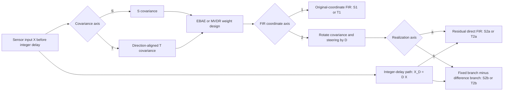
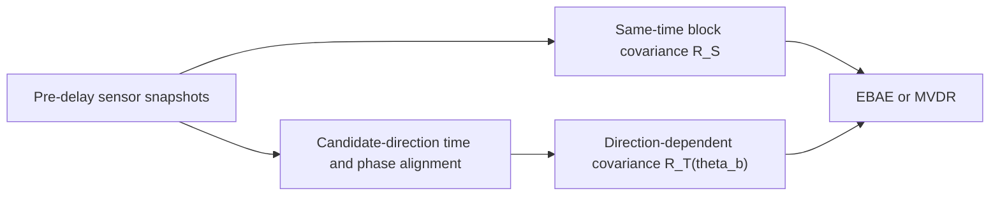
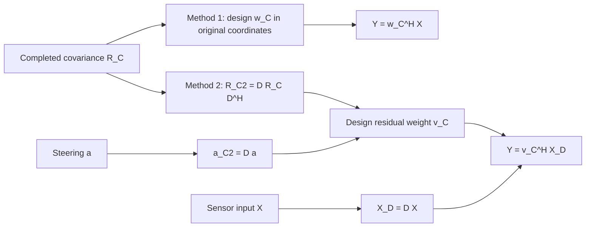
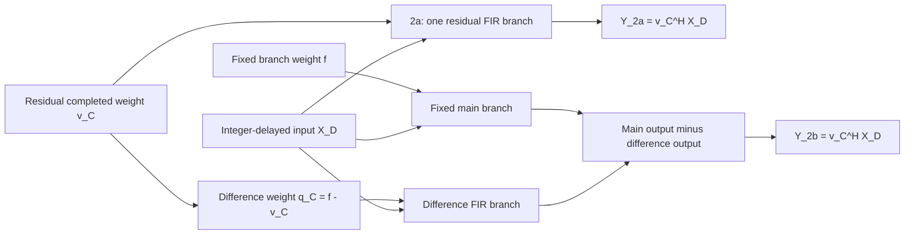

# 整相方式 設計結果

## 1. 目的と責務範囲

本書は、粗い分析幅の共分散から設計したMVDR重みを用いる整相方式について、整数遅延の寄与、方位別時間切り出し共分散との接続、運用上の成立条件をまとめる。

共分散の生成方式、方位選択性、積分schedule、完成状態の設計結果は`方位別時間切り出し共分散設計結果.md`を正とし、本書で再定義しない。本書は完成済み共分散を受け取った後の重み設計と整相出力を責務とする。

方位別時間切り出し共分散を使うことは前提であり、同一時間block共分散の旧方式は整相方式候補に含めない。調査する問いは次の2つである。

1. 方位別共分散から作ったMVDR重みを、整数遅延なしの元の多channel信号へ直接適用できるか。
2. 前段に整数遅延を置く方式と比べ、target波形、干渉抑圧、連続性、計算量、latencyのどこに実装上の差が出るか。

## 2. 理想MVDRにおける整数遅延の等価性

周波数bin `k`の入力を`X[k]`、共分散を`R[k]`、target steeringを`a[k]`とする。channelごとの整数遅延`d_i`は、対角unitary行列

\[
D[k]=\operatorname{diag}\left(e^{-j2\pi f_k d_i/f_s}\right)
\]

で表される。遅延後入力、共分散、steeringは、同じ符号規約で

\[
X_D[k]=D[k]X[k],\qquad
R_D[k]=D[k]R[k]D[k]^H,\qquad
a_D[k]=D[k]a[k]
\]

と変換する。このときMVDR重みは

\[
w[k]=\frac{R[k]^{-1}a[k]}{a[k]^H R[k]^{-1}a[k]},\qquad
w_D[k]=D[k]w[k]
\]

であり、

\[
w_D[k]^H X_D[k]=w[k]^H X[k]
\]

が成り立つ。したがって、無限長、完全な時刻同期、同一の共分散標本、整合したsteeringという理想条件では、整数遅延の有無だけでMVDR出力は改善しない。この等価性を数値誤差レベルで確認することを最初の基準試験とする。

整数遅延の寄与は、この等価性が崩れる実装条件で評価する。具体的には、残留小数遅延の大きさ、有限長FIR近似誤差、FFT bin内の広帯域位相差、block境界の履歴不足、異なる時間区間から作った共分散、weight更新時の不連続、整数遅延bufferによるlatencyである。

現行の方位別時間切り出しは、channelごとに到来遅延した区間を取得する。ただし、異なる時刻から切り出したFFTは、切り出し開始時刻の差による位相差も含む。そこで`exp(-j2πfΔt)`を掛け、この「切り出し時刻差の位相」だけを取り除いてから共分散を作る。

この処理後の共分散は、元の多channel入力と同じchannel位相基準を持つ。したがって、この共分散から設計したweightを整数遅延なし入力へ直接適用できるかが、今回の主検証仮説である。

一方、前段でchannelごとに整数遅延を与える場合は、信号のchannel位相もその分だけ変わる。そのため共分散とsteeringにも同じ整数遅延分のchannel位相補正を与える。後述の`R_D=D R D^H`と`a_D=D a`は、この「前段の整数遅延に重みの位相基準を合わせる処理」を表す。

## 3. 比較方式

主比較は、同じ完成済み方位別時間切り出し共分散を使う次の2方式とする。

| 方式名 | 信号経路 | 共分散とsteeringの扱い | 検証目的 |
|---|---|---|---|
| 直接MVDR | 元の多channel信号へMVDR重みを直接適用 | 切り出し時刻差の位相補正後の完成共分散と物理steeringをそのまま使用 | 整数遅延bufferなしで正しい整相出力が得られるか |
| 整数遅延前段MVDR | channelごとの整数遅延後にMVDR重みを適用 | 完成共分散とsteeringのchannel位相を、前段の整数遅延分だけ合わせ直して使用 | 整数遅延bufferが波形、境界、実装量に与える差を確認 |

整数遅延前段MVDRでsteeringを全channel共通の`1`に固定してはならない。整数sampleへの丸め後には最大0.5 sample相当の相対遅延が残るため、その残留位相を拘束steeringに残す。

上記の主比較が成立した後に、「整数遅延+小数遅延固定整相」と「固定整相-差分MVDR」を運用比較として追加する。

## 4. 評価ケースと成分分解

両方式は、同じ入力波形、同じ観測時間、同じ完成済み方位別共分散、同じdiagonal loading規約、同じweight更新時刻で比較する。異なるのは、整数遅延bufferを信号経路に置くかと、それに合わせて共分散・steeringのchannel位相を補正するかだけである。

1. `target-only`、空間雑音なしで直接MVDRの成立性、2方式の整相出力一致、歪みなし拘束、出力波形を確認する。
2. `noise-only`、channel無相関等分散雑音で、観測出力powerと`w^H R_n w`を照合する。
3. `interferer-only`、targetと同一周波数帯の独立干渉音に対する保護beamへの漏れ量を比較する。
4. `target+interferer+noise`で、成分別powerから混合出力が説明できることを確認する。
5. 低周波、中間周波、高周波、broadside、中間方位、endfireに展開する。

単一図だけで判定せず、target-only、noise-only、interferer-only、mixedのBLを同一方位軸、同一表示範囲、同一基準で保存する。BLは待受beam方位軸であることを明記し、一つの保護weightを固定して入力方位をsweepするbeam patternと混同しない。

## 5. 必須指標

`fixed_beam_single_source`と`slc_same_frequency_interference`の評価基準を併用し、次を必須とする。

- 歪みなし拘束`|w^H a|`と位相誤差。
- target-onlyの入力帯域積分RMSに対する出力level差`dB re input RMS`。
- target peak方位誤差、-3 dB幅、第一null幅、guard外peak。
- interferer-onlyの保護beam漏れlevelと固定整相からの低減量`dB re fixed beamformer output`。
- noise-onlyの実測power、`w^H R_n w`、white-noise gain。
- 出力波形のRMS、peak、NaN/inf、入力との相互相関、群遅延補正後の波形RMS誤差。
- 共分散のHermitian誤差、最小固有値、loading前後の条件数、weight norm、fallback率。
- block境界とweight更新境界のjump RMS、正常時jump RMSとの比。
- 1 block当たりの実行時間、実時間比、履歴buffer量、algorithmic latency。

理想等価性試験では、beam patternだけでなく、2方式のcomplex出力最大絶対誤差とRMS誤差を直接比較する。その後、実時系列で波形誤差、block境界、latency、必要buffer量の差を比較する。運用上の採否閾値は、この数式同値性確認と代表条件の成分分解が完了した後に固定する。

## 6. 検討順序と判定

実装と評価は次の順序で進める。

1. offlineの複素スペクトルで2方式の等価性を確認し、符号、共役、正規化、axisを固定する。
2. 方位別時間切り出し共分散から直接MVDR用weightを作り、整数遅延なし入力へ適用する。
3. 同じ完成共分散から整数遅延前段MVDR用weightを作り、実時系列で2方式を比較する。
4. target-only、noise-only、interferer-only、mixedで波形と成分別powerを確認する。
5. 初回、終端、block境界、weight切替、latency、実時間比を評価する。

### 6.1 評価scenario空間

整数遅延の寄与は単一周波数・単一方位では判定しない。次の軸を明示的に組み合わせ、各scenarioに安定したIDを与える。

| 評価軸 | 必須条件 |
|---|---|
| 周波数帯 | 低周波、中間周波、高周波 |
| 低周波代表 | 40--60 Hz、80--120 Hz、100 Hz tone、256 Hz未満の代表tone |
| 分析幅 | 16、32、64、128、256 Hz |
| 信号帯域 | bin中心tone、bin非整合tone、狭帯域雑音、1 bin広帯域、複数bin広帯域 |
| target方位 | 0、10、30、60、90、120、150、170、180 deg |
| 必須難条件 | 低周波×0/180 deg endfire、低周波×10/170 deg近傍endfire |
| 信号数 | 1、2、3 |
| 複数信号の周波数関係 | 同一toneでcoherent、同一帯域で独立、近接周波数、部分帯域重複、帯域非重複 |
| 複数信号の方位関係 | 同一待受beam内、-3 dB幅以内、近接beam、十分に分離、両endfire |
| 入力成分 | target-only、noise-only、interferer-only、target+interferer+noise |
| SNR | -10、0、+10、+20 dBとnoiseなし |
| 積分・更新 | 積分初期、定常後、source方位切替、source数変化、weight更新境界 |

「狭帯域」は単一toneだけを意味しない。周波数binに整合するtoneと整合しないtone、狭帯域雑音を分ける。「広帯域」も1 bin内に収まる信号と複数binへまたがる信号を分ける。これは、粗い分析幅でのbin内coherence問題と、複数binの出力統合問題を混同しないためである。

複数信号は、単にsource数だけを増やさない。同一周波数で位相固定のcoherent sourceと、同一帯域で時系列が独立なsourceは共分散rankが異なるため別scenarioとする。また、targetとinterfererが同一待受beamまたは主ローブ内にある条件は、通常MVDRの分離限界を評価する難条件として保持する。

### 6.2 DC binと空間aliasの分離

低周波信号が粗い分析幅でDC binへ入る条件は必ず実行する。ただしDCでは物理steeringが全方位で同一になるため、通常MVDRで方位scanできない。この場合は、直接MVDRまたは整数遅延前段MVDRの失敗と記録せず、`MVDR_NOT_APPLICABLE_DC_BIN`として別集計する。

高周波のgrating lobeは、分析幅による共分散破綻とは原因が異なる。必ずspacing/wavelengthを記録し、空間alias条件は`SPATIAL_ALIAS_PRESENT`を付ける。これにより、整数遅延の有無で解決できない物理的曖昧性を方式破綻と誤認しない。

### 6.3 完了条件

全scenarioについて、直接MVDRと整数遅延前段MVDRの両方を同一入力、同一完成共分散、同一weight更新時刻で実行する。各scenarioは最低でもtarget-only、noise-only、interferer-only、mixedの成分分解を保持する。

評価完了は、次のすべてを満たす状態とする。

1. scenario catalogの全IDに結果がある。
2. 必須の低周波endfireと近傍endfireが含まれる。
3. 入力帯域RMSと出力帯域RMSの基準が明記される。
4. 複数sourceの各成分とmixed出力がpower上整合する。
5. DC bin適用不能、空間alias、共分散異常、fallbackを別statusで記録する。
6. block境界、weight更新境界、latency、実時間比が記録される。

この完了条件を満たすまで、「整数遅延は寄与しない」または「整数遅延が必要」という採否結論を出さない。

### 6.4 正式な3方式比較

方位別時間切り出し共分散を使う2方式は、現行の固定整相と、粗い同一時間block共分散を使う2方式に対する差分として評価する。正式な方式比較は次の5方式とし、すべてのscenarioで同じ入力波形、同じ待受beam軸、同じ解析周波数軸、同じchannel shadingを使う。

| method ID | 方式 | 評価上の役割 |
|---|---|---|
| `fixed_integer_fractional` | 整数遅延+小数遅延FIRの固定整相 | 現行の安全側baselineとfallback出力 |
| `S1` | 整数遅延なしで、同一時間blockの粗い共分散からMVDRを直接設計 | 粗い分析幅の破綻を観測する参照方式。旧S0→新S1 |
| `S2a` | S1共分散と重みを整数遅延後のchannel位相基準へ回転し、残差完成重みを直接FIR化 | S1と同じ完成重みを整数遅延後入力へ適用する直接残差FIR方式。旧S1→旧S2→新S2a |
| `S2b` | S2aと同じS共分散・整数遅延座標で、固定主枝から差分補正枝を減算 | `q_S=f-v_S`を用いる差分補正枝方式。S2aと同じ完成重みを別構造で実現 |
| `T1` | 切り出し時刻差の位相補正後の方位別共分散から設計したMVDR重みを元入力へ直接適用 | 整数遅延bufferを持たない候補 |
| `T2a` | T1と同じ完成共分散から設計し、整数遅延後の残差完成重みを直接FIR化 | 整数遅延を前段に残す直接残差FIR方式。旧T2→新T2a |
| `T2b` | T2aと同じT共分散・整数遅延座標で、固定主枝から差分補正枝を減算 | `q_T=f-v_T`を用いる差分補正枝方式。T2aと同じ完成重みを別構造で実現 |

固定整相baselineは理想steeringで代用せず、実際の整数遅延表、小数遅延FIR bank、channel shadingから得られる実周波数応答を使う。小数遅延FIRの群遅延と整数遅延bufferのlatencyを明記し、3方式の出力時刻を合わせてから波形比較を行う。

### 6.5 BL、FRAZ、周波数スペクトル

各scenarioは、少なくともBL、FRAZ、入力周波数スペクトル、3方式の出力周波数スペクトルを保存する。図だけでなく、描画直前の線形配列もNPZに保存する。

#### BL

BLは入力sourceを固定し、待受beam方位を走査した出力応答とする。保護weightを固定して入力方位をsweepするbeam patternと混同しない。

- toneのBLはsource周波数binのRMS levelを使う。
- 広帯域sourceのBLは入力source帯域のone-sided RMS powerを積分し、`dB re input source RMS`で表す。
- 複数sourceはsource周波数またはsource帯域ごとのBLと、全source帯域を統合した`source_frequency_bl_overlay.png`を両方保存する。
- 3方式は同じ方位軸、y軸範囲、dynamic range、source marker、guard maskで重ねる。

BLからは、target peak方位、target level差、-3 dB幅、第一null幅、guard外peak、局所悪化、source分離valleyを記録する。一つの未検証複合scoreだけで方式を採否しない。

#### FRAZ

FRAZは待受beam方位軸と周波数軸を持つ帯域別出力とする。配列shapeは`[n_beam,n_frequency]`、axis=0は待受beam方位、axis=1は周波数bin、levelは`dB re input RMS`または明記した物理基準とする。

固定整相FRAZと各MVDR FRAZの絶対levelを保存するとともに、次の差分も保存する。

\[
\Delta L_m(\theta,f)
=L_m(\theta,f)-L_{fixed}(\theta,f)
\]

差分の基準は`dB re fixed integer+fractional FRAZ level`と明記する。FRAZからは、target帯域の主ローブが周波数方向に維持されるか、特定周波数だけで方位peakが移動しないか、干渉抑圧が帯域全体か局所binだけか、別周波数に増幅領域を生じていないかを評価する。

equal-cos方位軸を使う場合は、方位centerからcell edgeを生成し、線形extentの`imshow`ではなく`pcolormesh`で描画する。

#### 周波数スペクトル

入力周波数スペクトルは、beamformingへ実際に渡した`signal+noise`の代表channelまたはchannel平均powerを表示する。出力周波数スペクトルは、各方式のtarget最近待受beamの時間波形から同じFFT正規化で求める。

- y軸はper-bin RMS levelとし、`dB re input RMS`と明記する。
- source帯域のper-binスペクトルと帯域積分RMSを混同しない。帯域積分値は別metricとして記録する。
- target-only、noise-only、interferer-only、mixedの出力スペクトルを分離保存する。
- 固定整相出力と各MVDR出力のスペクトル差を保存し、target帯域保存、interferer帯域低減、帯域外増幅を別々に数値化する。
- toneの表示床は例えばsource levelから-120 dBと明記し、浮動小数点残差を虚偽sourceのように表示しない。

周波数方向の寄与は、target帯域積分level差、interferer帯域積分低減量、noise帯域積分level、最大帯域外増幅、周波数ごとのpeak方位誤差で記録する。これらをBLの空間指標と併記し、空間方向の改善と周波数方向の改善を分離する。

### 6.6 review pack成果物

各scenarioの正式成果物は次の構成とする。

```text
artifacts/beamforming/direction_cut_mvdr_method_comparison/review_pack/
  review_index.md
  scenario_summary.csv
  worst_cases.csv
  figures/<scenario_id>/
    bl_overlay.png
    source_frequency_bl_overlay.png
    fraz_panel.png
    fraz_delta_<candidate_method>_vs_fixed.png
    input_spectrum.png
    output_spectrum_overlay.png
    output_spectrum_delta.png
    btr_panel.png
  data/<scenario_id>.npz
```

### 6.7 MATLAB運用係数とscene_rendererを使うT2a逐次評価

#### 6.7.1 目的と責務

`evaluations/beamforming/scene_renderer_t2a_streaming.py`を追加し、一つのCLIから次を実行できるようにした。

1. MATLABが生成した独自rawから物理センサ位置と周波数別複素shadingを読む。
2. `scene_renderer`でtarget、interferer、channel独立帯域雑音を成分分離して生成する。
3. 候補方位別に実整数sampleで同一波面区間を切り出し、T共分散を作る。
4. T2a残差座標でMVDR重み、EBAE重み、固定CBF重みを設計する。
5. 完成周波数重みを有限長残差FIRへ変換し、実整数delay bufferと直列にblock逐次適用する。
6. target-only、interferer-only、noise-only、mixedを同じ完成係数へ通し、BL、FRAZ、FLを保存する。

本スクリプトは運用係数の設計やMATLAB側の変数生成を責務に含めない。`--write-example-coefficients`はI/Oと周波数切替の疎通確認用であり、実運用係数の代替ではない。

コード上では`run_evaluation`を高水準の処理順として残し、MATLAB係数読込、alias事前予測、scene生成、T2a重み設計、逐次評価、review pack保存を上から順に記述する。波形完全性とblock境界指標の計算・波形PNGは`scene_renderer_t2a_waveform_reporting.py`へ分離する。逐次適用と評価指標計算は`_evaluate_streaming_scenario`が固定型`T2aReviewData`として完成させ、CSV、NPZ、JSON、Markdown、BL/FRAZ/FL描画は`scene_renderer_t2a_review_reporting.py`が直列化する。reporting側は重み設計、逐次処理、評価指標を再計算せず、未完成状態を成果物へ公開しない。

#### 6.7.2 MATLABファイル契約

既存の独自little-endian float32 raw契約を使う。

| ファイル | MATLAB側の配列契約 | 単位・意味 |
|---|---|---|
| `COE_POS`相当 | `reshape(pos,3,[])` | ArrayFrame `[Bow, Starboard, Up]`上のセンサ位置、m |
| `COE_CBFSHADING`相当 | `reshape(shading,n_ch,[])`の前半列real、後半列imag | `[n_ch,n_frequency]`複素線形channel shading |

周波数軸はCLIの`--shading-frequency-step-hz`と列indexの積で復元する。周波数表の中間では`searchsorted(..., side="left")`により高周波側の列を使う。高周波で低周波用の広いactive setを誤用し、空間alias条件を悪化させないための安全側規約である。active channelは`abs(shading)>0`から導出し、独立した1-based indexファイルを追加しない。

#### 6.7.3 T2aと周波数別active channelの接続

候補方位`theta_b`、channel`c`の到達遅延を`tau[b,c]=-r_c dot u_b/c`、最近傍整数sampleを`q[b,c]=round(fs tau[b,c])`とする。候補方位別T共分散では同じ波面区間を作り、実行時の因果delayは

```text
d[b,c] = max_c(q[b,c]) - q[b,c]
```

方位別時間切り出しと共分散推定は、T2a評価固有の処理から
`spflow.beamforming.direction_aligned_covariance`へ分離する。
`extract_direction_aligned_rfft_snapshots`は、因果遅延`d[b,c]`を受け、先頭ゼロ詰めを
混ぜずに同一波面区間を矩形窓・非正規化rFFTの
`[n_frame,n_frequency,n_ch]`へ変換する。
`estimate_direction_aligned_frequency_covariance`は、指定周波数、active channel、実際の
snapshot数`L`を受け、`R=(1/L) sum_l x_l x_l^H`を返す。DC/Nyquistを含む各binの空間共分散
にはone-sided conjugate-pair係数を掛けない。全帯域power積分ではなく、同一bin内のchannel間
統計だからである。両関数はMVDR/EBAE、scene条件、更新scheduleを知らず、評価側はtraining長と
方式別`L`を決めて組み合わせる。この境界により、方位別共分散の数式をscene rendererへ埋め込まない。

とする。残差steeringは

```text
a_res[f,b,c] = exp(-j 2 pi f (tau[b,c] - q[b,c]/fs))
```

である。各周波数ではMATLAB表からactive channelを選び、その部分共分散と部分steeringだけでMVDRとEBAEを設計する。EBAEのN/E AICはactive channel数`M`ごとに`L=M^2`とし、宣言値だけでなく物理共分散にも`M^2`個のnon-overlap snapshotを平均する。training区間が不足する場合は早期エラーとし、重複snapshotや架空の`L`で処理を継続しない。信号数、MUSIC最大方位、fallbackを保存する。実信号経路の複素shading`g`は`w^H x`規約の重み側へ`conj(g)`として反映する。shading適用後に`w^H a_res=1`へ再正規化し、正規化不能なら不完全な適応値を公開せず固定CBFへfallbackする。

周波数重み`w[f,b,c]`は`y=w^H x`表現なので、実適用FIRの周波数応答は`H=conj(w)`である。全channel共通のcircular tap窓でenergy最大区間を選び、`StatefulIntegerDelay`と`VersionedCausalFIR`を直列にする。初回の整数遅延・FIR履歴が完成していないsampleは`valid_mask=False`とし、BL/FRAZ/FLには使わない。

#### 6.7.4 通常Pythonによる方式分岐とオンライン係数更新

`run_streaming_beam_branches`はblock反復、信号経路、係数更新経路、完成係数のfeedbackを
通常のPython制御構文で表す。適応重み更新間隔は
`adaptive_weight_update_interval_s`で秒単位に指定し、既定値を1 sとする。秒からsampleへの
換算は`round(interval_s * fs_hz)`で一度だけ行い、更新時刻が通常blockの内部にある場合は
そのsample位置で入力blockを分割する。従って更新周期をblock数へ丸めない。

```text
for each input block:
    split the block at the next coefficient-update sample when necessary
    hold mixed_runtime_block in the current adaptive cycle
    completed_update = online_weight_updater.process(held_mixed_cycle)
    if completed_update is not None:
        request the completed FIR version for every adaptive branch
        for runtime_block in held_same_cycle:
            for branch in [fixed_branch, t2a_mvdr_branch, t2a_ebae_branch]:
                completed_block = branch.process(runtime_block)
                store completed_block at its original sample position
```

最初の更新は`training_duration_s`の入力を保持した後に完成し、以後は最新
`training_duration_s`秒のrolling mixed入力から、指定更新間隔ごとに再設計する。処理周期と
更新周期が同じ場合は、`[start, stop)`を観測して完成した重みを、保持していた同じ
`[start, stop)`の信号へ適用する。この規約は1周期分の出力遅延を許容する代わりに、適応対象
となった信号周期と実際に重みを掛ける信号周期を一致させる。最初のtraining窓では、末尾の
1更新周期だけを最初の完成適応係数で処理し、それより前は固定整相を使う。training窓全体は
性能評価から除外する。これにより初回だけ4.5 s分へ同じ重みを遡及適用することを避ける。

`VersionedCausalFIR`は全beam・channelのpending係数を、保持周期を処理する最初のruntime
block先頭でatomicにlatchし、FIRの信号履歴とvalid履歴は維持する。未完成係数やblock内で
旧版と新版が混じった出力は公開しない。設計が一処理周期内に完了しない構成では、同じ周期
への適用を待たせられる範囲だけbufferし、deadlineを超える場合は前回完成重みを使う。
海洋環境の変化が処理周期より十分遅い場合は、入力処理周期を変えずに
`adaptive_weight_update_interval_s`だけを長くし、計算量と追従速度を調整する。

係数はmixed入力だけから設計する。target-only、interferer-only、noise-only評価では、mixed
実行で完成した版番号、係数、適用開始sampleをそのまま再適用する。成分ごとに適応重みを
再推定しないため、mixed出力と成分出力の線形分解条件を維持する。一括処理参照も係数更新
境界だけは分割し、通常のruntime block境界を追加した場合との差を評価する。

各branchは入力blockごとに必ず一つの完成`BeamBlock`を返し、0個・複数個の出力や処理レート
差を扱わない。この箇所で`Flow`を使っても逐次処理上の面倒は減らず、信号経路と係数feedback
の実行順序が入れ子に隠れるため採用しない。整数delay履歴とFIR履歴は各branchが保持し、
block反復、方式分岐、係数更新、時刻位置への収集は通常の`for`文で明示する。

係数経路は`StepScheduler`へ接続する。item順は、全方式共通の周波数重み設計を1 item、
その後の方式別残差FIR実現を各1 itemとする。既定の
`adaptive_weight_design_items_per_cycle=None`は全itemを一更新周期で処理するため、完成FIRを
同じ入力周期へ適用する。正の整数を指定すると、1更新周期に処理するitem数を制限する。

時間分割中は開始時のrolling信号snapshotとgenerationを固定し、新着snapshotは最新1件だけ
待機させる。全item完成前の周波数重みや一部方式だけのFIRは公開せず、その入力周期は前回完成
FIRで処理する。完成周期では全方式のFIRを一つの`CompletedWeightUpdate`へまとめてatomicに
置換する。完成値には適用周期に加えて`source_snapshot_stop_sample`を残し、時間分割により何周期
前の観測値から設計されたかを追跡可能にする。設計例外時は`StepScheduler`が進行中作業だけを
破棄して前回完成版を内部に保持するが、例外自体は呼び出し元へ通知し、runtimeが独断で異常入力
の処理を継続しない。

現状では`design_frequency_weights`内部のfrequency・beam loop自体は1 itemである。実測でこの
1 itemがdeadlineを超える場合に限り、共分散snapshotの共有を維持したままfrequency itemへ
細分化する。方式ごとに同じ共分散計算を複製して時間分割する構成は採用しない。

#### 6.7.5 シナリオと評価成果物

既定scenarioは自由音場、target 55 deg / 512 Hz / 0 dB re input RMS、interferer 125 deg / 768 Hz / +6 dB re input RMS、128--1400 Hzのchannel独立雑音を用いる。雑音指定はone-sided ASDの`dB re input RMS/sqrt(Hz)`であり、scene_rendererが帯域積分RMSへ変換する。

評価patternは`fixed_beam_multi_source`と`sparse_array_design`である。`fixed_baseline`、`t2a_mvdr`、`t2a_ebae`を同じ軸で並列表示する。重み設計に使った先頭training区間は性能評価maskから外し、完成係数を適用した後半区間だけで指標を計算する。単一のmixed BLだけに依存せず、成分分離FRAZ、source-frequency BL、入力spectrum、peak方位誤差、guard外sidelobe、出力SNR、FIR energy包含率、runtime factorを保存する。BL/FRAZ/FLは`dB re input RMS`、入力spectrumはper-bin RMSの`dB re input RMS`である。

review packは次を含む。

- `review_index.md`
- `scenario_summary.csv`
- `worst_cases.csv`
- `metadata.json`
- `plot_arrays.npz`
- `rendered_input_spectrum.png`
- `bl_fraz_fl.png`
- `source_frequency_bl_overlay.png`

自由音場以外の海面・海底反射、音速プロファイル、係数更新過渡、実測runtime環境は未評価であり、本scenarioから成立を主張しない。また、疎アレイの理論aliasは任意3次元・非一様配置では単一spacingのULA式へ還元できないため、実係数ごとにactive位置から予測・分類する追加評価を採用前条件とする。

#### 6.7.6 実行方法

疎通確認用rawを作って実行する場合は次とする。

```bash
.venv/bin/python evaluations/beamforming/scene_renderer_t2a_streaming.py \
  --positions-raw artifacts/beamforming/t2a_scene_renderer_streaming/COE_POS \
  --shading-raw artifacts/beamforming/t2a_scene_renderer_streaming/COE_CBFSHADING \
  --shading-frequency-step-hz 512 \
  --adaptive-weight-update-interval-s 1.0 \
  --adaptive-weight-design-items-per-cycle 2 \
  --write-example-coefficients
```

実運用MATLAB係数では`--write-example-coefficients`を付けず、2つのraw path、実際の周波数間隔、
必要な適応重み更新間隔を指定する。更新間隔を省略した場合は1 sである。設計item数を省略した
場合は同一周期に全itemを処理し、正の整数を指定した場合だけ複数周期へ時間分割する。

#### 6.7.7 T2a-EBAE単独実行

`evaluations/beamforming/scene_renderer_t2a_ebae_streaming.py`は、共通実装へ`method_ids=("t2a_ebae",)`を明示する単独CLIである。T共分散、EBAE完成重み、残差FIR、逐次処理branch、BL/FRAZ/FLはT2a-EBAEだけ生成する。`fixed_baseline`と`t2a_mvdr`の独立した重み設計、逐次処理branch、CSV行、NPZ配列、図系列は生成しない。方式ごとの数式を別ファイルへ複製せず、3方式版と単独版でMATLAB raw契約、遅延符号、shading、正規化、valid maskを同じ実装に固定する。

EBAEのAIC/MUSIC、正規化、数値有限性が成立しない場合に固定整相重みへ戻す内部fallbackは残す。これは未完成の適応値を公開しないためのEBAE方式内の安全契約であり、比較対象として`fixed_baseline`を並列実行することとは異なる。単独review packは動作と診断の確認に用い、baselineを含まない方式間採否には用いない。

```bash
.venv/bin/python evaluations/beamforming/scene_renderer_t2a_ebae_streaming.py \
  --positions-raw artifacts/beamforming/t2a_ebae_scene_renderer_streaming/COE_POS \
  --shading-raw artifacts/beamforming/t2a_ebae_scene_renderer_streaming/COE_CBFSHADING \
  --shading-frequency-step-hz 512
```

#### 6.7.8 streaming波形完全性とblock境界診断

波形評価の計算と描画は`evaluations/beamforming/scene_renderer_t2a_waveform_reporting.py`へ分離する。このmoduleは完成済み波形だけを入力とし、scene生成、T2a重み設計、FIR化、block逐次処理、MATLAB係数読込を責務に含めない。

整相前後の波形表示を次の3成果物へ分離する。

- `input_waveform_diagnostics.png`: 原点最近傍の物理channelについて、実際にbeamformerへ入力したmixed信号の全時間波形、runtime block境界を含む拡大波形、training後の片側per-bin RMS spectrumを表示する。
- `output_waveform_diagnostics_<method>.png`: target最近傍の待受beamについて、mixed出力の全時間波形、block境界拡大波形、同じ完成係数を一括blockで適用した参照との差、片側per-bin RMS spectrumを表示する。
- `target_waveform_integrity_<method>.png`: 妨害音抑圧や雑音低減を波形歪みと混同しないため、target-only基準channel入力とtarget待受beam出力を位相整列し、拡大波形、残差、同一軸spectrum、数値指標を表示する。

片側spectrumはDC/Nyquistを除く内側binで`2|X/N|^2`をper-bin RMS powerとし、`dB re input RMS`で表示する。target-only位相差は、exact target周波数`f_t`への複素射影`A_in`、`A_out`から

```text
delta_phi = angle(A_out / A_in)
D_phase = delta_phi * fs / (2 pi f_t)
```

として求める。出力spectrumへ`exp(-j 2 pi f D_phase/fs)`を掛け、target toneの位相差を除いた後にRMS差、相関、残差RMSを計算する。単一toneでは1周期異なる遅延を識別できないため、`D_phase`は絶対伝搬遅延ではなくtarget周期を法とするsample数である。

block境界の不連続は、隣接sample差の大きさだけでは判定しない。toneと雑音には物理的なsample差があるためである。同じ完成係数、整数delay、FIRを、指定block長で分割した結果と全系列1 blockの結果へ適用し、全完成区間と各block境界前後1 sampleの最大絶対差、valid mask一致を記録する。疎通確認用rawのT2a-EBAE単独実行では、全体差と境界差はいずれも0、valid maskは一致した。target-onlyは位相整列後相関`0.9999999999999949`、出力／入力RMS差`+0.00320 dB`、残差RMS`-68.7 dB re input RMS`であった。この値は疎通確認係数に対する観測であり、実運用係数の成立値として流用しない。

### 6.8 review pack配列契約と採用条件

NPZはPNGの描画直前配列を保存する。PNG binaryの一致へ依存せず、同じ数値配列から図を再描画し、shape、軸、単位、dB基準を監査できることが目的である。方式の主たる数値判定には`scenario_summary.csv`、図の再描画と数値監査にはNPZ、表示確認にはPNG、artifactの意味と非対応条件には`review_index.md`を使う。NPZは少なくとも次の配列とmetadataを持つ。

| key | shape | 単位・意味 |
|---|---|---|
| `azimuth_deg` | `[n_beam]` | 待受beam方位、deg |
| `frequency_hz` | `[n_frequency]` | 片側周波数軸、Hz |
| `<method>_bl_level_db` | `[n_beam]` | 帯域積分RMS、dB re input source RMS |
| `<method>_fraz_level_db` | `[n_beam,n_frequency]` | per-bin RMS level、dB re input RMS |
| `<method>_output_spectrum_db` | `[n_frequency]` | target最近beamのper-bin RMS level、dB re input RMS |
| `<method>_btr_level_db` | `[n_time,n_beam]` | frameごとの相対level、dB re frame max |
| `source_frequency_indices` | `[n_source_frequency]` | source周波数bin index |
| `source_mask` / `non_source_mask` | `[n_beam]` | source guardとその補集 |
| `diagnostic_input_mixed_reference_channel` | `[n_sample]` | 表示対象channelの整相前mixed入力、input RMS基準 |
| `<method>_target_beam_mixed_output_real` | `[n_sample]` | target待受beamの実部mixed出力、input RMS基準 |
| `<method>_target_beam_mixed_one_block_real` | `[n_sample]` | 同じ係数の一括block参照、input RMS基準 |
| `<method>_target_integrity_input` | `[n_valid_sample]` | target-only基準channel入力、input RMS基準 |
| `<method>_target_integrity_phase_aligned_output` | `[n_valid_sample]` | 位相遅延を除いたtarget-only出力、input RMS基準 |

`scenario_summary.csv`は、方式ごとのBL指標に加え、target帯域積分level、interferer帯域積分level、noise帯域積分level、帯域外最大増幅、周波数ごとのpeak方位誤差、fallback理由、位相整列後波形完全性、分割／一括block誤差、実時間比を持つ。`worst_cases.csv`はレビュー優先順位であり、それ単独で自動採否しない。

「整数遅延+MVDRが現実的」と判定するには、target保存とsame-frequency interferer抑圧だけでなく、streaming境界で未完成値を公開しないこと、fallback後も固定整相相当の安全側出力を維持すること、対象実行環境で実時間比が1未満であることを必須とする。

## 7. offline代表条件の評価結果

### 7.1 評価範囲

最初の方式確認として、平坦な1-bin広帯域信号の解析共分散を使い、直接MVDRと整数遅延前段MVDRを比較した。両方式は同じ方位別時間切り出し共分散を使う。この評価は矩形周波数積分によるpair coherence

\[
\operatorname{sinc}\left\{\Delta f(\tau_i-\tau_j)\right\}
\]

を使ったoffline解析モデルである。実時系列の切り出し、整数遅延buffer、overlap-save、weight更新境界はまだ含まない。したがって、本章の結果は「前段の整数遅延分を共分散とsteeringの位相に正しく反映すれば、2方式は数式上同じ出力になる」ことの確認であり、streaming方式の採用結論ではない。

また、現行のoffline成果物は保護weightを固定したbeam patternであり、正式なBL、FRAZ、入出力周波数スペクトルを含まない。そのため本章は位相規約の単体確認に限定し、第6.4--6.6節の3方式review packが揃うまで方式比較の証拠には使用しない。

代表条件は次のとおりである。

| 項目 | 条件 |
|---|---:|
| channel数 | 64 |
| ULA間隔 | 6.25 m |
| sample rate | 32768 Hz |
| 分析幅 | 64 Hz |
| 中心周波数 | 128 Hz |
| target方位 | 60 deg |
| interferer方位 | 110 deg |
| noise power | 0.01 re target power/channel |
| diagonal loading | trace平均の0.001倍 |

### 7.2 結果

| 方式 | peak方位 | peak誤差 | guard外peak | interferer漏れ | weight norm |
|---|---:|---:|---:|---:|---:|
| 直接MVDR | 60 deg | 0 deg | -24.71 dB re target response | -38.72 dB re target response | 0.1250 |
| 整数遅延前段MVDR | 60 deg | 0 deg | -24.71 dB re target response | -38.72 dB re target response | 0.1250 |

直接MVDRは、整数遅延を信号経路に入れなくてもtarget 60 degにpeakを保った。したがって、「切り出し時刻差の位相補正後の方位別共分散から、元入力へ直接適用するMVDR重みを設計できる」という仮説は、少なくとも数式上は支持された。

整数遅延前段MVDRは、前段の整数遅延に合わせて共分散とsteeringのchannel位相を補正した結果、この代表条件では直接MVDRと同じbeam patternになった。共分散固有値は数値誤差内で一致し、target複素出力の絶対差は`1.12e-16`だった。ただし、これは1条件での数式同値性確認にすぎず、整数遅延の寄与の有無はまだ判定しない。

### 7.3 複数の破綻条件に対する確認

分析幅`16, 32, 64, 128 Hz`とtarget方位`15, 30, 60, 120, 150, 165 deg`を組み合わせた24条件を評価した。同一時間block共分散は整相方式候補ではなく、各条件が粗い分析幅による破綻条件かを判別するための参照に限定した。

参照のpeak誤差が2 degを超える、またはguard外peakがtarget応答以上となる条件を「通常共分散の破綻条件」とした。24条件中14条件が該当し、分析幅`16, 32, 64 Hz`の3種類、全6方位を含んだ。

14条件のすべてで、直接MVDRと整数遅延前段MVDRのpeak誤差は0 degだった。両方式のguard外peak差の最大値は`2.54e-11 dB`であり、offline解析の数値誤差内で一致した。

この結果は、粗い分析幅で通常共分散が破綻する複数条件でも、方位別時間切り出し共分散を使う2方式が数式上成立することを示す。一方、このofflineモデルは整数遅延buffer、block境界、時刻量子化された連続波形、weight切替を含まない。そのため、「整数遅延前段の寄与はない」とはまだ結論しない。整数遅延の寄与は、次の実時系列評価で判定する。

### 7.4 成果物と次の判定

| 成果物 | 配置 |
|---|---|
| 評価実装 | `evaluations/beamforming/coarse_covariance_integer_delay_mvdr.py` |
| 回帰試験 | `tests/beamforming/test_coarse_covariance_integer_delay_mvdr.py` |
| 数値結果 | `artifacts/beamforming/coarse_covariance_integer_delay_mvdr/scenario_summary.csv` |
| 破綻条件sweep | `artifacts/beamforming/coarse_covariance_integer_delay_mvdr/failure_condition_sweep.csv` |
| 図の元配列 | `artifacts/beamforming/coarse_covariance_integer_delay_mvdr/plot_data.npz` |
| 固定weight beam pattern | `artifacts/beamforming/coarse_covariance_integer_delay_mvdr/beam_pattern_overlay.png` |
| 成果物定義 | `artifacts/beamforming/coarse_covariance_integer_delay_mvdr/review_index.md` |

次は直接MVDRと整数遅延前段MVDRを実時系列と完成済み方位別共分散へ接続する。その段階でtarget-only、noise-only、interferer-only、mixedの波形を別々に処理し、block境界、weight更新境界、latency、実時間比を含めて始めて運用上の成立性を判定する。

## 8. 5方式画像出力の代表scenario

### 8.0 `S2a`実装不整合による結果の訂正

名称変更は旧S0→新S1、旧S1→新S2aである。旧S1、すなわち現S2aの意図は、S1共分散、steering、重みを整数遅延後入力のchannel位相基準へ回転して適用することである。共分散を再推定したり、方位別時間切り出し共分散へ置き換えたりする方式ではない。

しかし、本章の成果物を生成した`evaluations/beamforming/direction_cut_mvdr_spatial_spectral_review.py`では、`S2a`用の共分散としてS1の`coarse_covariance`を使わず、`_direction_cut_covariance(...)`を代入してから整数遅延位相を与えていた。このため、本章の`S2a`結果は正しいS2aではなく、実質的にT系共分散を整数遅延後座標へ回転した結果である。

したがって、以下の8.2節に記録された「`S2a`が方位別共分散の2方式と一致した」という結果は、S2aがT1/T2aへ近づくことを示す証拠として無効である。正しいS2aは次で定義する。

\[
R_{S2a}=D R_{S1}D^H,\qquad a_{S2a}=Da_{S1}
\]

S2a座標の重みを`v_S2a`とすると、元入力座標の等価重みは`D^H v_S2a`である。`D`がunitaryなchannel位相回転で、loading規約が同じなら、正しいS2aは元入力座標でS1と一致し、S1共分散のcoherenceや固有値を改善しない。

この不整合は、S2aへS1の`coarse_covariance`を渡すよう評価実装を修正した。再生成前の旧成果物に含まれるS2a数値と図は正式比較へ使用しない。現回帰試験ではS1=S2aおよびT1=T2aの静的FRAZ同値性を独立に確認する。

### 8.1 条件

正式review packの最初の画像として、64ch長大ULAの低周波endfire条件を生成した。

| 項目 | 条件 |
|---|---|
| scenario ID | `low_broadband_endfire_0deg_interferer_60deg` |
| target | 0 deg、40--120 Hz広帯域、帯域積分RMS=1 |
| interferer | 60 deg、40--120 Hz広帯域、帯域積分RMS=1 |
| 分析幅 | 16 Hz |
| 固定整相 | 整数遅延+標準51相×128 tap小数遅延FIR |
| 表示周波数 | 16--256 Hz |
| noise | 1 bin・1 channelあたり0.001 re source RMS power |

固定整相は理想steeringではなく、`DelayTable.from_geometry`が作る整数遅延表と、`design_standard_fractional_delay_filter_bank`が作る実FIR bankの周波数応答から重みを生成した。

### 8.2 BLとFRAZ


BLは待受beam方位軸である。固定整相はtarget 0 degとinterferer 60 degの両方にpeakを保った。`S1`は固定整相より裾を狭めたが、低周波帯で方位方向の広がりが残った。`S2a`は、方位別共分散を使う2方式と数値誤差内で同じ曲線になった。


FRAZはshape`[n_beam,n_frequency]`のper-bin RMS levelである。固定整相は40--120 Hzでtargetとinterfererの広い裾を持つ。`S1`は低周波側に広い応答が残る。`S2a`と方位別共分散の2方式は0 degと60 degのridgeを保ちつつ、その他の待受方位を強く抑圧し、静的モデルでは3方式が一致した。これは、整数遅延後のABFが残留小数遅延整相を担える可能性を示すが、実時系列のFIR境界とweight更新を含まないため採用結論ではない。

### 8.3 周波数スペクトル


スペクトルはtarget最近待受beamのper-bin RMS levelであり、帯域積分RMSではない。このscenarioでは全5方式のtarget beam FLがほぼ重なった。これは各方式がtarget方向の歪みなし応答を保ったことを示すが、方位方向の裾の差はFLだけでは見えない。そのためBLとFRAZを必ず併記する。

### 8.4 判定範囲

本scenarioは画像出力経路、方位符号、固定整相FIR応答、BL/FRAZ/スペクトルのdB基準を確認する最初の代表例である。一般化した方式採否には使用しない。BTRとstreaming境界は未評価であり、scenario catalogの残り条件へ同じ成果物契約を展開する。

## 9. S/T共分散とFIR実現座標の設計

本章以降はEBAEまたはMVDRの内部方式ではなく、両方の重み設計部品へ渡す共分散の構成と、得られた周波数重みのFIR実現方法を定義する。方式は「S/T共分散」「元入力/整数遅延分離座標」に加え、整数遅延分離後を「a: 残差完成重みの直接FIR」「b: 固定主枝－差分補正枝」で区別する。名称変更前との対応は旧S0→新S1、旧S1→旧S2→新S2a、旧T2→新T2aである。

### 9.1 方式IDを構成する3軸

方式IDは一つの通し番号ではなく、次の3軸を左から組み合わせたものである。

| 軸 | 記号 | 意味 |
|---|---|---|
| 共分散構成 | `S` / `T` | `S`: 同一時間block共分散、`T`: 候補方位別に時間・位相を整合した共分散 |
| FIR実現座標 | `1` / `2` | `1`: 元入力座標で直接FIR実現、`2`: channel整数遅延を前段へ分離して残差をFIR実現 |
| 2方式の実現構造 | `a` / `b` | `a`: 残差完成重みを1枝で直接FIR化、`b`: 固定主枝から差分補正枝を減算 |

したがって、S/Tは1/2の別名ではない。`S2a`は「S共分散・整数遅延分離・残差直接FIR」、`T2b`は「T共分散・整数遅延分離・差分補正枝」を表す。1方式は元入力座標へ直接実現するためa/bを付けず、`S1`、`T1`と書く。

#### 全体処理フロー



この図の`D`は待受方位ごとのchannel整数遅延位相である。共分散は整数遅延前の入力から生成し、2方式では共分散とsteeringを同じ`D`で整数遅延後座標へ移す。整数遅延後の実信号から共分散を再推定するフローではない。

#### S/T共分散生成フロー



S/Tの違いは統計入力の構成だけであり、後段でEBAEを使うかMVDRを使うかとは独立である。T方式の候補方位別整合も統計処理であり、前段の実integer-delay bufferとは区別する。

#### 1/2 FIR座標フロー



理想的なunitary座標変換では`D^H v_C=w_C`であり、1方式と2方式の完成空間フィルタは同じである。差は有限長FIRへ実現するときの時間支持と処理構造に現れる。

#### a/b実現構造フロー



2a/2bが同じ結果になるには、`q_C=f-v_C`を無歪正規化後の完成重みから作り、主枝・差分枝・2aへ同じtap支持、群遅延、channel共通shiftを適用する必要がある。

### 9.2 過去のMVDRにおけるS1・S2a・T1・T2a結果との関係

過去のMVDR比較で用いた旧名称は、旧S0→新S1、旧S1→新S2aとして読み替える。以下の表は新名称で統一する。

| 旧ID | 共分散・適用方式 | 過去結果の群 |
|---|---|---|
| S1 | 整数遅延なし、同一時間blockの粗い共分散から直接設計 | 低周波・粗い分析幅で裾が広く、他3方式と異なる |
| S2a | S1共分散とS1重みを整数遅延後のchannel位相基準へ回転し、遅延後入力へ適用 | 理論上S1と同じ完成出力になるべき |
| T1 | 方位別時間切り出し共分散から設計し、元入力へ直接適用 | 正しいT2aと数値誤差内で一致するべき |
| T2a | T1と同じ完成共分散を整数遅延後座標へ変換して適用 | T1のunitary座標変換であり、元座標へ戻せばT1と同じ |

代表的な低周波endfire条件として保存された旧成果物では、当時の`integer_delay_then_mvdr`（新S2a相当）と方位別時間切り出し共分散の2方式がほぼ同じBL/FRAZとなり、新S1だけ低周波側に広い応答が残っていた。しかし、この結果を「正しいS2aがT1・T2aへ近づいた」と解釈してはならない。

評価実装`direction_cut_mvdr_spatial_spectral_review.py`の旧版を確認すると、旧ID `integer_delay_then_mvdr`の共分散を作る箇所で、S1の`coarse_covariance`を位相回転せず、次のように方位別時間切り出し共分散を再計算していた。

```python
integer_aligned_coarse_covariance = _direction_cut_covariance(...)
rotated_coarse_covariance = D * integer_aligned_coarse_covariance * D.conj()
```

したがって、旧成果物の`integer_delay_then_mvdr`は、名称上は新S2a相当でも、共分散内容はT系を整数遅延後座標へ回転したものだった。T1・T2aへ近づいたのは当然であり、この結果はS2aとS1の差を示す証拠として無効である。現評価実装はS2aへS1共分散を渡すよう修正済みである。

意図されたS2aは、同じS1共分散とsteeringを整数遅延位相行列`D_b[k]`で次のように変換する。

\[
R_{S2a}(\theta_b,k)=D_b[k]R_{S1}[k]D_b[k]^H
\]

\[
a_{S2a}(\theta,\theta_b,k)=D_b[k]a(\theta,k)
\]

S2a座標で設計した重みを`v_S2a`とすると、元入力座標へ戻した等価重みは次である。

\[
w_{S2a,equivalent}(\theta_b,k)=D_b[k]^H v_{S2a}(\theta_b,k)
\]

`D_b`がunitaryなchannel別位相回転で、loading規約もunitary変換に対して不変なら、S1とS2aは次を満たす。

\[
w_{S2a,equivalent}(\theta_b,k)=w_{S1}(\theta_b,k)
\]

したがって、正しいS2aはS1のcoherenceや固有値を改善しない。S1重みを整数遅延後入力の位相基準へ移しただけであり、元入力座標へ戻せばS1と同じ方式である。

S1の同一時間block共分散は、長大開口、粗い分析幅、広帯域信号の組合せで、bin内の周波数成分を単一steering vectorとして表せず、channel pairごとに概ね次のcoherence低下を持つ。

\[
\operatorname{sinc}\left(\Delta f\,\tau_{ij}\right)
\]

このcoherence低下により、単一sourceであっても信号powerが複数固有modeへ分散し、共分散rankと固有空間が理想的な狭帯域モデルから外れる。T1・T2aは方位別時間切り出しにより同一波面区間を揃えるため、S1より信号部分空間を回復する。一方、正しいS2aはS1共分散のunitary位相回転なので固有値とcoherenceを変えず、この劣化を回復しない。

#### EBAEで予想される影響

EBAEはMVDRより共分散固有空間へ直接依存するため、S1/S2a群とT1/T2a群の差を無視できない。S1と、そのunitary座標変換であるS2aが持つcoherence低下は、EBAEの各段へ次のように伝わる。

1. 単一sourceの固有値が複数modeへ分散し、N/E AICが`Ns`を過大推定する可能性がある。
2. 雑音部分へ本来の信号成分が漏れ、MUSIC peakが広がる、移動する、または複数peakになる可能性がある。
3. 信号固有ベクトルと方位の対応が崩れ、保護すべきmodeへ`delta_i=1`を適用する可能性がある。
4. 雑音固有値平均`alpha`と`beta_i`が変わり、除外量がT1/T2a系と異なる。
5. 結果として、target保持、非target抑圧、`Ns=0`へ戻る条件がT1/T2a系と異なる。

したがって、EBAEでも次の群分けを第一仮説とする。

```text
S1共分散と同じ固有空間で設計する方式:
    direct_s1_ebae
    integer_delay_then_ebae       （正しいS2a。S1の位相座標変換）
    fixed_integer_fractional_ebae_difference
        ※差分枝の完成重みをS1共分散から設計する場合

coherenceを回復した共分散で設計する方式:
    direction_cut_direct_ebae     （T1相当、今後の比較候補）
    direction_cut_integer_ebae    （T2a相当、今後の比較候補）
```

EBAE差分補正枝方式は、固定主枝に整数遅延＋小数遅延FIRを持っていても、統計ルートでS1共分散から`w_opt`を設計する限りS1群に属する。実時間主枝を高精度にしても、S1共分散の固有空間劣化は修復されない。これは実行経路の整相方式と、重み設計に使う共分散方式を分離して考える必要があることを示す。

一方、正しい整数遅延＋EBAE補正方式はS1共分散をunitary位相回転したS2aを使うため、EBAEでも固有値、N/E AIC、MUSIC値、`rho_i`、`delta_i`、元座標へ戻した完成重みがS1-EBAEと一致することを期待する。T1・T2aへ近づく根拠はない。過去の`integer_delay_then_mvdr`結果はT系共分散が混入しているため、この仮説の検証には使わない。

#### 3方式比較への反映

先に定義した3方式だけを比較すると、実装構造差と共分散方式差が同時に変わる。比較は次の2段階に分ける。

1. **重み実装構造の同値性確認**
   - `direct_s1_ebae`
   - `fixed_integer_fractional_ebae_difference`
   - 両方とも同じS1共分散、同じ`w_opt`を使い、差をFIR化と時間整合だけへ限定する。
2. **S1とS2aの座標変換同値性確認**
   - `direct_s1_ebae`
   - `integer_delay_then_ebae`（正しいS2a）
   - 同じS1共分散から`R_S2a=D R_S1 D^H`を作り、元座標へ戻した完成重みとcomplex出力が一致することを確認する。
3. **共分散coherence回復の効果確認**
   - `direct_s1_ebae`
   - 将来接続する`direction_cut_direct_ebae`（T1）
   - 将来接続する`direction_cut_integer_ebae`（T2a）
   - `Ns`、固有値比、信号部分空間角、MUSIC peak、`delta_i`、完成重みを比較する。

EBAEでは、S1とS2aが同じ中間量を持ち、T1とT2aが別の同じ群を作るかを確認する。少なくとも次を比較する。

- binごとの`Ns`
- 降順固有値と雑音平均`alpha`
- 信号部分空間間のprincipal angle
- MUSIC peak方位とpeak順位
- 固有ベクトルごとの対応beam index
- `rho_i`、`delta_i`、`beta_i`
- 正規化前`q_raw`と完成`w_opt`

この確認により、S1とS2a、およびT1とT2aがそれぞれ同値となる理由を、EBAE内部の信号数推定、方位対応、固有mode除外まで含めて説明できる。

### 9.3 並列差分補正枝と補正済み小数遅延FIRの数学的等価性

ここでは共分散方式のS1/S2a比較とは分離し、**同じ完成MVDR重みを2つの実装構造で実現する場合**を整理する。比較対象は次の2方式である。

1. `(整数遅延＋小数遅延の固定主枝)－(MVDR差分補正枝)`として並列に計算する方式。
2. MVDR差分補正を小数遅延FIR係数へあらかじめ合成し、`整数遅延＋補正済み小数遅延FIR`として1枝で計算する方式。

この2方式は、整数遅延後に別のS2a共分散からMVDRを再設計するかどうかを表す区別ではない。**同じ差分重みを並列枝として保持するか、係数へ焼き込むかという実装分解の違い**である。

#### 周波数領域での等価性

整数遅延＋小数遅延の固定主枝が元センサ入力`X[k]`に対して持つ完成重みを`w_fixed[k]`、同じ入力座標で表した完成MVDR重みを`w_mvdr[k]`とする。MVDR差分補正重みは次である。

\[
q_{mvdr}[k]=w_{fixed}[k]-w_{mvdr}[k]
\]

並列差分補正枝方式の出力は次となる。

\[
Y_A[k]
=w_{fixed}[k]^H X[k]-q_{mvdr}[k]^H X[k]
\]

差分重みの定義を代入すると、次が厳密に成立する。

\[
Y_A[k]
=\left(w_{fixed}[k]-q_{mvdr}[k]\right)^H X[k]
=w_{mvdr}[k]^H X[k]
\]

一方、補正済み小数遅延FIR方式では、整数遅延と補正済みFIRを合わせた完成周波数重みを次とする。

\[
w_{corrected}[k]
=w_{fixed}[k]-q_{mvdr}[k]
\]

1枝での出力は次である。

\[
Y_B[k]=w_{corrected}[k]^H X[k]
\]

したがって、

\[
w_{corrected}[k]=w_{mvdr}[k]
\]

を満たすように係数を合成できれば、

\[
Y_A[k]=Y_B[k]=w_{mvdr}[k]^H X[k]
\]

となる。つまり、理想的な線形時不変処理としては、並列の`固定主枝－差分補正枝`と、差分を焼き込んだ`整数遅延＋補正済み小数遅延FIR`は数学的に同じ意味である。

#### 時間領域FIRでの表現

実適用係数は`y=w^H X`の共役規約を含むため、固定主枝FIRを`h_fixed[ch,tap]`、差分補正FIRを`h_q[ch,tap]`とする。両者が同じ整数遅延基準、同じtap原点、同じshape`[n_ch,n_tap]`を持つ場合、補正済みFIRは次となる。

\[
h_{corrected}[ch,tap]
=h_{fixed}[ch,tap]-h_q[ch,tap]
\]

畳み込みは線形であるため、

\[
(h_{fixed}*x)[n]-(h_q*x)[n]
=((h_{fixed}-h_q)*x)[n]
= (h_{corrected}*x)[n]
\]

が成立する。したがって、差分補正結果を出力で引くか、FIR係数で先に引くかは数学的意味を変えない。

#### 実装上同じにならない条件

実装では、次の条件があると2方式は一致しない。

1. 固定主枝と差分補正枝でinteger delay、FIR群遅延、tap原点、block latencyが異なる。
2. それぞれを独立に有限tap化した後で出力減算し、`h_fixed-h_q`を同じtap長で直接構成した場合と打切り誤差が異なる。
3. 係数量子化、飽和、channel shading、active channel maskの適用順が異なる。
4. 並列枝の係数更新時刻がずれ、異なる完成世代の`w_fixed`と`q_mvdr`を一時的に組み合わせる。
5. 片方だけにcrossfade、窓、overlap-save、fallbackが適用される。
6. `q_mvdr`を作った`w_fixed`と、実時間主枝が実際に使う`w_fixed`が一致しない。

このため、方式同値性は最終BLだけでなく、次の周波数応答誤差で直接確認する。

\[
\epsilon_w[k]
=w_{fixed}[k]-q_{mvdr}[k]-w_{corrected}[k]
\]

加えて、同一入力に対するcomplex出力最大絶対誤差、RMS誤差、block境界誤差を記録する。

#### S2a方式との区別

`整数遅延＋補正済み小数遅延FIR`という実装名だけでは、重みをどの共分散から設計したかは決まらない。同じS1またはT1/T2a由来の完成`w_mvdr`を係数へ焼き込むだけなら、並列差分補正枝方式と数学的に同じである。

一方、整数遅延後の実信号から共分散を新しく再推定し、その再推定共分散から残留MVDR重みを設計する場合は、完成重み自体が変わり得る。この再推定方式をS2aとは呼ばない。この場合の比較は、

\[
w_{mvdr,S1/T}[k]
\stackrel{?}{=}D[k]^H v_{mvdr,reestimated}[k]
\]

であり、単なるFIR合成の同値性ではない。正しいS2aは再推定を行わず、S1共分散、steering、重みへ整数遅延分の位相を戻すだけなので、理想条件ではS1と同値である。

#### EBAEへの置換

MVDRをEBAEへ置き換える場合も同じ関係を使う。完成EBAE重み`w_opt`に対して、

\[
q_{EBAE}=w_{fixed}-w_{opt}
\]

を作れば、並列EBAE差分補正枝と、`q_EBAE`を小数遅延FIRへ焼き込んだ補正済み1枝は、同じ時間・周波数基準で係数を再現する限り数学的に同じである。AIC、MUSIC、`delta_i`、`beta_i`の意味も変わらない。S1から正しいS2aへの変更もunitary座標変換なので意味を変えない。これらの意味が変わるのは、EBAEへ入力する共分散をT系または整数遅延後の再推定共分散へ変更したときである。

### 9.4 S2a方式と差分補正枝方式の数学的等価性

正しいS2a方式と差分補正枝方式は、**同じS1完成適応重みを目標にする場合、元入力に対する完成重みと出力が数学的に同じ**である。ただし、2方式は同じ計算手順ではなく、同じ完成空間フィルタを異なる信号経路で実現する。

S1共分散から設計した完成適応重みを`w_S1[k]`とする。これはMVDRの場合は`w_MVDR,S1`、EBAEの場合は`w_opt,S1`である。

#### S2a方式

整数遅延後入力を次とする。

\[
X_D[k]=D[k]X[k]
\]

S1共分散とsteeringを同じ整数遅延位相で回転する。

\[
R_{S2a}[k]=D[k]R_{S1}[k]D[k]^H
\]

\[
a_{S2a}[k]=D[k]a_{S1}[k]
\]

S2a座標の完成重みを`v_S2a[k]`とすると、unitary座標変換の下では次となる。

\[
v_{S2a}[k]=D[k]w_{S1}[k]
\]

S2a出力は次である。

\[
Y_{S2a}[k]
=v_{S2a}[k]^H X_D[k]
=\left(D[k]w_{S1}[k]\right)^H D[k]X[k]
\]

`D^H D=I`より、

\[
Y_{S2a}[k]=w_{S1}[k]^H X[k]
\]

となる。

#### 差分補正枝方式

整数遅延＋小数遅延の固定主枝の完成重みを`w_fixed[k]`とし、同じS1完成適応重みを目標に差分を作る。

\[
q_{difference}[k]=w_{fixed}[k]-w_{S1}[k]
\]

出力は次である。

\[
Y_{difference}[k]
=w_{fixed}[k]^H X[k]
-q_{difference}[k]^H X[k]
\]

したがって、

\[
Y_{difference}[k]
=\left(w_{fixed}[k]-q_{difference}[k]\right)^H X[k]
=w_{S1}[k]^H X[k]
\]

となる。

#### 結論

以上から、

\[
Y_{S2a}[k]
=Y_{difference}[k]
=w_{S1}[k]^H X[k]
\]

である。元入力座標の完成重みで書けば、

\[
D[k]^H v_{S2a}[k]
=w_{fixed}[k]-q_{difference}[k]
=w_{S1}[k]
\]

となる。したがって、正しいS2aと差分補正枝方式は数学的に同じ意味を持つ。

違いは実装構造にある。

- S2aは整数遅延後のchannel座標へ完成重みを移して適用する。
- 差分補正枝は固定整相主枝を残し、目標完成重みとの差だけを並列枝で減算する。

次の場合は等価性が成立しない。

1. S2aと差分補正枝で異なるS1共分散、異なる更新時刻、異なるloadingまたは異なるEBAE設定を使う。
2. 差分補正枝が`q=w_fixed-w_S1`ではなく、正規化前の差分だけを使用する。
3. S2a側でS1の位相回転ではなく、整数遅延後共分散を再推定する。
4. FIR有限長化、群遅延、tap原点、係数量子化、active channel、shadingが一致しない。
5. 重み更新境界で、固定主枝と差分枝が異なる完成世代を参照する。

正式確認では、BLの一致だけでなく、周波数binごとに次を直接比較する。

\[
\epsilon_{S2a-difference}[k]
=D[k]^H v_{S2a}[k]
-\left(w_{fixed}[k]-q_{difference}[k]\right)
\]

理想等価性試験では、この相対norm、同一入力に対するcomplex出力最大絶対誤差、RMS誤差を数値床近傍で確認する。その後にFIR化、streaming境界、latencyの実装差を評価する。

### 9.5 整数遅延への線形位相分離とFIR短縮可能性

S2aと差分補正枝が数学的に同じ完成出力を持つことは、実装量まで同じであることを意味しない。大きな到来遅延を整数sample delay lineへ分離し、後段FIRには残留小数遅延と適応補正だけを表現させることで、必要FIR tap数を短くできる可能性がある。

#### 遅延の因数分解

channel`m`、待受beam`theta_b`の物理遅延をsample単位で次のように分ける。

\[
\tau_m(\theta_b)f_s
=d_{int,m}(\theta_b)+d_{frac,m}(\theta_b)
\]

ここで`d_int`は整数sample、`d_frac`は丸め規約により概ね`[-0.5,0.5] sample`へ収める。周波数応答の線形位相も次の積へ分けられる。

\[
e^{-j2\pi f\tau_m}
=e^{-j2\pi f d_{int,m}/f_s}
e^{-j2\pi f d_{frac,m}/f_s}
\]

第1項は整数delay lineで厳密に実装できる。第2項だけをFIRで近似すれば、FIRはアレイ開口全体の大きな遅延差ではなく、1 sample未満の残留小数遅延を表現すればよい。

したがって、整数遅延へ大きな線形位相を担当させることで、FIR長を短くする設計は成立し得る。これはS2aの主要な実装上の意味であり、S1と完成出力が同値であることと矛盾しない。

#### S2a座標の残留適応重み

元入力座標の完成適応重みを`w_adaptive[k]`とする。整数遅延位相行列を`D[k]`とすると、整数遅延後座標の重みは次である。

\[
v_{residual}[k]=D[k]w_{adaptive}[k]
\]

`D`が`w_adaptive`に含まれる大きなchannel別線形位相を取り除けば、`v_residual[k]`の周波数応答は`w_adaptive[k]`より緩やかになり、そのIFFT energyが短いtap範囲へ集中する可能性がある。実時間処理は次となる。

\[
X_D[k]=D[k]X[k]
\]

\[
Y[k]=v_{residual}[k]^H X_D[k]
\]

この構造では、長い幾何遅延はdelay lineのbuffer長として保持し、乗算加算を必要とするFIR tap数だけを短縮できる。総algorithmic latencyや必要履歴長が消えるわけではない。

#### 差分補正枝で同じ短縮を得る条件

元入力座標の固定主枝と完成適応重みを、同じ整数遅延因子で次のように表す。

\[
w_{fixed}[k]=D[k]^H v_{fixed}[k]
\]

\[
w_{adaptive}[k]=D[k]^H v_{adaptive}[k]
\]

元入力座標の差分重みは次である。

\[
q_{original}[k]
=w_{fixed}[k]-w_{adaptive}[k]
=D[k]^H\left(v_{fixed}[k]-v_{adaptive}[k]\right)
\]

整数遅延後座標の残留差分を次とする。

\[
q_{residual}[k]=v_{fixed}[k]-v_{adaptive}[k]
\]

差分補正枝を元入力へ直接適用する場合、`q_original`のFIRはchannel別整数遅延を含むため、tap配置または別delay lineでその遅延開口を表現する必要がある。一方、固定主枝と差分補正枝で同じ整数delay line出力`X_D`を共有し、`q_residual`だけをFIR化すれば、補正FIRも大きな整数遅延を持たずに済む。

\[
Y[k]
=v_{fixed}[k]^H X_D[k]
-q_{residual}[k]^H X_D[k]
=v_{adaptive}[k]^H X_D[k]
\]

したがって、FIR短縮の本質は「S2aという名称」や「差分補正枝の有無」ではなく、主枝と補正枝の両方から共通の整数遅延因子`D`を明示的に括り出すことである。

#### FIR長が短くなる保証はない

整数遅延で除去できるのは、主として幾何遅延に対応するchannel別線形位相である。必要FIR長は残った周波数応答の時間支持で決まるため、次の要因は整数遅延後も残る。

1. 小数遅延近似に要求する帯域端誤差とstopband条件。
2. MVDRまたはEBAE適応重みの周波数方向の急峻な変化。
3. narrow null、共分散条件数、loadingによるbin間weight変動。
4. EBAEのN/E AIC信号数、MUSIC対応beam、`delta_i`がbin間で切り替わる不連続。
5. real FIRを要求する場合の共役対称性、因果化shift、窓による広がり。
6. channel shadingまたはactive channelが周波数で切り替わる不連続。

特に現行EBAEは各FFT binを完全に独立に処理するため、隣接binで`Ns`または対応方位が変わると`v_residual[k]`が不連続になり、IFFT energyが長いtapへ広がり得る。整数遅延を入れただけで短いFIRを保証してはならない。

#### FIR長の決定方法

FIR長は整数遅延前後のweight IFFTを実測して決める。各channel・beamについて、因果化前のimpulse response energyを計算し、最短の連続tap区間`I_L`に含まれるenergy比を次で記録する。

\[
\eta_L
=\frac{\sum_{n\in I_L}|h[n]|^2}
{\sum_n|h[n]|^2}
\]

少なくとも次をtap長sweepで比較する。

- 元入力座標の直接適応FIR
- 元入力座標の差分補正FIR`q_original`
- 整数遅延後座標の残留適応FIR`v_residual`
- 整数遅延後座標の残留差分FIR`q_residual`

各tap長で、周波数応答relative error、待受応答`w^H a`、target-only level差`dB re input RMS`、interferer低減`dB re fixed output`、BL、波形RMS誤差、group delay、runtimeを確認する。短いtapでtarget保持またはEBAEの固有mode除外効果が崩れる場合、そのtap長は採用しない。

現時点の結論は「整数遅延を前段へ置けばFIRを短くできる可能性がある」であり、「必ず所定tap数まで短縮できる」ではない。正式なtap数は、整数遅延因数分解後の残留weightについて上記sweepを実施して決定する。

## 10. S1/S2a/T1/T2a×FIR長評価計画

次段階ではEBAEとMVDRの両方について、S1、正しいS2a、T1、T2aを同じ完成共分散・位相規約で構成する。各方式の直接周波数重みを基準とし、整数遅延因数分解前後のFIR tap長をsweepする。

比較を混同しないため、次の順で実施する。

1. 各方式の周波数領域完成重みで、S1=S2a、T1=T2aのunitary座標変換同値性を確認する。
2. EBAEとMVDRについて、bin中心・beam直上の直接重み応答を比較する。
3. 元入力座標の直接FIRと差分補正FIR、整数遅延後座標の残留FIRについてtap長をsweepする。
4. 各tap長でweight再構成誤差、`w^H a`、target-only、noise-only、mixed BLを保存する。
5. 単一bin sanityの後に複数bin帯域へ広げ、FRAZ、周波数スペクトル、BTR、block境界、latency、runtimeを評価する。

tap長候補は、現在の128 tapだけを前提にせず、短い側と長い側を含めて設定する。具体的な候補値は、各方式のIFFT energy集中率を先に計測してから固定する。EBAEはbin独立の`Ns`・MUSIC対応方位切替により長いimpulse responseを持つ可能性があるため、MVDRと同じtap長で十分とは仮定しない。

## 11. S1・S2a・T1・T2a FIR長sweep結果

### 11.1 評価目的と方式定義

直接EBAE方式と整数遅延＋EBAE方式の実装上の利点を確認するため、EBAEとMVDRの双方でS1、S2a、T1、T2aの完成周波数重みを作り、FIR tap長を変えて再構成誤差を比較した。

方式定義は次で固定した。

| ID | 共分散 | 重み適用座標 | FIR化する重み |
|---|---|---|---|
| S1 | 同一時間blockの粗い共分散 | 元入力座標 | 元入力座標の直接重み |
| S2a | `R_S2a=D R_S1 D^H` | 整数遅延後座標 | 大きな整数遅延を除いた残留重み |
| T1 | 候補方位別時間切り出し共分散 | 元入力座標 | 元入力座標の直接重み |
| T2a | `R_T2a=D R_T1 D^H` | 整数遅延後座標 | 大きな整数遅延を除いた残留重み |

S2aで共分散を再推定していない。T2aもT1と同じ完成共分散のunitary位相変換である。したがって、FIR化前はS1=S2a、T1=T2aでなければならない。

### 11.2 評価条件

| 項目 | 条件 |
|---|---:|
| channel数 | 8 |
| ULA間隔 | 6.0 m |
| aperture | 42.0 m |
| sample rate | 8192 Hz |
| FFT長 | 512 sample |
| 分析幅 | 16 Hz |
| source | 60 deg、64--128 Hz、各bin中心 |
| source帯域積分level | 0 dB re input RMS |
| channel雑音power | `0.01 re input RMS^2/bin/channel` |
| beam grid | 0--180 deg、10 deg刻み |
| EBAE | `DL=1`、`sigm_a=10`、`sigm_b=0.5`、`L=M^2=64` |
| MVDR | trace平均の`0.001`倍loading |
| FIR tap | 16、32、64、128、256、512 |

対象帯域上端128 Hzの波長は約11.72 mであり、半波長は約5.86 mである。6.0 m間隔は上端で半波長をわずかに超えるため、128 Hz近傍では空間alias境界に近い。今回はFIR時間支持の差を出す長大開口条件として使用するが、grating lobe採否には使用しない。

full DFT重みから実適用応答`conj(w)`をIFFTし、beamごとに全channel共通の連続circular tap窓を選んだ。channelごとに異なるtap窓を許すと、暗黙のchannel別整数遅延を導入して直接方式を有利にするため禁止した。選択tap以外を0にし、FFTで重みを再構成した。

### 11.3 完成重みの同値性

元入力座標へ戻したfull DFT重みの相対誤差は次であった。

| アルゴリズム | S1対S2a | T1対T2a |
|---|---:|---:|
| EBAE | `1.274e-15` | `1.139e-15` |
| MVDR | `1.515e-15` | `1.467e-15` |

両アルゴリズムで、正しいS1=S2aおよびT1=T2aが数値誤差内で成立した。したがって、以下のtap長差は方式の完成空間フィルタ差ではなく、整数遅延をFIR外へ括り出したことによる実装差である。

### 11.4 EBAE信号数推定

target beam、source帯域の全10 full-DFT binで、N/E AICとMUSICは次となった。

| 方式 | 推定`Ns` | MUSIC第1対応beam |
|---|---:|---:|
| S1 | 2 | 60 deg |
| S2a | 2 | 60 deg |
| T1 | 1 | 60 deg |
| T2a | 1 | 60 deg |

S1とS2aは同じ固有値を持つため信号数2で一致し、T1とT2aも信号数1で一致した。単一sourceにもかかわらずS1/S2aが2を推定したのは、長大開口と16 Hz幅により同一時間block共分散の信号powerが複数固有modeへ分散したためである。方位別時間切り出しT1/T2aは候補60 degで残留遅延を減らし、rank-1に近い信号部分空間を回復した。

これはS1からS2aへの位相変換では共分散coherenceが改善しない一方、T1/T2aでは改善するという設計整理と一致する。

### 11.5 FIR再構成結果

target beamに対する代表値を次に示す。`weight error`はsource帯域の全beam・全channel相対norm、`energy`はtarget beamの採用tap内energy比、`target delta`はfull DFT完成重みに対する帯域積分level差である。

#### EBAE

| 方式 | tap | weight error | energy | target delta |
|---|---:|---:|---:|---:|
| S1 | 32 | 0.823 | 0.252 | -11.517 dB re reference |
| S2a | 32 | 0.333 | 0.993 | +0.00018 dB re reference |
| T1 | 32 | 0.821 | 0.252 | -11.517 dB re reference |
| T2a | 32 | 0.311 | 0.993 | +0.00018 dB re reference |
| S1 | 128 | 0.459 | 0.996 | -0.00394 dB re reference |
| S2a | 128 | 0.145 | 0.998 | -0.000014 dB re reference |
| T1 | 128 | 0.468 | 0.996 | -0.00389 dB re reference |
| T2a | 128 | 0.153 | 0.998 | -0.000014 dB re reference |

#### MVDR

| 方式 | tap | weight error | energy | target delta |
|---|---:|---:|---:|---:|
| S1 | 32 | 0.811 | 0.257 | -11.001 dB re reference |
| S2a | 32 | 0.400 | 0.978 | +0.00013 dB re reference |
| T1 | 32 | 0.823 | 0.252 | -11.517 dB re reference |
| T2a | 32 | 0.333 | 0.993 | +0.00018 dB re reference |
| S1 | 128 | 0.458 | 0.988 | -1.134 dB re reference |
| S2a | 128 | 0.164 | 0.995 | 約0 dB re reference |
| T1 | 128 | 0.459 | 0.996 | -0.00394 dB re reference |
| T2a | 128 | 0.156 | 0.998 | -0.000014 dB re reference |

32 tapでは、元入力座標でFIR化するS1/T1が大きな幾何遅延を表現できず、target peakが10 deg移動し、target levelが約11 dB低下した。整数遅延後の残留座標でFIR化するS2a/T2aは、32 tapでもtarget peak誤差0 deg、target level差0.0002 dB未満を維持した。

128 tapではS1/T1もtarget peakを回復するが、weight全体の相対誤差は約0.46残った。S2a/T2aは同じtap数で約0.15まで低下した。512 tapでは全方式が`3e-16`以下でfull DFT重みを再構成した。

### 11.6 解釈

本結果は、整数遅延を前段へ置く利点を確認している。S1とS2a、T1とT2aは完成重みとして同じだが、S2a/T2aでは大きなchannel別線形位相をdelay lineが担当するため、後段FIRは残留小数遅延と適応weightだけを表現すればよい。これにより短いFIRでもtarget応答を維持できた。

ただし、32 tap S2a/T2aのsource帯域weight相対誤差はEBAEで0.31--0.33、MVDRで0.33--0.40残り、BL全体のdeep nullとsidelobeはfull DFT基準から一致していない。target levelが一致しただけで32 tapを採用してはならない。128 tapでも残留weight誤差は約0.15であり、最終tap数はBL shape、干渉源条件、noise-only、mixed、波形、runtimeを含めて決める必要がある。

EBAEとMVDRはFIR短縮傾向がほぼ同じだった。EBAE固有の差は、S1/S2aで`Ns=2`、T1/T2aで`Ns=1`となったことである。したがって、整数遅延因数分解によるFIR短縮と、T系共分散による信号部分空間回復は別の利点として扱う。

### 11.7 成果物と現時点の結論

| 成果物 | 配置 |
|---|---|
| 評価実装 | `evaluations/beamforming/ebae_mvdr_s1_s2a_t1_t2a_fir_sweep.py` |
| 回帰試験 | `tests/beamforming/test_ebae_mvdr_s1_s2a_t1_t2a_fir_sweep.py` |
| 指標CSV | `artifacts/beamforming/ebae_mvdr_s0_s1_t1_t2_fir_sweep/review_pack/scenario_summary.csv` |
| 描画配列 | `artifacts/beamforming/ebae_mvdr_s0_s1_t1_t2_fir_sweep/review_pack/data/low_band_long_ula_beam_center.npz` |
| FIR誤差図 | `artifacts/beamforming/ebae_mvdr_s0_s1_t1_t2_fir_sweep/review_pack/figures/low_band_long_ula_beam_center/fir_weight_error_sweep.png` |
| BL図 | `artifacts/beamforming/ebae_mvdr_s0_s1_t1_t2_fir_sweep/review_pack/figures/low_band_long_ula_beam_center/source_frequency_bl_overlay.png` |

このディレクトリ名は旧方式名で評価した履歴を保持している。Release添付では内容を変更せず、`11_ebae_mvdr_s1_s2a_t1_t2a_fir_sweep/`へ配置して現行方式名との対応を明示する。

現時点では、次を確認済みとする。

1. 正しいS1=S2a、T1=T2aはEBAE/MVDR双方で成立する。
2. 整数遅延後座標のS2a/T2aは、元入力座標のS1/T1より短いFIRでtarget応答を維持できる。
3. S2aはS1のcoherenceを改善せず、EBAE信号数も同じである。
4. T1/T2aは方位別時間切り出しにより、単一sourceのEBAE信号数を2から1へ回復した。
5. 32 tapはtarget保持には有望だが、weight/BL全体の再現性が不足しており採用未確定である。

次は、同じ4方式×2アルゴリズムについてtarget-only、noise-only、interferer-only、mixedを生成し、same-frequency interferer条件、FRAZ、BTR、streaming境界、runtimeを評価する。tap候補は32、64、128、256を中心とし、512 tap full DFT再構成を参照にする。

## 12. T方式実装監査と狭帯域・広帯域方位推定確認

### 12.1 T1短tap結果の再解釈

13章の32 tap評価では、T1のtarget peakが10 deg移動し、T2aは正しい60 degを維持した。この結果だけを見ると「T1共分散が正しく方位を推定できていない」ように見える。しかし、T1とT2aのfull DFT完成重みは元入力座標で`1.2e-15`程度まで一致し、512 tapでは両方のtarget peak誤差が0 degであった。

したがって、32 tap T1のpeak移動はT共分散の方位推定失敗ではない。T1は完成重みを元入力座標へ直接適用するため、42 m開口の大きなchannel別幾何遅延をFIR内に含む。32 tapではその時間支持を表現できず、重み打切り後にtarget peakが移動した。T2aは同じ完成重みから整数遅延因子をFIR外へ括り出しているため、32 tapでも残留重みを再現できた。

つまり、次の2つは独立した性質である。

1. **T共分散の利点**: 広帯域binでも同一波面区間を揃え、正しい方位選択性と信号部分空間を得る。
2. **T2a/S2a実装の利点**: 大きな整数遅延をdelay lineへ分離し、短い残留FIRで完成重みを近似する。

T1は1を持つが2を持たない。T2aは1と2の両方を持つ。

### 12.2 実装式の監査

`ebae_mvdr_s1_s2a_t1_t2a_fir_sweep.py`とT方式の既存解析実装を、次の観点で再確認した。

#### 候補方位別残留遅延

T共分散では、source物理遅延`tau_true[ch]`と候補方位の整数sample切り出し遅延`tau_int(theta,ch)`から、次の残留を使う。

\[
\tau_{res}(\theta,ch)
=\tau_{true}(ch)-\frac{\operatorname{round}(f_s\tau_{candidate}(\theta,ch))}{f_s}
\]

平坦1-bin広帯域のpair coherenceは次である。

\[
C_{ij}(\theta)
=\operatorname{sinc}\left[\Delta f
\left(\tau_{res}(\theta,i)-\tau_{res}(\theta,j)\right)\right]
\]

正しい候補では残留が1 sample未満へ収まり、coherenceが1へ近づく。誤候補ではsourceとcandidateの遅延差が残り、coherenceが低下する。

#### channel位相基準

T1共分散は元入力へ直接適用する重みを設計するため、共分散の外積位相には元入力の物理steeringを使う。

\[
R_{T1}(\theta)
=C(\theta)\odot
\left(a_{true}a_{true}^H\right)
+\sigma_n^2 I
\]

候補遅延をcoherence残差へ使っても、外積位相を候補steeringへ置き換えてはならない。現評価実装は物理`source_steering`の外積を維持しており、この契約と一致する。

#### T2a位相変換

T2aはT1を再推定せず、整数遅延位相`D(theta)`でunitary変換する。

\[
R_{T2a}(\theta)=D(\theta)R_{T1}(\theta)D(\theta)^H
\]

\[
a_{T2a}(\phi,\theta)=D(\theta)a(\phi)
\]

整数遅延後重み`v_T2a`を元入力座標へ戻すと`D^H v_T2a=w_T1`になる。EBAE/MVDR双方でこの相対誤差が`1.5e-15`以下であることを回帰試験へ固定した。

#### 整数遅延位相の符号

steeringを`a=exp(-j2πf tau)`としたため、幾何整数遅延を取り除く前段位相は`D=exp(+j2πf d_int/fs)`である。逆符号でもunitary同値性だけは成立するが、遅延を二重化してFIR短縮が成立しない。tap長sweepではS2a/T2aの短tap energy集中まで確認し、符号を固定した。

以上から、T方式の主要数式、位相基準、S/T unitary変換は設計どおりである。full DFT T1/T2aのtarget peak誤差0 degも回帰試験へ追加した。

### 12.3 S失敗・T成功条件

T方式が狭帯域toneを壊さず、粗い1-bin広帯域でS方式の破綻を回避することを、FIR化前の完成共分散だけで評価した。

| 項目 | 条件 |
|---|---:|
| channel数 | 64 |
| ULA間隔 | 6.25 m |
| aperture | 393.75 m |
| sample rate | 32768 Hz |
| source方位 | 0 deg endfire |
| bin中心周波数 | 100 Hz |
| 分析幅 | 64 Hz |
| source | bin中心tone、または平坦1-bin広帯域 |
| channel雑音power | `0.01 re source power` |
| scan方位 | 0--180 deg、0.5 deg刻み |
| EBAE | N/E AIC、MUSIC、`DL=1` |
| MVDR | trace平均の`0.001`倍loading、Capon spectrum |

100 Hzの波長は15 m、半波長は7.5 mであり、6.25 m間隔は空間alias条件を満たさない。したがって、ここでの誤方位や幅拡大をgrating lobeで説明しない。

### 12.4 狭帯域tone結果

bin中心toneでは周波数幅が0なので、S/Tともpair coherenceは1である。結果は次となった。

| アルゴリズム | 方式 | peak方位 | peak誤差 | 遠方margin | -3 dB幅 | EBAE `Ns` |
|---|---|---:|---:|---:|---:|---:|
| EBAE MUSIC | S | 0 deg | 0 deg | 100 dB re far peak | 0 deg | 1 |
| EBAE MUSIC | T | 0 deg | 0 deg | 100 dB re far peak | 0 deg | 1 |
| MVDR Capon | S | 0 deg | 0 deg | 37.49 dB re far peak | 1.0 deg | 該当なし |
| MVDR Capon | T | 0 deg | 0 deg | 37.49 dB re far peak | 1.0 deg | 該当なし |

T方式は狭帯域toneでもS方式と同じ正方位を維持した。候補方位別時間切り出しは、狭帯域信号へ不要な方位biasを加えていない。

### 12.5 平坦1-bin広帯域結果

同じbin中心周波数で64 Hz幅の平坦広帯域信号を与えた。最大遅延開口は0.2625 sなので、`Δf tau_ap=16.8`であり、S共分散の単一steering近似が成立しない条件である。

| アルゴリズム | 方式 | peak方位 | peak誤差 | 遠方margin | -3 dB幅 | EBAE `Ns` |
|---|---|---:|---:|---:|---:|---:|
| EBAE MUSIC | S | 11.0 deg | 11.0 deg | -8.51 dB re far peak | 0 deg | 20 |
| EBAE MUSIC | T | 0 deg | 0 deg | 73.74 dB re far peak | 0 deg | 1 |
| MVDR Capon | S | 0 deg | 0 deg | 0.013 dB re far peak | 46.5 deg | 該当なし |
| MVDR Capon | T | 0 deg | 0 deg | 15.42 dB re far peak | 1.0 deg | 該当なし |

EBAEではS共分散が単一sourceを20 modeと推定し、MUSIC最大方位も11 degへ移動した。T共分散は信号数1、peak 0 degへ回復した。

MVDR/CaponではSの最大値自体は0 degに残ったが、-3 dB幅が46.5 deg、20 deg以遠とのmarginが0.013 dBしかなく、方位を実用的に分離できない平坦plateauとなった。Tは-3 dB幅1.0 deg、遠方margin15.42 dBへ回復した。したがって、MVDRでもS失敗・T成功と判定する。

### 12.6 方式上の結論

今回の監査と追加条件から、T方式の利点を次のように整理する。

1. bin中心toneではS/Tとも正しく方位推定し、Tは狭帯域性能を壊さない。
2. `Δf tau_ap`が大きい平坦1-bin広帯域では、Sの共分散rankと方位選択性が破綻する。
3. Tは候補方位ごとに同一波面区間を揃え、EBAEの`Ns`とMUSIC方位、MVDR/Caponのpeak幅とmarginを回復する。
4. T1の短tap失敗はT共分散の失敗ではなく、元入力座標の幾何遅延を短FIRで表現できない実装問題である。
5. 広帯域方位推定にはT共分散が必要であり、短FIR化には整数遅延分離が有効である。したがって両方を得る候補はT2aだが、短FIR化そのものはS2aにも同じく適用される。

本確認は単一source・静的解析共分散である。実時間のtransient、複数source、同一周波数干渉、方位変化、共分散積分、係数更新境界については未確認である。

### 12.7 成果物

| 成果物 | 配置 |
|---|---|
| 評価実装 | `evaluations/beamforming/ebae_mvdr_s_t_directionality_sanity.py` |
| 回帰試験 | `tests/beamforming/test_ebae_mvdr_s_t_directionality_sanity.py` |
| 指標CSV | `artifacts/beamforming/ebae_mvdr_s_t_directionality_sanity/review_pack/scenario_summary.csv` |
| 描画配列 | `artifacts/beamforming/ebae_mvdr_s_t_directionality_sanity/review_pack/data/long_ula_tone_and_flat_bin_endfire.npz` |
| S/T比較図 | `artifacts/beamforming/ebae_mvdr_s_t_directionality_sanity/review_pack/figures/long_ula_tone_and_flat_bin_endfire/source_frequency_bl_overlay.png` |

## 13. T1/T2a必要tap数の多条件評価

### 13.1 監査と評価分離

評価前に、`a=exp(-j2πfτ)`、整数遅延除去位相`D=exp(+j2πf d_int/fs)`、`R_T2a=D R_T1 D^H`、元座標重み`D^H v_T2a`、`w^H a`、IFFT/FFTのaxis、未正規化steeringによる正規化を再確認した。T1/T2aのfull DFT重みは元入力座標で一致する。有限長化は全channel共通のcircular窓を使い、その開始sampleをlatency情報として保存する。

判定は次の2段階へ分離した。

1. A: FIR化前のT共分散で、EBAE `Ns=1`、MUSIC対応方位、完成重みBL peakが正しいか。
2. B: Aで得た同じ完成重みをT1/T2a座標で有限長FIRへ変換したときの実現誤差。

### 13.2 条件と指標

8 channel、8192 Hz、512点DFTを共通条件とし、開口7.5/21/42 m、broadside/60 deg/endfire、分析幅0/16/32/64 Hz、bin中心tone、平坦128--384 Hz広帯域、Hann形状に近い64--512 Hz実運用相当帯域を組み合わせた。tap数は8、16、32、64、128、256、512とした。分析幅と信号占有帯域幅は別列へ保存する。

指標は共通窓内energy包含率、対象beamの複素重み再構成誤差、`w^H a` level、帯域内位相RMS、群遅延RMS、目標波形相関・正規化RMS誤差、BL peak、-3 dB主ローブ幅、guard外sidelobe、nullとした。deep nullは数値床の影響を避けるため-60 dBまでで比較する。合格基準は成果物READMEに固定し、主な値はenergy 0.99以上、重み誤差0.05以下、`w^H a`誤差0.2 dB以下、位相5 deg以下、群遅延0.5 sample以下、相関0.995以上、波形誤差0.10以下である。

### 13.3 実測結果

全12条件・方式でAのT共分散方位推定は成功した。Bの全指標を同時に満たす最短tap数は次である。

| 条件 | `fs tau_ap` [sample] | 残差幅 [sample] | T1最短tap | T2a最短tap |
|---|---:|---:|---:|---:|
| 7.5 m、broadside、bin中心tone | 0 | 0 | 512 | 512 |
| 42 m、broadside、bin中心tone | 0 | 0 | 512 | 512 |
| 42 m、endfire、bin中心tone | 229.376 | 0.768 | 512 | 512 |
| 21 m、60 deg、16 Hz分析、256 Hz平坦帯域 | 57.344 | 0.960 | 512 | 512 |
| 42 m、endfire、64 Hz分析、256 Hz平坦帯域 | 229.376 | 0.768 | 256 | 128 |
| 42 m、60 deg、32 Hz分析、448 Hz実運用相当帯域 | 114.688 | 0.848 | 512 | 512 |

512 tapはfull DFTそのものであり、短縮不能を意味する行は、幾何遅延だけでなく未使用binとの重み不連続、適応重みの周波数変化、BLのdeep null/主ローブ形状まで同時に保つ厳しい基準による。とくに単一bin toneは目標応答自体が良くても、隣接未使用binの重みとの差が長いインパルス応答を作る。このため`fs tau_ap`を無条件の数学的下限にはできない。

一方、42 m endfireの平坦広帯域ではT1の最短256 tapが幾何遅延幅229.376 sampleと同程度になり、有力な予測値という仮説を支持した。T2aは残差遅延幅0.768 sampleまで減るが、適応重みと帯域端の時間支持が残るため128 tapを必要とした。したがってT2aの必要tapを残差遅延幅だけで決めてもいけない。分析幅はT共分散のcoherence、占有帯域と帯域端はFIR支持長へ別々に影響する。

結論として、T1の必要tapは広帯域・因果的な元入力座標直接実現では`fs tau_ap`と相関し得るが、信号帯域と重みの周波数平滑性を含めて実測する必要がある。T2aは幾何整数遅延を除去するためT1以下になったが、残差幅のみから最短tapを保証できない。運用係数では本評価と同じA/B分離と全指標を用いて条件別に決定する。

### 13.4 成果物

| 成果物 | 配置 |
|---|---|
| 評価実装 | `evaluations/beamforming/ebae_t1_t2a_tap_requirement_sweep.py` |
| 回帰試験 | `tests/beamforming/test_ebae_t1_t2a_tap_requirement_sweep.py` |
| 全tap指標 | `artifacts/beamforming/ebae_t1_t2a_tap_requirement_sweep/review_pack/tap_sweep.csv` |
| 条件別最短tap | `artifacts/beamforming/ebae_t1_t2a_tap_requirement_sweep/review_pack/minimum_taps.csv` |
| 合否基準 | `artifacts/beamforming/ebae_t1_t2a_tap_requirement_sweep/review_pack/README.md` |

## 14. EBAE重み部品との接続構造

本章はEBAE内部アルゴリズムではなく、整相主枝、差分補正枝、整数遅延分離とEBAE重み部品の接続方法を定義する。MVDR重み部品へ置き換える場合も同じ信号経路契約を用いる。

### 14.1 固定遅延＋小数遅延主枝と差分補正枝への接続

#### 14.1.1 信号数0の境界条件

N/E AICの推定結果が`Ns=0`の場合、信号固有modeの除外和は空和で0となる。

\[
w_{tmp}(\theta_b)=w_0(\theta_b)
\]

CBF重みは`a(theta_b)^H w_0(theta_b)=1`を満たすため、最終正規化を適用しても次となる。

\[
w_{opt}(\theta_b)
=\frac{w_0(\theta_b)}{a(\theta_b)^Hw_0(\theta_b)}
=w_0(\theta_b)
\]

したがって、信号数0ではEBAE適応重みが数値誤差を除いてCBF重みと一致する。これは推定対象の信号modeがないときに不要な適応処理を行わない安全側の境界条件であり、実装もこの場合は`fixed_weights`をそのまま返す。

#### 14.1.2 正規化前のEBAE差分量

EBAEの固有mode除外和を次の差分量として定義する。

\[
q_{raw}(\theta_b)
=\sum_{i=1}^{N_s}\delta_i(\theta_b)\beta_i(\theta_b)
\left(u_i^Hw_0(\theta_b)\right)u_i
\]

このとき、正規化前重みは固定整相主枝から差分補正枝を引く既存構造と同じ形になる。

\[
w_{tmp}(\theta_b)=w_0(\theta_b)-q_{raw}(\theta_b)
\]

したがって、以前検討した「整数遅延＋小数遅延FIR」の固定整相主枝と、差分補正FIR枝の構造をEBAEへ再利用できる。ただし、既存の名称`差分MVDR`は補正量が`w_0-w_MVDR`であることを表すため、EBAE接続後の枝は`EBAE差分補正枝`と呼び、MVDR重みを使用していると誤解させない。

#### 14.1.3 最終正規化を含む差分重み

`q_raw`をそのまま時間領域差分補正枝へ与えると、合成後の実効重みは`w_tmp`であり、設計済みの`w_opt`とは正規化係数だけ異なる。正規化分母を次とする。

\[
g(\theta_b)=a(\theta_b)^H\left(w_0(\theta_b)-q_{raw}(\theta_b)\right)
\]

\[
w_{opt}(\theta_b)=\frac{w_0(\theta_b)-q_{raw}(\theta_b)}{g(\theta_b)}
\]

固定整相主枝を変更せず、既存の`主枝－差分枝`で正規化後のEBAE重みを厳密に再現する差分重みは次である。

\[
q_{EBAE}(\theta_b)
=w_0(\theta_b)-w_{opt}(\theta_b)
=w_0(\theta_b)
-\frac{w_0(\theta_b)-q_{raw}(\theta_b)}{g(\theta_b)}
\]

これを用いると次が厳密に成立する。

\[
w_0(\theta_b)-q_{EBAE}(\theta_b)=w_{opt}(\theta_b)
\]

この方法は既存の差分補正FIR設計器へ完成済み適応重み`w_opt`を渡し、`q=w_0-w_opt`を作る現在の責務分離と一致する。また`Ns=0`では`q_raw=0`かつ`g=1`であるため、`q_EBAE=0`となり差分補正枝は無出力になる。

別案として、`q_raw`をそのまま差分枝へ適用した合成出力を後段で`1/conj(g)`倍する方法も数式上は同値である。ビーム出力規約が`y=w^H X`であるため、重みを`1/g`倍したとき出力側の係数は`1/conj(g)`になる。しかし、この方法はbin・beam別の複素gainを合成後段へ追加し、固定主枝と補正枝の完成値公開境界を複雑にする。このため正式接続では、正規化済み`w_opt`から`q_EBAE=w_0-w_opt`を作る方式を第一候補とする。

#### 14.1.4 接続前に確認する項目

EBAE差分補正枝を実装する前に、次を評価で確認する。

1. 周波数領域で`w_0-q_EBAE`と`w_opt`が一致すること。
2. FIR化後も待受応答`(w_0-q_FIR)^H a`が1に近いこと。
3. `Ns=0`で差分補正出力が数値床に留まり、CBF出力と一致すること。
4. `Ns`または対応方位が更新された境界で、未完成の`q_EBAE`を公開しないこと。
5. target-only、noise-only、interferer-only、mixedの各出力で、正規化によるtarget level変化と干渉低減を分離して記録すること。

### 14.2 EBAEを適用する3方式の整理

#### 14.2.1 比較の基準

EBAEの適用方法として、次の3方式を区別する。

| method ID | 方式名 | 共分散座標 | 実時間出力構造 | EBAEの数式上の意味 |
|---|---|---|---|---|
| `direct_s1_ebae` | 直接EBAE重み方式 | 元センサ座標のS1共分散 | 完成EBAE重みを直接適用 | 本設計で定義した基準EBAE |
| `fixed_integer_fractional_ebae_difference` | EBAE差分補正枝方式 | 元センサ座標のS1共分散 | 整数遅延＋小数遅延の固定主枝からEBAE差分補正枝を減算 | 完成重みが一致する限り、直接EBAEと同じ空間フィルタを別構造で実現 |
| `integer_delay_then_ebae` | 整数遅延＋EBAE補正方式 | S1共分散を待受beam別の整数遅延後座標へ位相回転 | 整数遅延後の残留整相と固有mode除外をEBAEで実施 | 同じS1共分散のunitary座標変換であり、理想条件では直接S1-EBAEと同じ |

ここで「補正」は2つの意味を持ち得るため混同しない。

- `EBAE差分補正枝`の補正は、完成EBAE重みと固定主枝重みの**差分を実装する並列枝**を意味する。
- `整数遅延＋EBAE補正`の補正は、整数遅延後に残る**小数遅延、残留位相、信号固有mode**をEBAE重みで処理することを意味する。

#### 14.2.2 方式A: 直接EBAE重み方式

元センサ入力を`X[k]`、S1共分散を`R_S1[k]`とする。

\[
R_{S1}[k]=E\{X[k]X[k]^H\}
\]

この共分散、元センサ座標の未正規化steering`a(theta_b,k)`、CBF重み`w_0(theta_b,k)`から、7章の式で`w_opt(theta_b,k)`を設計する。出力は完成重みを直接適用する。

\[
Y_{direct}(\theta_b,k)=w_{opt}(\theta_b,k)^H X[k]
\]

この方式は現在の`design_ebae_weights`が表す基準方式であり、EBAEアルゴリズムそのものの成立性を評価する。固定遅延主枝、差分補正FIR、整数遅延後共分散の影響を含まないため、他2方式の誤差を切り分ける参照になる。

直接適用をSTFT、filter bank、または周波数応答から作った多channel FIRで実装する場合、有限長化、窓、overlap、再合成による誤差はEBAEの数式ではなく実装誤差として別に記録する。

#### 14.2.3 方式B: EBAE差分補正枝方式

整数遅延＋小数遅延FIRの固定整相主枝が実際に持つ周波数重みを`w_fixed(theta_b,k)`とする。理想steeringから作ったCBF重みで代用せず、整数遅延表、小数遅延FIR、channel shading、FIR群遅延を含む実周波数応答を使う。

直接EBAEで設計した完成重みを`w_opt(theta_b,k)`とし、差分補正重みを次で定義する。

\[
q_{EBAE}(\theta_b,k)
=w_{fixed}(\theta_b,k)-w_{opt}(\theta_b,k)
\]

固定主枝出力と差分補正枝出力を同じ時間基準で減算する。

\[
Y_{difference}(\theta_b,k)
=w_{fixed}(\theta_b,k)^H X[k]
-q_{EBAE}(\theta_b,k)^H X[k]
\]

差分重みが周波数領域で厳密に再現される場合は次が成立する。

\[
Y_{difference}(\theta_b,k)
=w_{opt}(\theta_b,k)^H X[k]
=Y_{direct}(\theta_b,k)
\]

したがって、この方式はEBAEの信号数推定、MUSIC対応付け、固有mode除外の意味を変えない。変わるのは完成重みの**実装分解**だけである。

ただし、次の場合は直接EBAEと同じ意味にならない。

1. `w_fixed`を実際の主枝応答ではなく理想CBFで近似した場合。
2. 差分FIRの有限tap化により`q_EBAE`を再現できない場合。
3. 固定主枝と差分枝の群遅延またはblock境界が一致しない場合。
4. EBAE重みの最終正規化前の`q_raw`だけを差分枝へ与え、正規化差分を含めない場合。
5. 重み更新時に主枝と差分枝が異なる完成世代の係数を参照した場合。

`Ns=0`では基準EBAE重みは理想CBF`w_0`へ戻る。一方、実固定主枝`w_fixed`が理想CBFと有限精度で異なる場合、差分は次となる。

\[
q_{EBAE}=w_{fixed}-w_0
\]

この場合、差分枝は完全な無出力ではなく、固定遅延＋小数遅延FIRの実応答を理想CBFへ合わせる実装誤差補正を含む。`Ns=0`で差分枝を必ず0にしたい場合は、EBAE内部の`w_0`を実固定主枝応答と同じ規約で定義し直す必要があり、その方式は現在の理想steering基準EBAEとは別契約になる。

#### 14.2.4 方式C: 整数遅延＋EBAE補正方式

待受beam`theta_b`に対応するchannel別整数遅延演算を、周波数bin上の行列`D_b[k]`で表す。整数遅延後のセンサ入力、共分散、steeringは次となる。

\[
X_D(\theta_b,k)=D_b[k]X[k]
\]

\[
R_D(\theta_b,k)
=E\{X_D(\theta_b,k)X_D(\theta_b,k)^H\}
=D_b[k]R[k]D_b[k]^H
\]

\[
a_D(\theta,\theta_b,k)=D_b[k]a(\theta,k)
\]

`D_b`は待受beamごとに異なるため、共分散とsteeringも`theta_b`ごとの座標を持つ。整数遅延後のEBAE重みを`v_opt(theta_b,k)`とすると、出力は次である。

\[
Y_{integer+EBAE}(\theta_b,k)
=v_{opt}(\theta_b,k)^H X_D(\theta_b,k)
\]

元センサ座標で等価な重みは次となる。

\[
w_{equivalent}(\theta_b,k)=D_b[k]^H v_{opt}(\theta_b,k)
\]

理想的な周波数領域位相回転として`D_b`を適用し、`R_D=D_b R_S1 D_b^H`と`a_D=D_b a`を厳密に使い、EBAEの全量を同じ座標へ変換する場合、これはunitaryな座標変換である。固有値、N/E AICの信号数、MUSIC値、元座標へ戻した完成重みは理論上、直接S1-EBAEと等価になり得る。

実時間の整数遅延bufferをFFT前に適用し、そのblockから共分散を新たに再推定する方式は、本書でいうS2aではない。これは`integer_delay_reestimated_covariance_ebae`など別IDを与えるべき追加候補である。channelごとの切り出し時刻、block境界、過渡波形、有限窓がS1と異なるため、この追加候補では一般に次が成立しない。

\[
R_{reestimated}(\theta_b,k)
\neq D_b[k]R_{S1}[k]D_b[k]^H
\]

この場合、固有値、N/E AICの推定信号数、雑音部分空間、MUSIC対応方位、`delta_i`、最終EBAE重みのすべてが変わり得る。したがって、実bufferから共分散を再推定する追加候補は、直接S1-EBAEおよびS2a-EBAEの実装違いではなく、**待受beam別に再推定した共分散を使う別方式**として扱う。

また、現在のEBAE公開APIは共通のS1共分散`[n_bin,M,M]`を全待受beamへ使用する。整数遅延後に共分散を再推定する方式では、概念上`[n_beam,n_bin,M,M]`の共分散、またはbeamごとに独立した逐次状態が必要であり、現在の実装契約には含まれない。

#### 14.2.5 小数遅延整相の意味

3方式では小数遅延整相の担当が異なる。

| 方式 | 整数遅延 | 小数遅延・残留位相 | 固有mode除外 |
|---|---|---|---|
| 直接EBAE | 前段では使用しない | `w_opt`の周波数依存位相が担当 | `w_opt`が担当 |
| EBAE差分補正枝 | 固定主枝が担当 | 固定主枝の小数遅延FIRを基準に、差分枝を含む合成重みが最終応答を担当 | 差分枝を含む合成重みが担当 |
| 整数遅延＋EBAE補正 | 前段bufferが担当 | 整数遅延後の`v_opt`が残留小数遅延と位相を担当 | `v_opt`が担当 |

したがって「整数遅延＋EBAE補正」は、整数遅延後にEBAEを単なる妨害除去器として足す方式ではない。残留小数遅延整相と固有mode除外を同じ重みが同時に担う。steering、共分散、正規化を整数遅延前の座標のまま混在させてはならない。

#### 14.2.6 採否ではなく切り分けとしての3方式評価

正式評価では同じ入力波形、active channel、方位軸、周波数軸、更新時刻を用い、次の順で切り分ける。

1. `direct_s1_ebae`でEBAE数式自体の信号数推定、方位対応、target保持、非target抑圧を確認する。
2. `fixed_integer_fractional_ebae_difference`と`direct_s1_ebae`を比較し、差をFIR近似、主枝応答、群遅延、係数切替へ限定できるか確認する。
3. `integer_delay_then_ebae`と`direct_s1_ebae`を比較し、同じS1共分散の位相回転で固有値、信号数、MUSIC値、元座標へ戻した完成重みが一致することを確認する。

各方式について、少なくとも次を保存する。

- `Ns[k]`とN/E AIC値
- MUSIC疑似スペクトルと対応beam index
- `w^H a`または整数遅延座標の`v^H a_D`
- target-only、noise-only、interferer-only、mixedの帯域積分RMS
- BLのtarget peak、guard外peak、source分離valley
- 差分枝方式では`w_fixed-q_FIR-w_opt`の周波数応答誤差
- 整数遅延前段方式では`R_S2a-D_b R_S1 D_b^H`の相対誤差。この式でS2aを定義する
- latency、block境界、重み更新境界、fallback状態

3方式のBL/FRAZ/BTRは同じ表示条件とdB基準で比較する。絶対levelは`dB re input RMS`などの基準、相対差は`dB re direct S1 EBAE`または`dB re fixed integer+fractional output`を明記する。直接方式との差が観測された場合、EBAE方式の優劣と即断せず、まず共分散座標、steering座標、FIR再現誤差、時間整合のどこで差が生じたかを判定する。

## 15. S2a/S2b・T2a/T2bの数学的同値性とシミュレーション

### 15.1 方式定義

整数遅延後入力を`X_D[k]=D[k]X[k]`とする。SまたはT共分散から設計し、整数遅延後座標へ移した完成適応重みを、共分散family `C in {S,T}`について`v_C[k]`と書く。固定整相主枝の同じ座標における完成重みを`f[k]`とする。

S2a/T2aで共分散と残差完成重みを作る処理順を明示する。

1. 整数遅延前の元入力信号`X`を統計入力とする。S2aはS1と同じS共分散`R_S1`、T2aはT1と同じ候補方位別T共分散`R_T1(theta_b)`を生成する。T共分散生成時の候補方位別切り出し・位相整合は統計処理であり、実信号経路の整数遅延buffer出力から共分散を再推定することを意味しない。
2. 待受方位の整数遅延位相`D_b[k]`を、共分散とsteeringの両方へ同じ規約で適用する。

\[
R_{S2a}=D_bR_{S1}D_b^H,\qquad
R_{T2a}=D_bR_{T1}D_b^H,\qquad
a_{2a}=D_ba
\]

3. 回転後の共分散とsteeringをEBAEまたはMVDRへ入力し、整数遅延後座標の残差完成重み`v_C`を設計する。
4. 実信号経路では`X_D=D_bX`を作り、`v_C`を残差FIRとして適用する。整数遅延後の実信号から共分散を再推定しない。

したがって、FIR化前には`D_b^H v_S=w_S1`、`D_b^H v_T=w_T1`が成立する。整数遅延後信号から共分散を新たに推定する方式は、S2a/T2aとは別方式として扱う。

- S2a/T2aは`v_C`を残差完成重みとして直接FIR化する。
- S2b/T2bは固定主枝を残し、差分重み`q_C=f-v_C`を別FIR枝として減算する。

EBAEまたはMVDRのどちらで`v_C`を設計したかは、この実現構造の定義を変えない。

### 15.2 周波数領域の同値性

a方式の出力は次である。

\[
Y_{C2a}[k]=v_C[k]^H X_D[k]
\]

b方式では差分補正枝を

\[
q_C[k]=f[k]-v_C[k]
\]

と定義する。固定主枝から差分枝を減算した出力は、共役を含めて次となる。

\[
\begin{aligned}
Y_{C2b}[k]
&=f[k]^H X_D[k]-q_C[k]^H X_D[k]\\
&=\left(f[k]-q_C[k]\right)^H X_D[k]\\
&=v_C[k]^H X_D[k]\\
&=Y_{C2a}[k]
\end{aligned}
\]

したがって、`S2a=S2b`および`T2a=T2b`は、EBAE/MVDRのアルゴリズムによらず完成周波数重みとして同じである。差分枝に正規化前の除外量を直接使わず、無歪正規化後の完成重みから`q_C=f-v_C`を作ることを必須とする。

### 15.3 有限長FIRで同値となる条件

周波数応答からFIRへ変換し、共通tap支持へ打ち切る線形射影を`P_L`とする。同じtap数`L`、同じcircular窓開始sample、同じchannel共通shiftを主枝・差分枝・a方式へ適用すれば、線形性から

\[
P_L(f)-P_L(q_C)
=P_L(f-q_C)
=P_L(v_C)
\]

となる。よって有限長でもa/bは同じ係数と出力を持つ。

ただし、主枝、差分枝、a方式で最大energy窓をそれぞれ独立に選ぶ場合は、異なる射影`P_{L,f}`、`P_{L,q}`、`P_{L,v}`となり、線形性を適用できない。integer delay、FIR群遅延、tap原点、block latency、更新時刻、channel shadingのいずれかが異なる場合も同値性は保証されない。

### 15.4 シミュレーション条件と結果

既存の8 channel、42 m開口、8192 Hz、512点DFT、60 deg信号、64--128 Hz帯域条件を用いた。EBAEとMVDR、S/T共分散、tap数16/32/64/128/256/512の全24条件で、a方式が選んだchannel共通tap窓を固定主枝と差分枝にも適用した。

| 指標 | 全24条件の最大誤差 | 合格基準 |
|---|---:|---:|
| 複素FIR再構成重み | `1.574e-16` | `< 1e-12` |
| `w^H a`複素応答 | `4.595e-16` | `< 1e-12` |
| BL power | `4.441e-16` | `< 1e-12` |
| target決定論的波形 | `7.030e-18` | `< 1e-12` |

全条件が合格した。これはS2a/S2b、T2a/T2bが同じ共分散と完成適応重みを使い、同じ有限長FIR射影を共有する限り、数値誤差を除いて同じ結果になることを示す。b方式の利点は方式性能の変更ではなく、既存固定主枝の再利用、適応差分だけの更新、`Ns=0`時の差分枝ゼロ化などの実装構造にある。

### 15.5 a方式とb方式の処理量

channel数を`M`、beam数を`N_b`、処理周波数bin数を`N_f`、a方式の残差FIR長を`L_a`、b方式の固定主枝と差分枝のFIR長を`L_f`、`L_q`とする。以下は1出力sample当たりの概算であり、対称性、実数係数、SIMD、FFT convolutionによる削減前の値である。

| 処理 | S2a/T2a | S2b/T2b | 比較 |
|---|---:|---:|---|
| 共分散生成 | S/T方式ごとの共通量 | a方式と同一 | a/bで差なし |
| 共分散・steeringの位相回転 | 概ね`O(N_b N_f M^2)` | a方式と同一 | b方式も同じ`v_C`を必要とする |
| EBAE/MVDR重み設計 | 同一 | 同一 | a/bで差なし |
| FIR係数生成 | `v_C`をFIR化 | `f`と`q_C=f-v_C`をFIR化 | 固定`f`を既存係数として再利用できる場合、更新対象は`q_C`だけ |
| 実時間FIR MAC | 概ね`N_b M L_a` | 概ね`N_b M(L_f+L_q)` | 独立2枝として数えるとb方式が多い |
| beamごとの合成 | 不要 | 主枝－差分枝の複素減算1回 | b方式だけに必要 |
| 係数memory | 概ね`N_b M L_a` | 概ね`N_b M(L_f+L_q)` | 固定主枝を既存処理と共有する場合は追加memoryを`N_b M L_q`とみなせる |
| 適応係数更新・転送 | `v_C`全係数 | `q_C`全係数 | 一般には同程度。`Ns=0`で`q_C=0`ならb方式は差分枝を停止できる |

S共分散とT共分散の処理量差はa/bとは独立である。S共分散を全beamで共有できる実装に対し、候補方位別T共分散を明示生成する実装は、概ねbeam数に比例する共分散構成・分解量を要し得る。この差を「b方式のコスト」として数えない。

b方式は常に低演算量になる方式ではない。固定主枝と差分枝を両方新設して逐次畳み込みするなら、通常はa方式の1枝よりMAC数と係数memoryが大きい。b方式の実装上の利点は、既に存在する固定整相主枝を共有できること、適応更新を差分枝へ局所化できること、`Ns=0`で差分枝を安全に停止できることである。

一方、係数生成時に`P_L(f)-P_L(q_C)`を合成して1本のFIRへ焼き込めば、実時間処理量はa方式と同じになる。ただし、この実装は実行時に並列差分枝を持たないため、方式分類上はa方式の1枝実現として扱う。

処理量の採否は、既存固定主枝を共有できるか、`L_a`と`L_f+L_q`、係数更新周期、`Ns=0`の出現率を実装条件として測定して決める。数学的同値性だけからb方式が軽いとは結論しない。

### 15.6 成果物

| 成果物 | 配置 |
|---|---|
| 評価実装 | `evaluations/beamforming/ebae_s2a_s2b_t2a_t2b_equivalence.py` |
| 回帰試験 | `tests/beamforming/test_ebae_s2a_s2b_t2a_t2b_equivalence.py` |
| 指標CSV | `artifacts/beamforming/ebae_s2a_s2b_t2a_t2b_equivalence/review_pack/equivalence_metrics.csv` |
| 合否条件 | `artifacts/beamforming/ebae_s2a_s2b_t2a_t2b_equivalence/review_pack/README.md` |

## 16. 単一信号直交試験と強弱近接信号試験

### 16.1 実施条件

S1/S2a/T1/T2aをEBAE/MVDRで設計し、S2b/T2bは15章で確認した同一FIR射影の等価出力として扱った。単一信号は狭帯域bin中心toneと64--128 Hz平坦広帯域、方位0/90/150 deg、入力SNR -10/0/10/20 dB、信号level -20/0/+20 dB re input RMS、tap 32/128/256を評価した。信号・雑音levelは帯域積分powerで定義し、同一SNRのlevel shiftでは両者を同じdBだけ移動した。

強弱近接信号は強信号方位0/90/150 deg、方位間隔2/5/10/20 deg、弱信号level -6/-20/-40 dB re strong、分析幅0/16 HzをS/T共分散、EBAE MUSIC/MVDR Caponで評価する。弱信号方位誤差2 deg以下、強信号とは別のlocal peak、強弱間valleyに対するprominence 3 dB以上という規則は候補観測値として保存するが、人間の視覚順位、対比較、合否との対応を未検証である。このため、現時点では可視／不可視の確定条件や方式採否には使用しない。

### 16.2 単一信号結果

全864行でNaN/infは発生しなかった。同一SNRのまま信号・雑音を-20/0/+20 dBへ平行移動したとき、SNR gainとtarget level誤差の最大spreadはともに`3.56e-15 dB`であり、絶対level依存性は認められなかった。

| tap | 最大target level誤差 | 最小energy包含率 | SNR gain範囲 |
|---:|---:|---:|---:|
| 32 | 19.60 dB | 0.130 | -2.83--9.03 dB |
| 128 | 6.66 dB | 0.432 | -9.46--9.03 dB |
| 256 | 6.49 dB | 0.863 | -14.63--9.03 dB |

32 tapは明確に不足する条件がある。128/256 tapでも全条件合格にはならず、tap増加だけでtarget levelとSNRが単調改善するとは限らなかった。未使用binとの重み不連続、BL形状、noise gainを含むため、方式・帯域・方位ごとに最短tapを決める必要がある。本表のSNRは完成FIR重みから計算した`P_signal |w^H a|^2 / (w^H R_n w)`であり、次段の実時系列Monte Carlo確認とは区別する。

図中の`S1`はS共分散＋元入力座標直接FIR、`S2a/S2b`はS共分散＋整数遅延分離、`T1`はT共分散＋元入力座標直接FIR、`T2a/T2b`はT共分散＋整数遅延分離を表す。図中文字はPDF環境の日本語font依存を避けるため英語表記とする。


### 16.3 強弱近接信号結果

**Status: Pending**

旧集計では0 degのT候補だけS共分散を使用していたため、T familyを含む件数と図を正式結果から撤回した。修正後は全候補方位で同じT共分散式を用いる。

また、peak誤差2 deg以下かつprominence 3 dB以上という候補規則は視覚評価との対応を未校正である。次の評価では表示条件を固定したBL/FRAZと候補規則の観測値を保存し、人間順位とのSpearman相関、対比較一致率、合否分類精度、未使用条件への汎化性能を確認する。要求精度を満たすまでは、heatmapを`uncalibrated candidate-rule rate`として扱い、可視率とは呼ばない。

`S covariance family`はS1/S2a/S2b、`T covariance family`はT1/T2a/T2bに共通する方位推定結果を表す。これはFIR実現前の共分散family比較であり、1方式と2方式の区別を省略した表記ではない。

### 16.4 信号数sweep

狭帯域ではS/Tとも期待信号数1/2/3を正しく推定した。16 Hz分析幅では、期待2信号を3、期待3信号を4と推定した。T方式でも候補方位へ整合していない他sourceの残留遅延は残るため、複数広帯域sourceでは信号powerが追加固有modeへ分散し得る。単一sourceでのT方式成功を複数sourceへそのまま一般化しない。

### 16.5 成果物と残る試験

| 成果物 | 配置 |
|---|---|
| 単一信号評価 | `evaluations/beamforming/alignment_single_source_validation_matrix.py` |
| 単一信号CSV | `artifacts/beamforming/alignment_single_source_validation_matrix/review_pack/scenario_summary.csv` |
| 強弱信号評価 | `evaluations/beamforming/alignment_weak_source_visibility_sweep.py` |
| 強弱信号CSV | `artifacts/beamforming/alignment_weak_source_visibility_sweep/review_pack/scenario_summary.csv`（視覚校正完了までPending） |
| 信号数CSV | `artifacts/beamforming/alignment_weak_source_visibility_sweep/review_pack/source_count_summary.csv` |

本章は要求された狭帯域/広帯域、3方位、level・SNR、3 tap、信号数、強弱近接信号のoffline試験である。off-bin tone、相関雑音、実整数遅延buffer、block境界、係数更新境界、実時間比、実時系列Monte Carlo SNRはまだ含まない。正式PDFの採否結論前に別章として実施する。

## 17. 低周波狭帯域・広帯域のFIR tap sweep

### 17.1 目的と共分散の周波数規約

低周波でS1/T1の元入力座標直接FIRと、S2a/T2aの整数遅延分離・残差FIRに必要なtap数を比較した。アレイは共分散行列検討時の長大アレイと同じ64 channel等間隔ULA、素子間隔6.25 m、開口393.75 mとした。信号方位は150 deg、tap数は32、128、256、512、1024である。

共分散検討時の長大アレイ評価は標本化周波数32768 Hzを使用したが、本章は150 Hz狭帯域信号を正確なDFT bin中心へ置き、off-bin誤差とFIR tap誤差を混在させないため、標本化周波数8192 Hz、4096点DFT、周波数間隔2 Hzを使用する。従って一致させる対象はchannel数と物理座標であり、標本化条件まで同一ではない。

信号条件は64 Hz単一bin、150 Hz単一bin、64--256 Hz平坦広帯域の3種類とした。広帯域条件は64--256 Hzの各DFT binに信号powerを等配分するが、**共分散行列は各FFT binで完全に独立して生成する**。共分散内で周波数を積分したり、256 Hz幅のsinc coherenceを与えたりするモデルではない。BLは占有binの出力powerを加算した帯域積分RMSであり、縦軸は`dB re input RMS`である。

本評価は`fixed_beam_single_source`のtarget-only BLと有限長FIR再現性を切り分ける静的評価である。実STFTの初回・終端、block境界、係数更新境界、雑音only、target+noise、時間波形相関は含まないため、これだけで実時間方式の採否を決めない。

評価結果を読む前に、アレイ配置と周波数から予測できるグレーティングローブを計算する。ULAでは`d(cos(theta_g)-cos(theta_0))=m lambda`を満たす`theta_g`が信号方位と同じセンサ間位相を与える。理論方位は6.25 m間隔の長大アレイに対して評価実装が再計算し、図とCSVへ保存する。64 Hzでは可視領域内に解がない。広帯域では周波数ごとに方位が変わるため、その範囲を表示する。この既知領域をFIR打切りによる偽ピークと混同しない。

### 17.2 目標感度とピーク方位

EBAEとMVDRは目標感度について同じ傾向を示した。S1とT1、S2aとT2aも本条件ではそれぞれ重なる。これは単一信号かつ各bin独立のrank-1共分散であり、T共分散の候補方位別切出しによる追加差が現れない条件だからである。

| 信号条件 | tap | S1/T1の目標level・ピーク | S2a/T2aの目標level・ピーク |
|---|---:|---|---|
| 64 Hz狭帯域 | 32 | -30.34 dB、110 deg | 0.00 dB、150 deg |
| 64 Hz狭帯域 | 128 | -22.15 dB、150 deg | 0.00 dB、150 deg |
| 64 Hz狭帯域 | 256 | -17.05 dB、150 deg | 0.00 dB、150 deg |
| 64 Hz狭帯域 | 512 | -11.01 dB、150 deg | 0.00 dB、150 deg |
| 64 Hz狭帯域 | 1024 | -5.24 dB、150 deg | 0.00 dB、150 deg |
| 150 Hz狭帯域 | 32 | -30.34 dB、40 deg（理論GL 42.78 degの最近傍beam） | 0.00 dB、150 deg |
| 150 Hz狭帯域 | 128 | -22.15 dB、50 deg | 0.00 dB、150 deg |
| 150 Hz狭帯域 | 256 | -17.05 dB、40 deg（理論GL 42.78 degの最近傍beam） | 0.00 dB、150 deg |
| 150 Hz狭帯域 | 512 | -11.00 dB、150 deg | 0.00 dB、150 deg |
| 150 Hz狭帯域 | 1024 | -5.24 dB、150 deg | 0.00 dB、150 deg |
| 64--256 Hz広帯域 | 32 | -30.35 dB、80 deg（理論GL範囲内） | 0.00 dB、150 deg |
| 64--256 Hz広帯域 | 128 | -22.14 dB、80 deg（理論GL範囲内） | 0.00 dB、150 deg |
| 64--256 Hz広帯域 | 256 | -17.04 dB、150 deg | 0.00 dB、150 deg |
| 64--256 Hz広帯域 | 512 | -11.01 dB、150 deg | 0.00 dB、150 deg |
| 64--256 Hz広帯域 | 1024 | -5.24 dB、150 deg | 0.00 dB、150 deg |

長大アレイのS1/T1は1024 tapでも整数遅延を含むインパルス応答支持を収容できず、目標感度は約-5.24 dBに留まった。150 degにおける開口投影遅延は約227 ms、8192 Hzでは約1862 sampleであり、1024 tapより長い。従って本結果は1024 tapまでにS1/T1の成立点がないことを示し、最短tapを確定するには2048 tap以上を追加する必要がある。

150 Hz・32/256 tapで40 degが最大になる現象は、FIRが新しい40 deg偽像を生成したのではない。6.25 m間隔から事前予測される42.78 degのグレーティングローブが残る一方、FIR打切りにより真の150 deg応答が低下し、既存グレーティングローブが最大へ入れ替わった結果である。S2a/T2aは整数遅延を前段へ分離するため、3信号条件のすべてで32 tapから目標方位150 degと0 dB応答を維持した。

ただし「目標方位が0 dB」はBL全形状がfull-DFT基準と一致することを意味しない。特にfull-DFT基準が深いnullを持つ狭帯域条件では、表示床を含む全方位dB RMS誤差がnull近傍に支配されるため、単独の合否指標には使わない。目標感度、理論グレーティングとの一致、主ローブ幅、null位置、線形power誤差を分離して判断する。

### 17.3 BL図

以下の図はすべて待受方位0--180 deg、表示範囲-60--5 dB re input RMS、信号方位150 degで統一した。実線は有限長FIRのtarget-only BL、黒破線は信号方位、橙点線は狭帯域の理論グレーティング方位、橙領域は広帯域で周波数ごとに移動する理論グレーティング範囲である。図中の`S1`、`S2a`、`T1`、`T2a`は共分散構成とFIR実現座標を省略せず表す。

64 Hzでも393.75 m開口は約16.8波長に相当するため、旧42 m開口より物理メインローブは大幅に狭い。現在の待受beam間隔10 degでは主ローブ内のsampleが不足し、-3 dB幅やnull位置を定量化できない。図はtapごとの目標保持と大域的偽ピークの確認には使えるが、ビーム幅測定には使わない。ビーム幅は完成重みを固定した高密度入力方位sweepを別途行う。

結果のピーク分類は、信号方位±10 degを`target_mainlobe_neighborhood`、理論グレーティング方位±5 degを`predicted_grating_lobe`、どちらにも属さないものを`fir_or_other_artifact`とする。CSVへ分類と理論グレーティング範囲を保存し、既知の空間aliasとFIR実現誤差を分離する。


### 17.4 成果物と次の確認

| 成果物 | 配置 |
|---|---|
| 評価実装 | `evaluations/beamforming/low_frequency_narrow_broad_tap_sweep.py` |
| 数値指標 | `artifacts/beamforming/low_frequency_narrow_broad_tap_sweep/review_pack/metrics.csv` |
| 64 Hz BL | `artifacts/beamforming/low_frequency_narrow_broad_tap_sweep/review_pack/narrow_64Hz_bl_tap_sweep.png` |
| 150 Hz BL | `artifacts/beamforming/low_frequency_narrow_broad_tap_sweep/review_pack/narrow_150Hz_bl_tap_sweep.png` |
| 64--256 Hz BL | `artifacts/beamforming/low_frequency_narrow_broad_tap_sweep/review_pack/broad_64_256Hz_bl_tap_sweep.png` |

次段では実時間信号を使い、狭帯域toneと帯域制限広帯域信号について、入力帯域RMS一致、出力波形相関・RMS誤差、noise-onlyの`w^H R_n w`一致、target+noise SNR、STFT block境界を確認する。この時間波形試験と本章の静的FIR結果が一致してから最短tap数を確定する。

## 18. 広帯域endfireにおけるS2a/T2a成立性

### 18.1 条件と切り分け

64 channel、6.25 m間隔、393.75 m開口の長大ULAへ、0 deg endfireから40--88 Hzの実時間広帯域雑音を入力した。標本化周波数1024 Hz、NFFT 16、分析幅64 Hz、評価bin中心64 Hz、処理時間10 sとした。64 Hz単一toneを成立対照とする。信号上限88 Hzでは6.25 m間隔が半波長条件内にあるため、本試験の誤方位をグレーティングローブで説明しない。

S2aは全channel同一時間blockから生成したS共分散を整数遅延後座標へunitary位相回転し、同じ回転をsteeringへ適用した。T2aは候補方位の物理遅延に従ってchannel別時間区間を切り出し、共通参照時刻へ位相復元したT共分散を使用した。AICは`rate*T=M^2=4096`となる条件を用いた。

### 18.2 結果

| 入力・方式 | AIC信号数 | MUSIC最大方位 | target-only BL最大方位 | 判定 |
|---|---:|---:|---:|---|
| 64 Hz tone・S2a相当 | 9 | 0 deg | 0 deg | 方位・BL成立、信号数過推定 |
| 40--88 Hz広帯域・S2a | 40 | 18.23 deg | 19.37 deg | 方位・BLとも破綻 |
| 40--88 Hz広帯域・T2a | 16 | 0 deg | 0 deg | 方位・BL成立、信号数過推定 |

広帯域S共分散をS2a座標へ回転した前後の固有値最大絶対差は`4.55e-13`であり、AIC信号数は40のまま、MUSIC最大方位も18.23 degのままであった。S2aの整数遅延位相回転はunitary座標変換なので、同一時間blockで失われたbin内coherenceや増加した信号subspace rankを回復できない。従ってS2aの破綻はFIR tap不足ではなく、FIR設計前のS共分散段で発生する。

T2aは候補0 degで同一波面に対応する時間区間を各channelから取得するため、MUSICとBLの最大を0 degに維持した。ただしAIC信号数16は真値1と一致しない。従って本試験から言えるのは「T2aはS2aの方位・BL破綻を回避する」であり、「T2aの信号数推定を含む全処理が成立する」ではない。AIC過推定はsnapshot独立性、有限時間窓、noise eigenvalue分布を別途検証する。


図の左はS共分散とT共分散のEBAE MUSIC、右はS2a/T2a相当のtarget-only BLである。青は64 Hz tone、橙は広帯域S2a、緑は広帯域T2aを表す。縦軸は左が`dB re MUSIC peak`で表示範囲-80--5 dB、右が`dB re input RMS`で表示範囲-120--5 dBである。右図はtarget-onlyなので、下端は雑音floorではなく数値表示床と深いnullを表す。noise-onlyの物理的な出力雑音floorは`w^H R_n w`と実測noise-only BLを別図で比較する。

## 19. 有限tap・実整数delay bufferを含む正式S2a/T2a endfire評価

### 19.1 目的と条件

18章の完成周波数重み相当の確認を、実整数delay buffer、有限長残差FIR、block逐次処理まで拡張した。64 ch、6.25 m間隔、393.75 m開口の長大ULAへ、0 degおよび180 degから40--88 Hzの実時間帯域制限乱数信号を入力した。`fs=1024 Hz`、分析`NFFT=16`、分析幅64 Hz、非overlap snapshot 4096個、N/E AICの`L=M^2=4096`、待受方位0--180 degを2 deg刻みとする。正式S2a/T2a比較の主tapは32/128/512とし、32 tapを短tap破綻側、128 tapを中間、512 tapを実用上の収束側代表とする。

この主tap縮約は整数遅延分離後の残差FIRであるS2a/T2aだけに適用する。17章の長大アレイS1/T1は元入力座標の幾何遅延を直接FIRへ含め、512から1024 tapでも変化し、1024 tapでも開口投影遅延約1862 sampleを収容できなかった。従ってS1/T1直接FIRの必要長評価を、S2a/T2a残差FIRの512 tap収束判断へ流用しない。

40--88 Hzは6.25 m間隔ULAのendfire空間alias開始`c/(2d)=120 Hz`より低い。従って本評価の誤方位を理論グレーティングローブへ分類しない。通常sidelobe、FIR artifact、共分散/MUSIC誤対応を分けて扱う。

S2a/T2aとも、同じtarget、channel独立noise、乱数seed、積分時間、AIC条件、待受方位、tap、257 sample blockを使用する。適応設計はmixed入力から一度だけ行い、完成係数をtarget-only、noise-only、target+noiseへ固定適用する。

### 19.2 正式処理順と遅延規約

S2aは同一時刻blockのS共分散を整数遅延後座標へunitary回転する。T2aは候補方位の物理遅延に従うchannel別時間切り出しからT共分散を生成する。その後はともにEBAE完成重み`v`を設計し、実適用応答`IFFT(conj(v))`を有限tap化する。

snapshot切り出しoffsetを`tau_i` sampleとすると、切り出しは`x_i[n+tau_i]`である。一方、因果整数delay bufferは`x_i[n-d_i]`なので、正式runtimeでは

```text
d_i = max_j(tau_j) - tau_i
```

とする。`d_i=tau_i-min(tau)`では符号が反転し、endfire遅延を二重化するため使用しない。初回有効sampleは`max(d_i)+L_FIR-1`であり、主sweepの32/128/512 tapでは299/395/779 sampleとなる。全方式でこの過渡以前を評価対象外とする。既存拡張評価の256/1024/2048 tapでは523/1291/2315 sampleであり、履歴参照値として保持する。

逐次FIRは入力履歴をblock間で保持する。係数更新はpending完成係数を次block先頭で全系列同時にlatchし、block内で旧/新係数を混在させない。更新時も信号履歴とvalid履歴を維持する。

### 19.3 A段: 共分散、固有空間、AIC、MUSIC

| source | 方式 | AIC Ns | MUSIC最大 | 主固有値/trace | rank-1残差 | pair coherence中央値 |
|---:|---|---:|---:|---:|---:|---:|
| 0 deg | S2a | 32 | 42 deg | 0.0912 | 0.9428 | 0.0399 |
| 0 deg | T2a | 3 | 0 deg | 0.9976 | 0.0011 | 0.9980 |
| 180 deg | S2a | 32 | 138 deg | 0.0911 | 0.9429 | 0.0403 |
| 180 deg | T2a | 3 | 180 deg | 0.9976 | 0.0011 | 0.9980 |

S2aは同一時刻16 sample窓に対し開口遅延が約269 sampleあるため、channelごとに異なる波形区間を観測する。共分散は高rank化し、MUSICが真のendfireから外れる。この破綻はFIR化前に発生するためtap増加では回復しない。

T2aは同一波面区間を候補方位別に取得し、rank-1に近い共分散と真のMUSIC方位を維持する。ただしAICは真値1に対して3を返す。従ってT2aは方位対応について成立するが、信号数推定を含むEBAE全体は未成立である。

### 19.4 B/C段: 完成重みと有限残差FIR

合否観点は、有限BL peak誤差2 deg以下、target level誤差0.5 dB以下、帯域端2 Hzを除く振幅誤差1 dB以下、波形相関0.99以上、FIR energy包含率0.98以上、block/一括最大差`1e-6`以下とした。矩形40--88 Hz応答は帯域端が不連続なので、端点の最大誤差と内部誤差を別記する。

| tap | T2a energy包含率 | 帯域内部最大振幅誤差 | target level 0/180 deg | 波形相関 0/180 deg |
|---:|---:|---:|---:|---:|
| 32 | 0.883 | 4.95 dB | -1.30/-1.30 dB | 0.978/0.977 |
| 128 | 0.967 | 2.53 dB | -0.54/-0.55 dB | 0.990/0.990 |
| 512 | 0.992 | 0.69 dB | -0.41/-0.37 dB | 0.997/0.997 |

主sweepでは512 tapがenergy包含率、帯域内部振幅誤差、target level、波形相関の全基準を満たす。128から512 tapでenergy包含率は0.967から0.992、内部振幅誤差は2.53 dBから0.69 dBへ改善し、合否が収束側へ移るため、512 tapを実用上の収束側代表とする。

次表は今回再実行しない既存拡張sweepの履歴値である。未評価へ戻さず、512 tap選定根拠、異常条件、追加長tap要否の参照に用いる。

| 既評価tap | T2a energy包含率 | 帯域内部最大振幅誤差 | target level 0/180 deg | 波形相関 0/180 deg | 位置づけ |
|---:|---:|---:|---:|---:|---|
| 256 | 0.983 | 0.74 dB | -0.34/-0.35 dB | 0.995/0.995 | 過去評価での最短合格点 |
| 1024 | 0.996 | 0.40 dB | -0.45/-0.46 dB | 0.998/0.998 | 512以降の変化量確認 |
| 2048 | 0.998 | 0.17 dB | +0.01/-0.01 dB | 0.9986/0.9987 | 異常時の長tap参照 |

過去評価ではT2aの最短合格tapは256であったが、今回の疎な正式主マトリクスでは256を再実行せず、512を合格側代表にする。512以降はenergy包含率と波形相関の変化が小さく、1024/2048を全条件で常時実行する必要はない。2048 tapでも矩形帯域端を含む最大振幅誤差が約2.50 dB残るが、これは理想応答の不連続点に対する有限FIR近似である。帯域内部、帯域積分level、波形は収束しているため、端点単独を不合格理由にしない。

1024または2048 tapを追加するのは、512 tapが合格基準を満たさない、128から512で占有帯域応答が収束側へ改善しない、energy包含率が0.98未満、帯域内部振幅誤差が1 dBを超える、またはS2a/T2a差をtap不足と共分散方式差へ切り分けられない場合だけとする。本条件では512 tapが全FIR基準を満たし、S2aのMUSIC誤方位がFIR化前の共分散段ですでに観測されるため、追加長tap条件に該当しない。

### 19.5 D段: 実時間target/noise/mixedとblock境界

| source | 方式 | 512 tap target level | 波形相関 | 出力SNR | 判定 |
|---:|---|---:|---:|---:|---|
| 0 deg | S2a | -0.90 dB | 0.997 | 27.62 dB | 真値beam波形は保持、MUSIC誤対応 |
| 0 deg | T2a | -0.41 dB | 0.997 | 48.02 dB | 方位・波形・SNR成立 |
| 180 deg | S2a | -0.86 dB | 0.997 | 27.63 dB | 真値beam波形は保持、MUSIC誤対応 |
| 180 deg | T2a | -0.37 dB | 0.997 | 47.31 dB | 方位・波形・SNR成立 |

S2aも真の方位を外部から既知として選べば、無歪正規化によりそのbeamのtarget波形は保持する。S2aの破綻を「target波形が必ず消える」と解釈しない。問題は共分散/AIC/MUSICによる信号対応が42/138 degへ外れ、noise抑圧もT2aより約20 dB低いことである。実運用scanで真値beamを選択できないため、tap増加だけではS2aを採用可能にできない。

主sweep全12条件でNaN/infはなく、257 sample block処理と一括処理の最大絶対差は0であった。target+noise出力とtarget-only+noise-onlyのRMS差も数値丸め範囲であった。係数更新回帰試験でも、pending係数は次block先頭でatomicに切り替わり、block内混在はない。

主表示は高SNRのmixed BLとする。本条件のchannel入力noiseはfull-band RMS 0.1であり、40--88 Hzへ帯域積分した入力SNRは約30.28 dBである。この高SNRではmixed BLがtarget-onlyへ十分近いため、target/noiseを同じ主図へ重ねない。


低SNRのsource視認性は別条件として0 dB入力帯域SNRのmixed BLへ分離する。次図は同じ完成weightに対してnoise powerを0 dB条件へscaleした固定weight stressであり、低SNR入力から共分散・AIC・EBAE重みを再推定する試験とは区別する。


target-onlyとnoise-onlyの分離結果は主表示ではなく原因監査用の補助図として保持する。target-only実線とnoise-only点線を同じ`dB re input RMS`で描き、全条件の有限値から共通表示範囲を決める。target-onlyの深いnullとnoise-onlyの物理noise floorを混同しない。


### 19.6 成立範囲と限定付き結論

この条件では、正式主sweepのT2a 512 tapが真のendfire方位、目標level、波形、SNR、block連続性を維持し、S2aより有効である。過去拡張sweepでは256 tapも合格済みだが、今回の収束側代表は512 tapである。成立根拠はT共分散による同一波面snapshot形成であり、整数遅延分離だけではない。

一方、T2aのAIC信号数3は真値1と一致しないため、EBAE全体の正式採用条件は満たさない。現時点の結論は「T2aは広帯域endfireの方位/BL/runtime実現に限定して成立」である。AIC過推定、低SNR入力から共分散と重みを再推定する正式試験、異なる積分時間、複数信号、150 deg、帯域端を滑らかにした実運用spectrum、係数更新時の適応過渡は残る境界試験とする。

### 19.7 成果物

| 成果物 | 配置 |
|---|---|
| 正式評価実装 | `evaluations/beamforming/formal_s2a_t2a_endfire.py` |
| stateful runtime helper | `src/spflow/simulation/integer_delay.py`、`versioned_fir.py` |
| 正式条件回帰試験 | `tests/beamforming/test_formal_s2a_t2a_endfire.py` |
| runtime/更新境界試験 | `tests/simulation/test_streaming.py` |
| review pack | `artifacts/beamforming/formal_s2a_t2a_endfire/review_pack/` |

## 20. Release評価artifact対応表

### 20.1 配布単位と同一性確認

本書に対応する評価artifactは、Gitリポジトリへ直接コミットせず、Release添付ファイル`alignment-method-evaluation-v1.zip`として配布する。ZIPのrootは`alignment-method-evaluation-v1/`であり、`manifest.json`に設計書章、評価目的、生成元ディレクトリ、Release内ディレクトリ、評価実装の対応を記録する。各ファイルの同一性は同梱する`SHA256SUMS`および`manifest.json`内の`sha256`で確認する。

DOCXに埋め込まれた図はレビュー時の表示用であり、再解析の一次資料ではない。数値判定にはRelease内のCSV、図の再描画にはNPZ、表示確認にはPNG、artifactの意味と制約には各review packの`review_index.md`または`README.md`を使用する。

### 20.2 章とRelease内artifactの対応

| 本書の章 | 評価内容 | Release ZIP内ディレクトリ |
|---|---|---|
| 5章 | 整数遅延MVDRの共分散破綻条件 | `05_coarse_covariance_integer_delay_mvdr/` |
| 6章 | S/T・1/2方式の5方式比較 | `06_direction_cut_mvdr_method_comparison/` |
| 11章 | EBAE/MVDRとFIR実現方式の比較 | `11_ebae_mvdr_s1_s2a_t1_t2a_fir_sweep/` |
| 12章 | S/T方向性sanity確認 | `12_ebae_mvdr_s_t_directionality_sanity/` |
| 13章 | T1/T2a必要tap数 | `13_ebae_t1_t2a_tap_requirement_sweep/` |
| 15章 | S2a/S2b・T2a/T2b等価性 | `15_ebae_s2a_s2b_t2a_t2b_equivalence/` |
| 16.1--16.8節 | 単一信号・tap・SNR成立性 | `16_alignment_single_source_validation_matrix/` |
| 16.9--16.12節 | 近傍強弱信号の可視性 | `16_alignment_weak_source_visibility_sweep/` |
| 17章 | 低周波狭帯域・広帯域tap sweep | `17_low_frequency_narrow_broad_tap_sweep/` |
| 18章 | 広帯域endfireのS2a/T2a切り分け | `18_s2a_broad_endfire/` |
| 19章 | 有限tap・実整数delay buffer正式評価 | `19_formal_s2a_t2a_endfire/` |

### 20.3 19章の図と数値データ

19章の正式評価は次のファイルへ対応する。いずれもRelease内の`19_formal_s2a_t2a_endfire/review_pack/`を基準とする。

| DOCX内の表示内容 | Release内ファイル | 用途 |
|---|---|---|
| 高SNR mixed BL | `bl_broadband_mixed_high_snr.png` | 高SNR条件の主表示 |
| 低SNR mixed BL | `bl_broadband_mixed_low_snr.png` | 0 dB入力帯域SNRの固定weight stress |
| target/noise分離診断BL | `bl_target_noise_components.png` | target-onlyとnoise-onlyの原因監査 |
| 帯域内周波数応答 | `frequency_response.png` | 有限FIRの振幅・位相応答確認 |
| block境界波形 | `waveform_block_boundary.png` | block連続性と共通latency確認 |
| A/B/C段の元配列 | `abc_arrays.npz` | 共分散・完成重み・FIR段の再描画 |
| mixed BLの元配列 | `mixed_bl_arrays.npz` | 高SNR・低SNR BLの再描画 |
| 共分散指標 | `covariance_metrics.csv` | 固有空間、AIC、MUSIC、rank/coherence |
| FIR指標 | `fir_metrics.csv` | energy包含率と周波数重み再構成誤差 |
| runtime指標 | `runtime_metrics.csv` | RMS、相関、SNR、block境界連続性 |
| 完成重み指標 | `weight_metrics.csv` | `w^H a`と理論応答 |
| artifact定義 | `review_index.md` | shape、axis、単位、dB基準、用途と非用途 |

### 20.4 Release生成方法

Release ZIPは次のコマンドで生成する。

```text
python tools/package_alignment_evaluation_release.py
```

生成先は`artifacts/releases/alignment-method-evaluation-v1.zip`である。`artifacts/`はGit追跡対象外とし、ZIPのみをGitHub Releaseへ添付する。Releaseを作成するcommitのhashとtagをRelease説明へ記載し、DOCX、評価実装、manifestの版を固定する。
