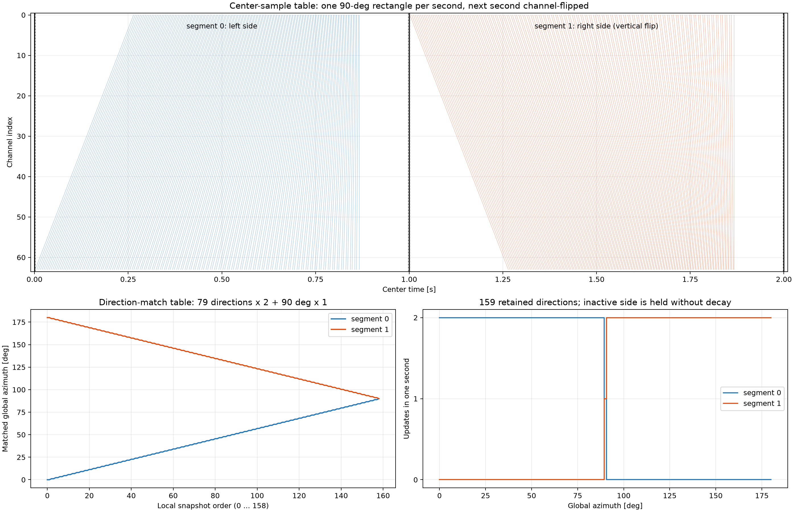

# 方位別時間切り出し共分散 設計結果

## 1. 目的

本書は、長大アレイに対する方位別時間切り出し共分散の設計、成立条件、評価結果、MVDR接続条件を単独で読める形にまとめる。

対象は64ch等間隔ULA、受波器間隔6.25 m、開口393.75 m、音速1500 m/sである。endfire両端遅延は262.5 msとなる。

本書では、絶対相関による補助診断、複素steering整合量、共分散品質、後段MVDRを分離して扱う。

## 2. 方位別更新モデル

### 2.1 保持方位と1秒内の観測順序

保持する物理方位は0--180度の159方位である。global方位indexは0--158であり、0--78を片側、79を共有境界90度、80--158を反対側とする。ここで、保持する159方位と1秒内に取得する159 snapshotは同数だが、一対一対応ではない。

```text
segment 0: [0--90度側79方位] x 2 + [90度] x 1
segment 1: [180--90度側79方位] x 2 + [90度] x 1
```

旧実装の隣接repeatは個数条件だけを満たし、中心線群を台形にしたため不成立とした。修正後はsegment 0を`[79,78,...,0,0,1,...,78]`、segment 1を`[79,80,...,158,158,157,...,80]`とする。0--0.5秒へ反転台形の左半分、0.5--1秒へ通常台形の右半分を置き、共有境界90度を秒頭へ1回だけ置く。右端は次秒頭の90度を概念上の閉端とする。偶数秒と奇数秒でsegmentを切り替える。各側79方位は担当秒に2回、次の秒には0回更新され、90度だけは毎秒1回更新される。したがって2秒平均の更新率は全方位で1 update/sとなる。更新しない側の完成済み共分散は、観測がないことをpower低下と誤解しないよう減衰させず保持する。

### 2.2 中心sampleを置ける範囲

snapshot長を`N`、sample rateを`fs`、左余白を`L=floor(N/2)`、右余白を`U=N-L`とする。全channel共通の基準中心`b_m`へ、候補方位`theta_m`に対する物理到来遅延`tau_i(theta_m)`をscaleせず加える。

\[
c_{i,m}
=
\operatorname{round}\left\{
f_s\left(b_m+\tau_i(\theta_m)\right)
\right\}
\]

各snapshotが1秒内へ収まるための基準中心の可行端点は、その候補方位における全channel遅延の最小値と最大値から決める。

\[
b_{\min,m}=\frac{L}{f_s}-\min_i\tau_i(\theta_m)
\]

\[
b_{\max,m}=1-\frac{U}{f_s}-\max_i\tau_i(\theta_m)
\]

`b_max <= b_min`なら、開口遅延とsnapshot長を1秒へ物理的に収められない。この場合は遅延を圧縮せず、schedule成立不能として検出する。

### 2.3 159中心の無駄のない充填

各snapshot固有の可行下端と上端を求め、半開区間の時間比`m/159`で補間する。

\[
b_m=\left(1-\frac{m}{159}\right)b_{\min,m}
+\frac{m}{159}b_{\max,m},\qquad m=0,\ldots,158
\]

segment 0では、この時間方向の等間隔列と片側90度の方位一致表を組み合わせる。各channelには物理遅延が加わるため線群は傾くが、block左右半長を含めた包絡は0--1秒の長方形内に収まる。segment 1はcentrosymmetricなchannel順を利用してsegment 0の中心表をchannel軸で上下反転する。これにより1--2秒も独立した長方形となり、隣接秒との境界は曲線や平行四辺形ではなく、1秒境界の縦線で分離される。

中心表と方位一致表のshapeは次であり、アレイ位置、`fs`、snapshot長、方位軸が変わらない限り初期化時の1回だけ生成して再利用する。

```text
channel_center_samples: [2, n_ch, 159]
direction_match_indices: [2, 159]
beam_azimuth_deg:        [2, 159]
global_azimuth_deg:      [159]
```



図の上段は、各列を1 snapshotとする中心sample表である。0--1秒は片側90度、1--2秒は反対側90度を上下反転して充填する。破線は中心から左右に`N/2` sampleを取得するための余白である。下段左は同じglobal方位indexが観測順に2回現れること、下段右は非更新側を保持しつつ2秒で全159方位を完成させることを示す。

### 2.4 snapshot切り出しと共通時間軸への復元

各中心`c[i,m]`から`N` sampleを切り出し、1秒入力`[n_ch,fs]`をsnapshot表`[n_ch,N,159]`へ変換する。異なるsnapshot間のsample重複は許可する。これは1方位につき256 blockを生成する処理ではなく、1秒につき159個の候補方位snapshotを1個ずつ作る処理である。

FFTはsnapshot内sample軸`axis=1`へ適用し、`X[ch,bin,snapshot]`を得る。その後、beam内channel平均中心を共通参照時刻として、実際の中心sample差に対応する位相を掛ける。

\[
\Delta t_{i,m}=\frac{c_{i,m}-\overline{c}_{m}}{f_s}
\]

\[
X^{\mathrm{ref}}_{i}(k,m)
=X_i(k,m)\exp\{-j2\pi f_k\Delta t_{i,m}\}
\]

### 2.5 重複方位への逐次指数積分

瞬時共分散`Q_m(k)=X_m(k)X_m(k)^H`を、方位一致表が示すglobal方位へ積分する。同じ方位の2 snapshotをadvanced indexingで一括代入すると最後の代入だけが残り得るため、観測順序を保持して必ず2回更新する。

\[
R_1=(1-\alpha)R_0+\alpha Q_1
\]

\[
R_2=(1-\alpha)R_1+\alpha Q_2
\]

steering powerとtotal powerも同じsnapshot順序、同じ`alpha`で更新する。方位ごとの更新率を`r_theta` [update/s]、等価積分時間を`T` [s]とすると、忘却係数は次で求める。

\[
\alpha(\theta)=\min\left(\frac{2}{1+r_\theta T},1\right)
\]

本scheduleでは2秒内の各global方位の更新回数が2なので、`r_theta=1 update/s`である。10、40、128秒積分の期待有効snapshot数は、それぞれ約10、40、128 updateであり、「1方位につき1秒256 block」ではない。

方位別共分散のshapeは次のとおりである。

```text
R_direction: [n_direction, n_ch, n_ch, n_bin]
eta:         [n_direction, n_bin]
```

保持量は`159 * n_ch * n_ch * n_bin * sizeof(complex64)`である。111 active channel、単一周波数では約15.7 MBとなる。317方位を保持する設計ではない。

## 3. 中心sample表と時間軸復元

各channelの中心sampleは、共通基準中心へ物理到来遅延をscaleせず加えて生成する。

\[
c_i(\theta)-c_j(\theta)
\simeq
f_s\left(\tau_i(\theta)-\tau_j(\theta)\right)
\]

channelごとの行を独立に正規化してはならない。長大開口の遅延をwindow内へ圧縮すると、同一波面の同一時間区間を取得できなくなる。

FFT後は実際の中心sample差を用いて共通参照時刻へ位相復元する。

\[
X_i^{\mathrm{ref}}(f)
=
X_i(f)\exp\left(-j2\pi f\Delta t_i\right)
\]

位相復元は中心時刻の差を戻すが、有限windowが観測した時間区間の違いは消さない。これが広帯域信号に対する候補方位別coherence差を残す。

## 4. 共分散と指数積分

瞬時共分散を

\[
R_{\mathrm{inst}}(k,\theta)=X(k,\theta)X(k,\theta)^H
\]

とし、方位ごとの更新率から求めた忘却係数で更新する。

\[
R_{\mathrm{next}}
=
(1-\alpha)R_{\mathrm{previous}}
+\alpha R_{\mathrm{inst}}
\]

重複するglobal方位indexへadvanced indexingで一括代入せず、2 snapshotを順番に更新する。

## 5. 絶対相関統計の検討とsteering powerへの移行

最初に、対角成分を除く下三角全channel pairについて、絶対正規化相関のmaximum、mean、median、95 percentileを比較した。

各pairの絶対正規化相関を次式で定義する。

\[
\rho_{ij}(k,\theta)
=
\frac{|R_{ij}(k,\theta)|}
{\sqrt{R_{ii}(k,\theta)R_{jj}(k,\theta)}}
\qquad i>j
\]

共分散行列がHermitian半正定値なら、Cauchy--Schwarzの不等式

\[
|R_{ij}|^2\le R_{ii}R_{jj}
\]

より、`0 <= rho_ij <= 1`が成立する。対角成分は自己相関1となるため統計から除外する。複素相関を直接平均せず、pairごとに絶対値正規化してから集約する。

比較した統計は次のとおりである。

\[
\rho_{\max}=\max_{i>j}\rho_{ij}
\]

\[
\rho_{\mathrm{mean}}=\frac{1}{N_{\mathrm{pair}}}\sum_{i>j}\rho_{ij}
\]

\[
\rho_{\mathrm{median}}(k,\theta)
=
\operatorname{median}_{i>j}
\frac{|R_{ij}(k,\theta)|}
{\sqrt{R_{ii}(k,\theta)R_{jj}(k,\theta)}}
\]

95 percentileはpair相関分布の上側を観測する。maximumは多数pairから最大値を選ぶ極値biasが強く、95 percentileも誤方位に残る少数の高相関pairの影響を受けた。meanとmedianは比較的安定し、その中ではmedianが最も外れpairへ頑健だった。

しかし、最も良かったmedianでも狭帯域toneを全く方位分離できず、広帯域でも半高幅が非常に広く、最大遠方peakに対するmarginが小さかった。このため、絶対相関統計を方位Weightへ採用しない。

不採用理由は数式上も明確である。候補方位処理が対角unitary位相回転

\[
R_\theta=D_\theta R D_\theta^H,
\qquad
D_\theta=\operatorname{diag}(e^{j\phi_1},\ldots,e^{j\phi_N})
\]

に帰着する場合、

\[
|(R_\theta)_{ij}|
=
|e^{j(\phi_i-\phi_j)}R_{ij}|
=
|R_{ij}|
\]

であり、対角powerも不変なので、maximum、mean、median、95 percentileはすべて方位不変となる。

また単一toneのrank 1共分散

\[
R=paa^H
\]

では、信号だけなら

\[
\rho_{ij}
=
\frac{|p a_i a_j^*|}{\sqrt{p|a_i|^2p|a_j|^2}}
=1
\]

となる。絶対値を取った時点で、方位を表すchannel間位相差を捨てている。広帯域では候補ごとに異なる有限時間区間を切り出す非unitary効果により相関低下が現れる場合があるが、その大きさは帯域幅、自己相関時間、基線長、SNRに依存し、一般的な方位指標とは言い切れない。

以上から、絶対相関medianは共分散coherenceの補助診断だけに残し、複素位相を保持するsteering整合量を検討する方針へ移行した。

主指標には正規化steering vectorとの整合量を使用する。

\[
u(k,\theta)=\frac{a(k,\theta)}{\|a(k,\theta)\|}
\]

\[
\eta(k,\theta)
=
\frac{u^H R u}{\operatorname{tr}(R)}
=
\frac{P_{\mathrm{steering}}}{P_{\mathrm{total}}}
\]

この定義はHermitian半正定値共分散に対して数学的に次を満たす。固有値を`lambda_m >= 0`とすると、単位ベクトル`u`に対し

\[
0\le u^HRu\le\lambda_{\max}\le\sum_m\lambda_m=\operatorname{tr}(R)
\]

なので、`0 <= eta <= 1`である。

空間白色雑音`R=sigma^2 I`では

\[
\eta_{\mathrm{noise}}
=
\frac{\sigma^2u^Hu}{N_{\mathrm{ch}}\sigma^2}
=
\frac{1}{N_{\mathrm{ch}}}
\]

となる。正しいsteeringに整合したrank 1信号`R=paa^H`では、`u=a/||a||`より`eta=1`となる。したがってetaは、noise-onlyの理論基準と完全整合信号の上限を持つ正規化指標である。

完成共分散へ二次形式を再計算せず、FFT直後のsnapshotから次の数学的同値変換で直接積分する。

\[
u^H(XX^H)u=|u^HX|^2
\]

また、

\[
\operatorname{tr}(XX^H)=\|X\|^2
\]

なので、steering powerとtotal powerを同じsnapshot、同じ忘却係数で指数積分すれば、完成共分散から計算したetaと一致する。

64ch、159方位、65binでは、追加演算量を約4233万complex MACから約66万complex MACへ削減できる。


## 6. 長大ULAにおける方位選択性

中心配置を往復順と候補別可行区間補間へ修正した後、10秒の代表4条件を再実行した。定常信号では同一global方位へ入る2 snapshotの観測順変更による最終統計値の差は表示精度未満だったが、以下は修正後scheduleから再生成した結果であり、旧配置の成果物を流用していない。

80--120 Hz広帯域、信号方位60度、target+noise、10秒積分では、全pair中央値よりsteering powerが明確な選択性を示した。

| 指標 | source対遠方平均margin | 最大遠方peak margin | 半高幅 |
|---|---:|---:|---:|
| 全pair相関median | 0.1670 | 0.0196 | 105.95度 |
| steering power eta | 0.4707 | 0.4696 | 1.14度 |

noise-onlyのetaは空間白色雑音の理論基準`1/N_ch=1/64`付近となった。相関中央値は有限snapshot biasにより約0.44となる。

100 Hz toneでは相関中央値が方位不変となる一方、steering powerは60度にpeakを保持した。

## 7. 分析幅と狭帯域成立条件

### 7.1 比較するblock分割方式

この章の`same_time`は方式2、`time_cut`は方式3のblock生成を表す。同じ`Δf`と`NFFT=fs/Δf`を使用するが、FFTへ渡す時間sampleの選び方が異なる。

方式2の`same_time`では、1秒入力`x[ch,sample]`を全channel共通の境界で長さ`NFFT`へ分割する。1秒当たりのblock数は`n_block=fs/NFFT=Δf`であり、各blockの同じsample範囲を全channelで使用する。

```text
input:       [n_ch, fs]
block:       [n_block, n_ch, NFFT]
spectrum:    [n_block, n_ch, n_bin]
covariance:  [n_ch, n_ch, n_bin]
```

方式3の`time_cut`では、1秒を`Δf`個の共通blockへ分割しない。159個のlocal snapshotについて、候補方位の物理到来遅延に従うchannel別中心sampleから長さ`NFFT`を切り出す。snapshot間の時間sample重複は許可する。

```text
input:                  [n_ch, fs]
direction snapshot:     [n_ch, NFFT, 159]
direction spectrum:     [n_ch, n_bin, 159]
direction covariance:   [159, n_ch, n_ch, n_bin]
```

`same_time`は全channelが同じ絶対時間区間を観測するため、`Δf τ_ap`が大きいendfireではbin内位相を単一steering vectorで代表できなくなる。`time_cut`は同一波面に対応する時間区間をchannelごとに選び、FFT後に共通参照時刻へ戻すため、この破綻を緩和する。したがって本章は単なる処理名の比較ではなく、方式2の破綻開始点と方式3の有効範囲を同じ分析幅で比較するものである。

### 7.2 分析幅による残留位相

長大開口では、同一時間blockのbin共分散を単一steering vectorで代表できる条件を確認する必要がある。endfire遅延開口を`tau_ap=0.2625 s`とすると、bin端の最大残留位相は

\[
\phi_{\max}=\pi\Delta f\tau_{ap}
\]

である。

| Δf | NFFT | Δf τap | bin端最大残留位相 | 1秒schedule |
|---:|---:|---:|---:|---|
| 1 Hz | 32768 | 0.2625 | 0.825 rad | 不成立 |
| 4 Hz | 8192 | 1.05 | 3.299 rad | 成立 |
| 16 Hz | 2048 | 4.20 | 13.195 rad | 成立 |
| 64 Hz | 512 | 16.80 | 52.779 rad | 成立 |
| 256 Hz | 128 | 67.20 | 211.115 rad | 成立 |

1 Hzでは1秒windowと262.5 ms遅延開口を現行1秒scheduleへ収められない。物理遅延を圧縮せず、成立不能として扱う。

同一時間blockでは、90度以外でMVDR幅が4 Hzから悪化し、steering peakは16 Hzから破綻した。256 HzのendfireではsteeringとMVDRの両方が誤方位を選んだ。

方位別時間切り出しでは、平坦な1 bin広帯域モデルに対して256 HzでもsteeringとMVDRが成立した。


## 8. 実信号帯域と粗いFFT bin

信号周波数をbin中心へ移さず、矩形window leakageを含めて評価した。図は方式差を直接読めるよう`target+noise`だけを表示し、分析幅ごとの同一axisへ全pair相関median、steering power、MVDR/Caponを重ねる。target-onlyとnoise-onlyは成分分離と数値検証には保持するが、この方式比較図には重ねない。

| 信号 | Δf | bin中心 | eta margin | MVDR margin | 結果 |
|---|---:|---:|---:|---:|---|
| 40--60 Hz | 16 Hz | 48 Hz | 0.9809 | 0.9997 | 成立 |
| 40--60 Hz | 64 Hz | 64 Hz | 0.9501 | 0.9992 | 成立 |
| 40--60 Hz | 256 Hz | 0 Hz | 0.8414 | 0.0000 | MVDR方位scan不能 |
| 80--120 Hz | 16 Hz | 96 Hz | 0.9721 | 0.9996 | 成立 |
| 80--120 Hz | 64 Hz | 128 Hz | 0.9263 | 0.9988 | 成立 |
| 80--120 Hz | 256 Hz | 0 Hz | 0.7837 | 0.0000 | MVDR方位scan不能 |
| 160--240 Hz | 256 Hz | 256 Hz | 0.7946 | 0.7912 | aliasを含み成立 |
| 100 Hz tone | 256 Hz | 0 Hz | 0.7832 | 0.0000 | MVDR方位scan不能 |

DCではsteering vectorが全方位で同一となるため、通常MVDRが方位を区別できない。これは共分散品質や時間切り出し方式の異常ではなく、DC binと通常MVDRの接続制約である。

一方、候補方位別時間切り出しetaは、候補ごとに異なる時間区間の整合度を使うため、DC binでも60度peakを保持できる。このため「eta peakが存在すること」と「同じbin共分散を通常MVDRへ使用できること」は必ず分離して判定する。


## 9. MVDR接続条件

方位別共分散を通常MVDRへ渡すには、少なくとも次を満たす必要がある。

1. 対象信号を表現する非DC binが存在する。
2. bin中心steeringが方位情報を持つ。
3. 選択した候補方位共分散がHermitian PSDである。
4. 固定loading後の条件数が許容範囲内である。
5. distortionless応答が0 dB近傍を維持する。
6. grating/ambiguous peakが採用基準を超えない。

Weightを使用して複数候補共分散を合成する場合は、steering powerが成立したことだけでMVDR成立とみなさず、合成後共分散に対して再評価する。

## 10. fallbackと完成状態

積分途中のeta、Weight、片側方位だけの共分散は外部へ公開しない。2秒の完成周期で公開値を更新する。

共分散合成が成立しない場合のfallback順序は次とする。

1. 成立条件を満たす方位選択共分散
2. 同一区間の通常時間block共分散
3. 保持期限内の前回完成共分散
4. 方位別対角powerを平均した対角PSD共分散

DC binへ低周波信号が集約される条件では、steering powerによる方位選択結果を通常MVDRへ渡さず、低周波用の細分解能解析、複素subband、または時間領域広帯域処理へfallbackする。

## 11. 採用結論

- 全pair相関medianは共分散coherenceの補助診断として保持する。
- 方位Weightの主指標には複素steering power etaを使用する。
- 方位別時間切り出しは、長大開口における粗い分析幅の狭帯域制約を大きく緩和する。
- eta成立とMVDR成立は別条件として判定する。
- `Δf=256 Hz`でも非DC binを使用できる信号はMVDRへ接続可能である。
- 低周波信号がDCへ落ちる条件では、通常MVDRへ直接接続しない。
- 1 Hz条件は現行1秒scheduleへ収まらないため、遅延を圧縮せず別の処理window設計を用いる。

## 12. 実装・成果物対応

| 責務 | 配置 |
|---|---|
| 中心sample表・時間軸復元・方位別積分 | `src/spflow/beamforming/covariance_snapshot_schedule.py` |
| steering powerとchannel shading | `src/spflow/beamforming/steering_power_weighting.py` |
| 相関統計 | `src/spflow/beamforming/spatial_correlation_statistics.py` |
| 共分散固有空間評価 | `src/spflow/beamforming/covariance_subspace_metrics.py` |
| 分析幅・MVDR評価 | `evaluations/beamforming/analysis_width_long_array_mvdr.py` |
| 実信号帯域評価 | `evaluations/beamforming/analysis_width_signal_band_covariance.py` |
| 数値成果物 | `artifacts/beamforming/analysis_width_long_array_mvdr/summary.json`ほか |

本書の詳細な更新周期、Weight生成、fallback状態遷移は`共分散積分3方式比較設計.md`を正とする。
