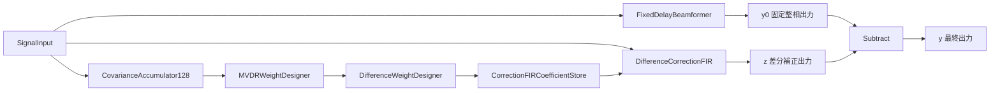
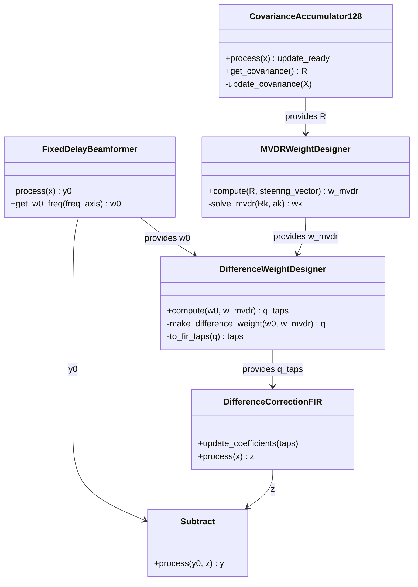

# 固定遅延+差分補正MVDR 詳細設計書

## 1. 目的

本書は、「固定遅延+差分補正MVDR」を spflow 上で実装可能な粒度まで具体化する詳細設計書である。

基本方式は以下である。

```text
固定整相出力 y0
-
差分補正出力 z
=
MVDR相当出力 y
```

周波数領域では、

\[
q[k] = w_0[k] - w_{\mathrm{MVDR}}[k]
\]

\[
y[k] = w_0[k]^H X[k] - q[k]^H X[k]
\]

\[
y[k] = w_{\mathrm{MVDR}}[k]^H X[k]
\]

である。

実装では、統計ルートで \(q[k]\) を設計し、リアルタイムルートで 128 tap FIR として適用する。

---

## 2. 実装方針

### 2.1 主要方針

- リアルタイム出力は時間領域で処理する。
- 統計ルートは係数設計専用とする。
- 共分散行列は 128 sample block ごとに更新する。
- MVDR 重みと補正 FIR 係数は 1 秒ごとに更新する。
- 初期実装では補正 FIR の係数更新は即時切替とする。
- 初期実装では overlap-save は使用しない。
- 係数段差が BTR で確認された場合に、係数平滑化またはクロスフェードを追加する。

### 2.2 想定パラメータ

| 項目 | 値または初期値 |
|---|---:|
| サンプリング周波数 | 32768 Hz |
| 統計 FFT 点数 | 128 |
| 統計 block 長 | 128 sample |
| 1秒あたり block 数 | 256 |
| 補正 FIR tap 数 | 128 |
| MVDR 重み更新周期 | 1 sec |
| 共分散更新周期 | 128 sample |
| 共分散時定数 | 5〜30 sec 程度から評価 |
| 対角ローディング係数 | 1e-3〜1e-1 程度から評価 |

---

## 3. spflow 上の処理構成

## 3.1 推奨パイプライン



### 3.2 データの流れ

リアルタイム信号は 2 つの枝へ分岐する。

1. 固定整相枝
   - 入力信号に対し、整数遅延と小数遅延 FIR を適用する。
   - チャネル合成して \(y_0[n]\) を出力する。

2. 差分補正枝
   - 入力信号に対し、統計ルートで設計された 128 tap 補正 FIR を適用する。
   - チャネル合成して \(z[n]\) を出力する。

最終段で、

\[
y[n] = y_0[n] - z[n]
\]

を計算する。

---

## 4. ブロック責務

## 4.1 SignalInput

### 責務

- 多チャネル時系列信号を供給する。
- 出力 shape は原則として以下とする。

```python
(n_ch, n_samples)
```

### 出力

| 名称 | shape | dtype |
|---|---|---|
| x | `(n_ch, n_samples)` | `float64` または `complex128` |

---

## 4.2 FixedDelayBeamformer

### 責務

- 固定整相主経路を生成する。
- チャネルごとに整数遅延を適用する。
- 残差の小数遅延を FIR で適用する。
- チャネル合成して固定整相出力 \(y_0[n]\) を生成する。
- 統計ルートで使う固定整相周波数重み \(w_0[k]\) を提供できるようにする。

### 入力

| 名称 | shape | dtype |
|---|---|---|
| x | `(n_ch, n_samples)` | `float64` or `complex128` |

### 出力

| 名称 | shape | dtype |
|---|---|---|
| y0 | `(n_samples,)` | `float64` or `complex128` |

### 内部状態

| 名称 | 意味 |
|---|---|
| `integer_delay_samples` | チャネルごとの整数遅延 sample 数 |
| `fractional_delay_taps` | チャネルごとの小数遅延 FIR 係数 |
| `delay_line` | 整数遅延および小数遅延用の履歴バッファ |
| `w0_freq` | 統計 FFT bin 上の固定整相重み |

### 設計上の注意

固定整相枝が時間領域で実装される場合でも、差分補正重み計算のために同じ応答を統計 FFT bin 上で評価する必要がある。

つまり、以下の対応を保証する。

```text
時間領域の整数遅延 + 小数遅延 FIR
≡
統計FFT bin上の固定整相重み w0[k]
```

この整合が崩れると、

\[
w_0[k] - q[k] \approx w_{\mathrm{MVDR}}[k]
\]

が成立しなくなる。

---

## 4.3 CovarianceAccumulator128

### 責務

- 入力信号を 128 sample block に分割する。
- 各 block に対して 128 点 FFT を実行する。
- 周波数 bin ごとに多チャネル共分散行列を指数平均更新する。
- 更新された共分散行列 \(R[k]\) を保持する。

### 入力

| 名称 | shape | dtype |
|---|---|---|
| x | `(n_ch, n_samples)` | `float64` or `complex128` |

### 出力

通常のリアルタイム出力は不要である。spflow 上では、状態更新ブロックとして扱う。

1 秒ごと、または指定 block 数ごとに以下を出力する。

| 名称 | shape | dtype |
|---|---|---|
| covariance | `(n_bin, n_ch, n_ch)` | `complex128` |
| update_ready | scalar | `bool` |

### 内部状態

| 名称 | 意味 |
|---|---|
| `fft_size` | 128 |
| `block_size` | 128 |
| `n_blocks_per_update` | 256 |
| `alpha` | block 単位の忘却係数 |
| `R` | 共分散行列 `(n_bin, n_ch, n_ch)` |
| `block_count` | 更新済み block 数 |
| `input_buffer` | 128 sample 未満の端数を保持するバッファ |

### 共分散更新式

block \(b\)、bin \(k\) の FFT ベクトルを \(X_b[k]\) とする。

\[
\hat{R}_b[k] = X_b[k]X_b[k]^H
\]

\[
R_b[k]
= \alpha R_{b-1}[k]
+ (1-\alpha)\hat{R}_b[k]
\]

### 忘却係数

時定数を \(T_R\) 秒、block 長を \(L\)、サンプリング周波数を \(f_s\) とすると、

\[
\alpha = \exp\left(-\frac{L}{f_sT_R}\right)
\]

である。

`L=128, fs=32768, T_R=10` の場合、

\[
\alpha \approx 0.99961
\]

である。

### FFT の扱い

入力が複素信号の場合は full FFT を用いる。

```python
X = np.fft.fft(x_block, n=fft_size, axis=-1)
```

入力が実信号で、実数 FIR への制約を重視する場合は、rFFT を用いる選択肢もある。ただし、MVDR 重みは一般に複素となるため、初期実装では full FFT を基本とする。

---

## 4.4 MVDRWeightDesigner

### 責務

- 共分散行列 \(R[k]\) とステアリングベクトル \(a[k]\) から MVDR 重み \(w_{\mathrm{MVDR}}[k]\) を計算する。
- 対角ローディングを適用する。
- 逆行列を明示的に計算せず、線形方程式として解く。

### 入力

| 名称 | shape | dtype |
|---|---|---|
| covariance | `(n_bin, n_ch, n_ch)` | `complex128` |
| steering_vector | `(n_bin, n_ch)` | `complex128` |
| update_ready | scalar | `bool` |

### 出力

| 名称 | shape | dtype |
|---|---|---|
| w_mvdr | `(n_bin, n_ch)` | `complex128` |

### 計算式

対角ローディングは以下で与える。

\[
R_{\mathrm{load}}[k]
= R[k] + \epsilon[k] I
\]

\[
\epsilon[k] = \gamma \frac{\mathrm{tr}(R[k])}{M}
\]

MVDR は以下で求める。

\[
R_{\mathrm{load}}[k]u[k] = a[k]
\]

\[
w_{\mathrm{MVDR}}[k]
= \frac{u[k]}{a[k]^H u[k]}
\]

### 数値安定化

以下の場合は fallback を行う。

- `np.linalg.solve` が失敗する。
- 分母 \(a[k]^H u[k]\) が極端に小さい。
- `w_mvdr` に NaN または Inf が含まれる。

fallback 候補は以下である。

1. 前回の `w_mvdr[k]` を維持する。
2. それもなければ固定整相重み `w0[k]` を使う。

### 擬似コード

```python
for k in range(n_bin):
    Rk = R[k]
    ak = a[k]
    eps = diag_load_ratio * np.trace(Rk).real / n_ch
    R_load = Rk + eps * np.eye(n_ch, dtype=np.complex128)

    try:
        u = np.linalg.solve(R_load, ak)
        denom = np.vdot(ak, u)  # ak^H u
        if abs(denom) < denom_floor:
            w[k] = fallback_weight(k)
        else:
            w[k] = u / denom
    except np.linalg.LinAlgError:
        w[k] = fallback_weight(k)
```

---

## 4.5 DifferenceWeightDesigner

### 責務

- 固定整相重み \(w_0[k]\) と MVDR 重み \(w_{\mathrm{MVDR}}[k]\) から差分補正重み \(q[k]\) を計算する。
- 必要に応じて周波数方向平滑化を行う。
- IFFT により 128 tap の補正 FIR 係数を生成する。
- 固定整相枝との遅延基準を合わせる。

### 入力

| 名称 | shape | dtype |
|---|---|---|
| w0 | `(n_bin, n_ch)` | `complex128` |
| w_mvdr | `(n_bin, n_ch)` | `complex128` |

### 出力

| 名称 | shape | dtype |
|---|---|---|
| q_freq | `(n_bin, n_ch)` | `complex128` |
| q_taps | `(n_ch, n_tap)` | `complex128` |

### 差分計算

\[
q[k] = w_0[k] - w_{\mathrm{MVDR}}[k]
\]

### IFFT

full FFT 系で実装する場合、`q_freq` は full spectrum として保持する。

```python
q_time = np.fft.ifft(q_freq.T, n=fir_taps, axis=-1)
```

このとき、`q_freq.T` の shape は `(n_ch, n_bin)` とする。

### 共役規約

基本式は、

\[
y[k] = w[k]^H X[k]
\]

である。

時間領域 FIR 実装では、畳み込み係数として使用する係数が \(w\) なのか \(w^*\) なのかを統一する必要がある。

推奨実装は以下である。

```text
周波数重み w[k] は数式上の w として保持する。
実際に信号に掛ける FIR 係数は conj(ifft(q[k])) として管理する。
```

すなわち、補正出力を

\[
z[n] = q^H x
\]

としたい場合、時間領域の実装係数は \(q\) の共役に対応する。

実装では、混乱を避けるため、変数名を以下のように分ける。

| 変数 | 意味 |
|---|---|
| `q_weight_freq` | 数式上の \(q[k]\) |
| `q_apply_freq` | 実際に信号へ掛ける周波数応答 |
| `q_apply_taps` | 実際に時間領域畳み込みで使用する FIR 係数 |

原則として、

```python
q_apply_freq = np.conj(q_weight_freq)
q_apply_taps = np.fft.ifft(q_apply_freq.T, axis=-1)
```

とする。

ただし、既存 spflow 内のビームフォーマ実装が `w.conj() @ x` 形式か `w @ x` 形式かに合わせ、ここは単体試験で固定する。

---

## 4.6 DifferenceCorrectionFIR

### 責務

- 入力信号に対して、差分補正 FIR を時間領域で適用する。
- チャネルごとの FIR 出力を合成して \(z[n]\) を生成する。
- 係数更新を受け取る。

### 入力

| 名称 | shape | dtype |
|---|---|---|
| x | `(n_ch, n_samples)` | `float64` or `complex128` |
| q_apply_taps | `(n_ch, n_tap)` | `complex128` |

### 出力

| 名称 | shape | dtype |
|---|---|---|
| z | `(n_samples,)` | `complex128` |

### 計算式

\[
z[n]
= \sum_{m=0}^{M-1}\sum_{l=0}^{L_q-1} h_q[m,l]x_m[n-l]
\]

ここで \(h_q[m,l]\) は実際に信号へ掛ける FIR 係数である。

### 内部状態

| 名称 | 意味 |
|---|---|
| `q_apply_taps` | 現在の補正 FIR 係数 |
| `delay_line` | チャネルごとの FIR 履歴 |
| `pending_taps` | 次回更新用係数 |
| `update_mode` | `immediate`, `smooth`, `crossfade` のいずれか |

### 初期実装

初期実装では、係数更新は即時反映とする。

```python
if new_taps_ready:
    q_apply_taps = new_taps
```

係数段差が BTR で確認された場合、次段階として係数平滑化を追加する。

---

## 4.7 Subtract

### 責務

- 固定整相出力 \(y_0[n]\) から差分補正出力 \(z[n]\) を引く。

### 入力

| 名称 | shape | dtype |
|---|---|---|
| y0 | `(n_samples,)` | `float64` or `complex128` |
| z | `(n_samples,)` | `complex128` |

### 出力

| 名称 | shape | dtype |
|---|---|---|
| y | `(n_samples,)` | `complex128` |

### 計算式

\[
y[n] = y_0[n] - z[n]
\]

### 遅延合わせ

`y0` と `z` の時間基準は必ず一致させる。

以下の差が出る場合は、明示的な遅延補償を追加する。

- 固定整相枝の整数遅延
- 小数遅延 FIR の群遅延
- 差分補正 FIR の群遅延
- IFFT 後の tap 切り出し位置

---

## 5. データ shape 設計

## 5.1 時間領域信号

| データ | shape | 備考 |
|---|---|---|
| `x` | `(n_ch, n_samples)` | 入力多チャネル信号 |
| `y0` | `(n_samples,)` | 固定整相出力 |
| `z` | `(n_samples,)` | 差分補正出力 |
| `y` | `(n_samples,)` | 最終出力 |

## 5.2 周波数領域統計

| データ | shape | 備考 |
|---|---|---|
| `X` | `(n_bin, n_ch)` | block FFT 結果 |
| `R` | `(n_bin, n_ch, n_ch)` | 共分散行列 |
| `a` | `(n_bin, n_ch)` | ステアリングベクトル |
| `w0` | `(n_bin, n_ch)` | 固定整相重み |
| `w_mvdr` | `(n_bin, n_ch)` | MVDR 重み |
| `q_weight_freq` | `(n_bin, n_ch)` | 数式上の差分補正重み |
| `q_apply_taps` | `(n_ch, n_tap)` | 実際に畳み込む FIR 係数 |

---

## 6. 設定パラメータ

spflow の BlockParams または設定ファイルで、以下を指定する。

```yaml
fixed_delay_diff_mvdr:
  fs: 32768
  n_ch: null  # 入力またはアレイファイルから取得
  sound_speed: 1500.0

  target:
    az_deg: 0.0
    el_deg: 0.0

  statistics:
    fft_size: 128
    block_size: 128
    covariance_time_constant_sec: 10.0
    mvdr_update_interval_sec: 1.0
    diagonal_loading_ratio: 0.01
    denominator_floor: 1.0e-12

  fixed_delay:
    fractional_delay_taps: 128
    fractional_delay_window: hann
    normalize_target_gain: true

  correction_fir:
    fir_taps: 128
    update_mode: immediate
    coefficient_smoothing_alpha: null
    crossfade_samples: null

  validation:
    enable_weight_check: true
    enable_target_response_check: true
    enable_q_blocking_check: true
```

### 必須パラメータ

| パラメータ | 必須性 | 備考 |
|---|---|---|
| `fs` | 必須 | サンプリング周波数 |
| `array_geometry` | 必須 | チャネル位置 |
| `sound_speed` | 必須 | 音速 |
| `target.az_deg` | 必須 | 目標方位 |
| `target.el_deg` | 必須 | 目標俯仰 |
| `statistics.fft_size` | 必須 | 初期値 128 |
| `correction_fir.fir_taps` | 必須 | 初期値 128 |

---

## 7. クラス設計

## 7.1 推奨ファイル構成

```text
spflow/
  blocks/
    beamforming/
      fixed_delay_beamformer.py
      covariance_accumulator.py
      mvdr_weight_designer.py
      difference_weight_designer.py
      difference_correction_fir.py
      subtract.py
  dsp/
    steering.py
    fractional_delay.py
    covariance.py
    mvdr.py
    fir.py
```

既存構成との整合を優先する場合は、`blocks/beamforming` 以下に処理ブロックを置き、数式処理は `dsp` 以下に分離する。

---

## 7.2 クラス図



---

## 8. 実装詳細

## 8.1 ステアリングベクトル生成

### 入力

- アレイ位置 `positions`: shape `(n_ch, 3)`
- 目標方向単位ベクトル `direction`: shape `(3,)`
- 周波数軸 `freq_axis`: shape `(n_bin,)`
- 音速 `c`

### 計算

チャネル \(m\) の遅延を、

\[
\tau_m = \frac{p_m^T d}{c}
\]

とする。

ステアリングベクトルは、

\[
a_m(f) = \exp\left(-j2\pi f \tau_m\right)
\]

または既存実装の符号規約に合わせる。

重要なのは、固定整相重み \(w_0\) と MVDR 重み \(w_{\mathrm{MVDR}}\) の双方で同じ符号規約を使うことである。

---

## 8.2 固定整相重み w0 の生成

### 方法A：ステアリングベクトルから生成

\[
w_0[k] = \frac{a[k]}{a[k]^H a[k]}
\]

これが最も単純である。

### 方法B：整数遅延 + 小数遅延 FIR の実応答から生成

時間領域で実際に使っている整数遅延と小数遅延 FIR から周波数応答を計算し、それを \(w_0[k]\) として使用する。

この方法の方が、時間領域主経路との一致性が高い。

初期実装では、方式確認を優先する場合は方法Aでよい。ただし、最終的には方法Bを推奨する。

---

## 8.3 共分散更新処理

### 入力 chunk が 128 sample より大きい場合

入力 chunk に複数 block が含まれる場合は、内部で 128 sample ごとに分割して処理する。

```python
while buffer_has_128_samples:
    x_block = pop_128_samples()
    X = fft_128(x_block)
    update_covariance(X)
    block_count += 1
```

### FFT 出力 shape

`np.fft.fft(x_block, axis=-1)` の結果は `(n_ch, n_bin)` になるため、共分散計算前に転置する。

```python
X_ch_bin = np.fft.fft(x_block, n=fft_size, axis=-1)
X_bin_ch = X_ch_bin.T
```

### 共分散計算

```python
for k in range(n_bin):
    xk = X_bin_ch[k]  # shape: (n_ch,)
    R_inst = np.outer(xk, np.conj(xk))
    R[k] = alpha * R[k] + (1.0 - alpha) * R_inst
```

ベクトル化する場合は以下でもよい。

```python
R_inst = X_bin_ch[:, :, None] * np.conj(X_bin_ch[:, None, :])
R = alpha * R + (1.0 - alpha) * R_inst
```

Pylance 対策として、`alpha` は Python `float` にし、`np.bool_` を `bool(...)` に変換して扱う。

---

## 8.4 MVDR 計算処理

### 逆行列禁止

以下は避ける。

```python
R_inv = np.linalg.inv(R_load)
w = R_inv @ a / (a.conj().T @ R_inv @ a)
```

以下を使う。

```python
u = np.linalg.solve(R_load, a)
w = u / np.vdot(a, u)
```

### fallback

`solve` 失敗時は、前回値を保持する。

```python
def fallback_weight(k: int) -> NDArray[np.complex128]:
    if previous_w_mvdr is not None:
        return previous_w_mvdr[k].copy()
    return w0[k].copy()
```

---

## 8.5 差分補正 FIR 生成

### 周波数重み

```python
q_weight_freq = w0 - w_mvdr
```

### 信号適用用応答

数式を `w^H x` として扱うため、実際に信号へ掛ける周波数応答は共役側に寄せる。

```python
q_apply_freq = np.conj(q_weight_freq)
```

### IFFT

```python
q_apply_taps = np.fft.ifft(q_apply_freq.T, n=fir_taps, axis=-1)
```

結果 shape は `(n_ch, fir_taps)` とする。

### tap 切り出し

初期設計では、`n_bin == fir_taps == 128` とし、IFFT 結果をそのまま 128 tap として使用する。

より長い周波数グリッドから 128 tap に切り出す場合は、以下を実装する。

1. IFFT で長いインパルス応答を得る。
2. 主エネルギー位置を検出する。
3. 固定整相枝の出力遅延と一致する位置で 128 tap を切り出す。
4. 再 FFT して \(q[k]\) の近似誤差を確認する。

---

## 8.6 差分補正 FIR の時間領域処理

### 直接畳み込み

初期実装では直接 FIR とする。

```python
z[n] = sum_m sum_l q_taps[m, l] * x[m, n-l]
```

### 実装上の注意

- チャネルごとに履歴バッファを持つ。
- 入力 chunk ごとに出力長を維持する。
- 初回の過去サンプルは 0 とする。
- 出力遅延は固定整相枝と合わせる。

### 最低限の実装イメージ

```python
class DifferenceCorrectionFIR:
    def __init__(self, n_ch: int, fir_taps: int) -> None:
        self.n_ch = n_ch
        self.fir_taps = fir_taps
        self.taps = np.zeros((n_ch, fir_taps), dtype=np.complex128)
        self.state = np.zeros((n_ch, fir_taps - 1), dtype=np.complex128)

    def update_coefficients(self, taps: NDArray[np.complex128]) -> None:
        if taps.shape != (self.n_ch, self.fir_taps):
            raise ValueError("invalid tap shape")
        self.taps = taps.copy()

    def process(self, x: NDArray[np.complex128]) -> NDArray[np.complex128]:
        if x.ndim != 2:
            raise ValueError("x must be 2-D: (n_ch, n_samples)")
        if x.shape[0] != self.n_ch:
            raise ValueError("channel count mismatch")

        x_ext = np.concatenate([self.state, x], axis=1)
        n_samples = x.shape[1]
        z = np.zeros(n_samples, dtype=np.complex128)

        for n in range(n_samples):
            seg = x_ext[:, n:n + self.fir_taps]
            z[n] = np.sum(self.taps[:, ::-1] * seg)

        self.state = x_ext[:, -self.fir_taps + 1:].copy()
        return z
```

このコードは分かりやすさ優先であり、最終的には `einsum`、`sliding_window_view`、Numba、または C 実装への置換を検討する。

---

## 9. 遅延合わせ設計

本方式で最も重要な実装リスクは、固定整相枝と差分補正枝の時間基準ズレである。

### 9.1 基準

以下が成立するようにする。

```text
固定整相枝 y0[n]
差分補正枝 z[n]
```

が同じ入力時刻に対応している。

### 9.2 確認方法

干渉源なし、目標信号のみを入力し、以下を確認する。

\[
z[n] \approx 0
\]

または周波数領域で、

\[
q[k]^H a[k] \approx 0
\]

が成り立つことを確認する。

次に、最終重みについて、

\[
\left(w_0[k]-q_{128}[k]\right)^H a[k] \approx 1
\]

を確認する。

### 9.3 遅延補正の候補

ズレが出る場合は、以下のいずれかで補正する。

- 固定整相枝に追加遅延を入れる。
- 差分補正枝に追加遅延を入れる。
- IFFT 後の FIR tap の circular shift を調整する。
- 固定整相重み `w0` を時間領域実装の実応答から再計算する。

---

## 10. 更新周期設計

## 10.1 共分散更新

共分散は 128 sample ごとに更新する。

```text
32768 sample/sec
128 sample/block
→ 256 block/sec
```

つまり、1秒間に各 bin あたり 256 snapshot を使える。

## 10.2 MVDR 更新

MVDR 重み更新は、初期値として 1秒ごととする。

```text
256 block 蓄積ごとに MVDR 重み更新
```

ただし、共分散そのものは常に指数平均で連続更新されているため、MVDR 更新時点では最新の `R` を使う。

## 10.3 FIR 係数更新

MVDR 更新と同じタイミングで FIR 係数を更新する。

初期実装では即時更新する。

BTR で係数段差が出た場合は、以下を追加する。

```text
1. q_weight_freq の周波数方向平滑化
2. q_apply_taps の時間方向平滑化
3. FIR 出力のクロスフェード
```

---

## 11. 係数段差の確認

係数段差は、時間方向に方位が変わる信号を入力し、BTR で確認する。

### 11.1 確認観点

- 更新時刻に同期した縦縞が出ないこと。
- 目標方位のレベルが周期的に落ちないこと。
- 干渉源抑圧方向が不自然に飛ばないこと。
- 重み更新直後に広帯域ノイズ状のアーティファクトが出ないこと。

### 11.2 初期判断

海洋音響環境では方位変化が比較的遅いため、1秒更新であれば問題が出にくいと想定する。

ただし、問題は環境変化速度だけでなく、MVDR 重みの数値不安定性でも発生する。したがって、共分散指数平均と対角ローディングは必須とする。

---

## 12. 検証項目

## 12.1 単体試験

### CovarianceAccumulator128

- 128 sample 入力で 1 block 更新されること。
- 256 block 入力で `update_ready=True` になること。
- `R[k]` が Hermitian になること。
- `R[k]` の shape が `(n_bin, n_ch, n_ch)` であること。
- block 単位の \(\alpha\) が期待値になること。

### MVDRWeightDesigner

- 白色雑音共分散 \(R=I\) のとき、MVDR 重みが固定整相重みに近いこと。
- \(w^Ha=1\) を満たすこと。
- 特異行列に対して fallback すること。
- 対角ローディングが有効に働くこと。

### DifferenceWeightDesigner

- `q = w0 - w_mvdr` になっていること。
- `w0 - q = w_mvdr` になること。
- `q^H a ≈ 0` になること。
- IFFT 後、再 FFT して元の `q` に近いこと。

### DifferenceCorrectionFIR

- インパルス入力に対して係数そのものが出力されること。
- 多チャネル合成が正しく行われること。
- chunk 分割しても一括処理と一致すること。
- 係数更新後に shape と dtype が維持されること。

---

## 12.2 結合試験

### 目標のみ

入力に目標方向信号のみを入れる。

期待結果：

- 固定整相出力と最終出力の目標レベルがほぼ同じ。
- 差分補正出力は十分小さい。
- BTR 上で目標方位が削れない。

### 干渉源あり

目標方向と異なる方位に干渉源を入れる。

期待結果：

- 固定整相のみより最終出力の干渉レベルが下がる。
- BTR 上で干渉方位に抑圧が出る。
- 目標方位のレベル低下が小さい。

### 方位変化あり

時間方向に方位が変わる信号を入力する。

期待結果：

- 係数更新時刻に縦縞が出ない。
- 追従遅れが許容範囲である。
- 重みが発散しない。

---

## 13. ログ・デバッグ出力

初期実装では、以下をログ出力できるようにする。

| ログ項目 | 用途 |
|---|---|
| `trace_R[k]` | 入力レベル確認 |
| `condition_number_R[k]` | 数値安定性確認 |
| `diag_load_epsilon[k]` | 対角ローディング量確認 |
| `target_response_w0[k]` | 固定整相の歪みなし確認 |
| `target_response_mvdr[k]` | MVDR の歪みなし確認 |
| `target_response_final[k]` | 128 tap 化後の歪みなし確認 |
| `q_blocking_response[k]` | 補正枝の目標漏れ確認 |
| `q_approx_error[k]` | 128 tap FIR 近似誤差確認 |

---

## 14. 実装上の注意点

## 14.1 `np.bool_` と Python `bool`

Pylance 対策として、条件分岐へ渡す値は Python `bool` に変換する。

```python
if bool(update_ready):
    update_coefficients()
```

## 14.2 dtype

複素演算は原則として `np.complex128` に統一する。

```python
R = np.zeros((n_bin, n_ch, n_ch), dtype=np.complex128)
w = np.zeros((n_bin, n_ch), dtype=np.complex128)
```

## 14.3 shape validation

各ブロック入口で shape を確認する。

```python
if x.ndim != 2:
    raise ValueError("x must have shape (n_ch, n_samples)")
```

## 14.4 逆行列禁止

MVDR 計算では `np.linalg.inv` を使わない。

```python
u = np.linalg.solve(R_load, a)
```

## 14.5 端数 sample

統計ルートでは、入力 chunk が 128 sample で割り切れない場合がある。端数は内部バッファに保持し、次回入力と結合する。

---

## 15. 初期実装ステップ

### Step 1: 数式検証スクリプト

- 固定の \(R\)、\(a\)、\(w_0\) を作る。
- MVDR 重みを計算する。
- \(q=w_0-w_{\mathrm{MVDR}}\) を計算する。
- \(w_0-q=w_{\mathrm{MVDR}}\) を確認する。
- \(q^Ha\approx0\) を確認する。

### Step 2: CovarianceAccumulator128 実装

- 128 sample block FFT。
- bin ごとの共分散指数平均。
- 256 block ごとの update flag。

### Step 3: MVDRWeightDesigner 実装

- 対角ローディング付き MVDR。
- fallback 処理。
- 歪みなし条件確認。

### Step 4: DifferenceWeightDesigner 実装

- 差分重み計算。
- IFFT による 128 tap 化。
- 再 FFT による近似誤差確認。

### Step 5: DifferenceCorrectionFIR 実装

- 時間領域直接 FIR。
- chunk 分割一致試験。
- 係数即時更新。

### Step 6: 結合試験

- 目標のみ。
- 干渉源あり。
- 方位変化あり。
- BTR 確認。

---

## 16. 初期実装で採用しないもの

以下は初期実装では採用しない。

- overlap-save によるリアルタイム補正 FIR
- 係数クロスフェード
- blocking matrix 明示型 GSC
- 周波数方向の高度な平滑化
- 可変 tap 数制御
- 複数目標方向制御

ただし、性能評価後に追加できるよう、クラス境界は分離しておく。

---

## 17. 完了条件

初期実装の完了条件は以下とする。

1. 128 sample ごとに共分散が更新される。
2. 1 秒ごとに MVDR 重みが更新される。
3. \(q=w_0-w_{\mathrm{MVDR}}\) が計算される。
4. \(q\) から 128 tap 補正 FIR が生成される。
5. リアルタイム枝で \(y=y_0-z\) が計算される。
6. 目標のみ入力で目標レベルが維持される。
7. 干渉源あり入力で固定整相より抑圧が改善する。
8. BTR 上で係数更新由来の明確な縦縞が出ない。

---

## 18. まとめ

spflow での実装は、以下の 5 つを中核ブロックとする。

```text
FixedDelayBeamformer
CovarianceAccumulator128
MVDRWeightDesigner
DifferenceWeightDesigner
DifferenceCorrectionFIR
```

基本式は、

\[
q[k] = w_0[k] - w_{\mathrm{MVDR}}[k]
\]

\[
y[n] = y_0[n] - z[n]
\]

である。

本方式では、MVDR 重み全体をリアルタイム周波数領域で適用するのではなく、固定整相との差分だけを 128 tap FIR として時間領域で補正する。これにより、固定遅延による安定した主経路と、MVDR による統計的抑圧を分離して実装できる。

---

## 19. 遅延中心切り出し型の共分散積分

### 19.1 目的

従来の短 FFT 共分散積分は、入力時系列を時間順に 128 sample block へ分割し、各 block の FFT から共分散を更新する方式である。

今回追加する方式では、beam ごとの固定遅延表を使い、各 beam・各 channel で中心 sample をずらした 128 sample snapshot を作る。これにより、MVDR 用の統計が固定整相の遅延基準に近い短時間区間から作られる。

従来方式との比較を可能にするため、既存の `ShortFFTCovarianceAccumulator` は残し、新方式は `DelayAlignedBeamCovarianceAccumulator` として別クラスに分離する。

### 19.2 入力と遅延表

入力信号を以下とする。

| 名称 | shape | 単位 |
|---|---|---|
| `y` | `[n_ch, n_sample]` | 振幅 |
| `delay_table_sample` | `[n_ch, n_beam]` | sample |

`delay_table_sample` は MATLAB 側の以下に対応する整数遅延である。

```matlab
tau = (pos .' * Dir3d) / c;
delay_table = int32(tau * fs);
```

標準 frame は 32768 sample とし、基準中心 sample は 16384 とする。beam `b`、channel `ch` の切り出し中心は以下である。

\[
n_c(ch,b) = 16384 + delay\_table\_sample[ch,b]
\]

### 19.3 128 sample snapshot の切り出し

snapshot 長を 128 sample とする。偶数長であるため、中心 sample は切り出し後 index 64 に置く規約とし、切り出し範囲は以下にする。

\[
[n_c - 64,\ n_c + 64)
\]

入力 frame の範囲 `[0, n_sample)` を外れる部分は 0 で埋める。これは、未観測の過去または未来 sample を統計へ混入させず、境界条件を明示するためである。

切り出し後の snapshot shape は以下である。

| 名称 | shape | axis |
|---|---|---|
| `snapshots` | `[n_beam, n_ch, 128]` | beam, channel, sample |

### 19.4 rFFT と beam 別共分散

128 sample snapshot は実信号として扱い、`np.fft.rfft(..., n=128, axis=2)` により 65 bin の片側スペクトルへ変換する。

| 名称 | shape | axis |
|---|---|---|
| `X` | `[n_beam, n_ch, 65]` | beam, channel, frequency bin |

beam 別の瞬時共分散は以下である。

\[
R_{b}[i,j,k] = X_b[i,k] X_b[j,k]^*
\]

実装上の shape は `[n_beam, n_ch, n_ch, 65]` とする。axis=0 は beam、axis=1/2 は channel、axis=3 は rFFT bin である。

### 19.5 共分散積分と MVDR 用合算

frame ごとの瞬時共分散を指数平均する。

\[
R_{b,t} = \alpha R_{b,t-1} + (1-\alpha) \hat{R}_{b,t}
\]

beam 別に積分した後、MVDR 計算時は beam 軸を合算する。

\[
R_{sum}[i,j,k] = \sum_b R_b[i,j,k]
\]

この合算結果は、ユーザー指定どおり `[n_ch, n_ch, 65]` として保持する。既存の `LoadedMVDRWeightDesigner` は `[n_bin, n_ch, n_ch]` を受け取るため、渡す直前に bin 軸を先頭へ移し、`[65, n_ch, n_ch]` に変換する。

### 19.6 評価上の注意

Beamforming Evaluation の分類では、本変更は差分 MVDR の統計推定方式差し替えであり、少なくとも以下を比較する。

- target-only で差分補正枝が target を自己消去しないこと。
- same-frequency interference で固定整相より干渉漏れが下がること。
- BTR 上で更新時刻に同期した縦縞が増えないこと。
- `R_sum` の Hermitian 性、条件数、対角ローディング後の fallback 率を記録すること。

評価図や数値に dB を出す場合は、`dB re input RMS`、`dB re fixed beamformer output` など、基準を明示する。


## 20. 3 秒 streaming 共分散による 3 方式比較評価

### 20.1 評価スクリプト

3 秒分の入力信号を 256 sample block で streaming 処理し、以下の 3 方式を同一入力で比較する評価を追加した。

- `fixed`: 固定整相重み `w = a / n_ch`。
- `diff_mvdr_cov256`: 256 sample block の通常共分散を用いる差分 MVDR。
- `diff_mvdr_beam_sum`: delay table で beam 方向ごとに中心 sample をずらして切り出し、beam 別共分散を合算する差分 MVDR。

実行コマンドは以下である。

```powershell
.\.venv\Scripts\python.exe .\examples\beamforming\evaluate_streaming_diff_mvdr_covariance_compare.py
```

出力先は以下である。

| 出力 | パス |
|---|---|
| PNG/CSV/NPZ/数式チェック | `artifacts/beamforming/fixed_delay_diff_mvdr/streaming_covariance_compare/` |
| zip | `artifacts/beamforming/fixed_delay_diff_mvdr/streaming_covariance_compare.zip` |

### 20.2 レベル正規化

256 point rFFT の bin power は Parseval の定理に合わせ、以下の one-sided RMS power として定義する。

\[
P[k] = \begin{cases}
|X[k]|^2 / N^2, & k = 0 \text{ または Nyquist} \\
2|X[k]|^2 / N^2, & \text{その他の片側 bin}
\end{cases}
\]

この定義により、解析対象帯域の bin power を線形加算した値は、同じ帯域に入力した時間領域 RMS power と一致する。

\[
\sum_{k \in B} P[k] = x_B\_{rms}^2
\]

beam response 図では、対象帯域の出力 power を音源入力の総 power で割ってから dB 化する。

\[
L_b = 10\log_{10}\left(\frac{\sum_{k \in B} P_{out}[b,k]}{\sum_s rms_s^2}\right)
\]

このため、狭帯域 tone と広帯域 band のどちらでも、入力した帯域を加算したレベルが入力信号レベルに一致する。

### 20.3 数式チェック

差分 MVDR の内部量は以下として確認した。

\[
q = w_{fixed} - w_{mvdr}
\]

最終的な出力重みは `w_fixed - q` であるため、以下が成立することを source band 上で確認した。

\[
w_{fixed} - q = w_{mvdr}
\]

また、MVDR の歪みなし制約は以下として確認した。

\[
w^H a = 1
\]

全 scenario で、差分重みの戻し誤差は最大でも丸め誤差レベル、fallback 率は 0 であった。入力 RMS の帯域加算値は、単一音源で `1.0`、2 音源で `sqrt(2)` と一致した。

### 20.4 評価パターンと主な結果

| scenario | 入力 RMS 確認 | 主な確認 |
|---|---:|---|
| `low_narrow_az030` | 1.000000 | 30 deg で fixed と差分 MVDR の source レベルが 0 dB に一致。 |
| `low_broadband_az010` | 1.000000 | 10 deg の広帯域加算レベルが 0 dB に一致。 |
| `high_narrow_az050` | 1.000000 | 50 deg の狭帯域高周波で 0 dB に一致。 |
| `high_broadband_az180` | 1.000000 | 180 deg の広帯域高周波で 0 dB に一致。 |
| `near_broadband_high_low_az085_az080` | 1.414214 | 2 音源の総 power 基準で、各 source 単独相当の期待レベルは約 -3.01 dB。 |
| `near_narrow_high_high_az085_az080` | 1.414214 | 近接 2 音源・別周波数 tone で総 power 基準のレベルを確認。 |

詳細な peak 方位、source beam レベル、数式チェック値は以下に保存する。

- `artifacts/beamforming/fixed_delay_diff_mvdr/streaming_covariance_compare/data/summary_metrics.csv`
- `artifacts/beamforming/fixed_delay_diff_mvdr/streaming_covariance_compare/data/math_check.md`

### 20.5 評価上の注意

`diff_mvdr_beam_sum` は delay table の整数遅延で snapshot 中心をずらすため、低周波の広い mainlobe では peak 方位が source 方位の近傍へ浅く移動する場合がある。ただし source 方位 beam の歪みなし制約と帯域加算レベルは保持されている。方式差の解釈では、peak 方位だけでなく source beam レベル、帯域加算レベル、条件数、fallback 率を併せて確認する。
